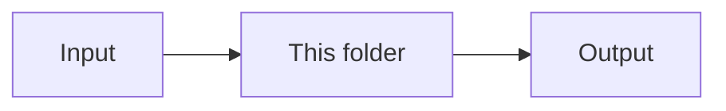

# Folder README Docs

## Purpose

Use this skill to update existing README files for a target folder.

The README should help a reader understand what the folder does before they read the code. Keep the writing practical. Do not turn the README into a technical reference.

## Required Inputs

- A target folder path.
- Existing README files inside that target folder.
- The code in each README folder and its subfolders.

## Required Context

Before writing docs, read:

- `.cursor/rules/markdown-style.mdc`
- `packages/core/GLOSSARY.md`
- Any existing README in the folder being edited
- The main exported files and nearby tests for the folder

Use local code as the main evidence. Do not infer behavior from file names alone.

## Workflow

1. Find existing `README.md` files under the target folder.
2. Do not create a README where one does not exist.
3. Read the code in the README folder and its subfolders.
4. Identify the folder structure before writing. Let file names, subfolders, exported surfaces, and local terminology decide the README groups.
5. Build an inventory for each README folder. Include every named exported type, constant, function, reducer handler, selector, service method, helper, and class or object method in the folder and its subfolders.
6. Check for stale names, legacy aliases, missing generated files, and terminology that conflicts with the glossary. Report code or generated-file issues separately from README edits.
7. Report the planned README edits before making changes.
8. Wait for explicit approval before editing files.
9. Edit only the existing README files that were approved.
10. Run a Markdown style check by reviewing the final text against `.cursor/rules/markdown-style.mdc`.

## README Shape

Use this shape unless the existing README has a better local structure:

````markdown
# [Folder Name]

This folder ...

---

## [Section Name]

A description of this section that needs to be called out ...

## [Section Name ...]

A description of this section that needs to be called out ...

---

## Flow



## Major Types And Functions

Use exactly three columns: `Type or Function`, `File`, `Purpose and use`. Do not add a separate `Use` column.

| Type or Function | File | Purpose and use |
| --- | --- | --- |
| `functionName` | `file-name.ts` | Does one specific thing. Used by reducers, services, tests, or external callers when ... |

## Notes

Add this section only when it helps. 

- Put items into bulleted lists if needed ...
- But only if the items read like a list ...

---

## Related Docs

- [`OTHER.md`](./OTHER.md)
- [`OTHER.md`](./OTHER.md)
````

## Summary Rules

- Start with a high-level summary of what the folder does in practical terms.
- Describe the folder and all subfolders together.
- Keep the summary short.
- Use terms from the glossary when the folder is under `packages/core/`.
- Avoid deep implementation details unless they explain the folder boundary.

## Related Docs Rules

- Add `## Related Docs` after the summary and before `## Flow` when same-folder Markdown files exist.
- Link only Markdown files in the same folder as the README.
- Exclude the README itself.
- Do not link Markdown files from child folders or parent folders.
- Omit the section when there are no other same-folder Markdown files.

## Diagram Rules

- Use a simple Mermaid diagram. 
- If the diagram is too long, draw it vertically.
- Show that input enters this part of the code.
- Show the main work this folder performs.
- Show that output leaves this part of the code.
- Use concrete labels. Prefer `Processed workspace`, `Computed workspace`, or `Workspace file` over vague labels like `Next workspace`.
- Show failure or rejection paths when the folder validates, routes, migrates, verifies, or can throw.
- Do not list every input field or output field.
- Do not diagram every helper call.

## Structure Rules

- Match the README structure to the folder architecture. Do not force every folder into one generic table.
- Use one table per meaningful group when that makes the README easier to scan.
- Prefer groups from local subfolders or pipeline stages.
- For `model/`, group by saved data shape or file-format section.
- For `reducers/`, group by handler folder, such as add, set, reset, insert, move, reorder, duplicate, remove, shared, and stubs.
- For `reducers/`, keep reducer handlers and local helper functions in separate tables unless the folder has no clearer split.
- For `services/`, group by service boundary.
- For `compute/`, group by pipeline stage.
- Keep entry points and action or public types in their own short groups when that helps.

## Sorting Rules

- Sort rows inside each group by the folder's ownership model.
- For workspace folders, use saved workspace section order when applicable: metadata, components, nodes, themes, font-collections, icon-sets, media.
- For reducer folders, group by handler folder first, then sort each table by the workspace section each action targets.
- For helper groups that do not map to workspace sections, sort by call flow or by the order a reader will need the concepts.

## Major Type and Function Rules

| Rule | Purpose |
| --- | --- |
| List every named exported type, constant, function, reducer handler, selector, service method, helper, and class or object method in the README folder and its subfolders. | Make the section complete and auditable. |
| Use one row per item. | Avoid grouped summaries that hide behavior. |
| Include important non-exported helpers when they explain folder behavior. | Cover code paths readers need to understand. |
| Do not combine related items into one row. | Keep each export on its own row. |
| Do not skip small helpers. | Small helpers often explain important behavior or constraints. |
| Use exactly three table columns. | `Type or Function`, `File`, and `Purpose and use` only. Never split purpose and use into two columns. |
| Use the item's exact exported or declared name. | Help readers search the code quickly. |
| Add the source file path for each item. | Show where the item lives. |
| Write purpose and use in the third column. | One short purpose sentence, then one short use sentence in the same cell. |
| Explain the core purpose in one short sentence. | State what the function does without implementation detail. |
| Explain the use in one short sentence. | State who calls it or when callers should use it. Same cell as purpose, not a fourth column. |
| For class or object methods, write names as `ClassName.methodName` or `objectName.methodName`. | Keep method entries clear. |
| Exclude anonymous inline callbacks unless they are assigned to a named constant or define meaningful folder behavior. | Avoid documenting control-flow noise. |

## Accuracy Rules

- Use local code as evidence for every row. Do not infer behavior from file names alone.
- Explain where key inputs come from and who owns them. This matters for terms such as action, entry, token, workspace, and template.
- Use current names only. Do not document deprecated aliases or legacy names as active API.
- Prefer concise names from the codebase and glossary. Flag awkward or stale names before preserving them in docs.
- If README work reveals code or generated-file issues, report them separately and ask for approval before fixing them.

## Notes Rules

- Add notes only when they help the next reader.
- Use notes for boundaries, common confusion, and important related folders.
- Do not add filler.
- Do not repeat what the summary or function list already says.

## Notice Rules
 - Add this boilerplate text to the bottom of all READMEs if it does not yet exist. Replace it if the boilerplate is out of date.

`## Notice for AI and LLM Training`

`You may not use this software, or any derivative works of it, in whole or in part, for the purposes of training, fine-tuning, or otherwise improving (directly or indirectly) any machine learning or artificial intelligence system without written permission.`

## Edit Boundaries

- Only edit existing `README.md` files.
- Do not create new README files.
- Do not edit code as part of this workflow.
- Do not update unrelated Markdown files.
- Preserve useful existing content when it is accurate.
- Replace stale or overly technical content when it blocks readability.

## Final Response

After edits, report:

- Which README files changed.
- The main documentation improvements.
- Any README files skipped and why.
