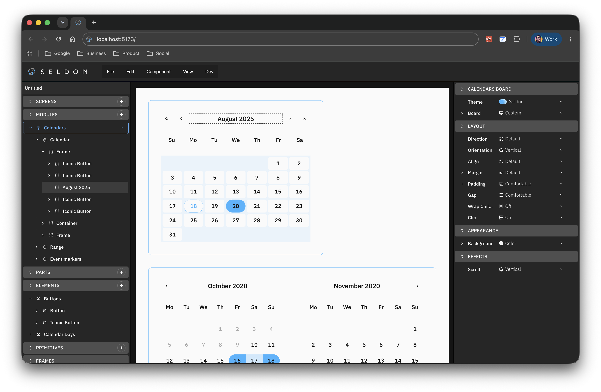

# Seldon · Core, Editor, and Factory

[License: PolyForm Noncommercial](LICENSE.md)

Seldon is a component-based design engine that consists of three main parts.



---

The [Seldon Core](packages/core/README.md) is the engine that defines component-based design systems. It ships a catalog of component building blocks, properties, and theme models those components use. It is also the processing engine for design workspace files.

Core owns design state and rules. Editors, agents, and other tools load a workspace, apply typed actions via the Core, and get validated JSON back. Workspaces can then be passed to the Factory for code and asset generation at any point in time.

---

The [Seldon Factory](packages/factory/README.md) turns a Seldon workspace into production code. It consumes a workspace file and produces components, CSS, and processed assets. Factory reads design-time state from Core, resolves properties and themes, and generates output. It does not change the workspace file.

Factory owns export and production code generation. It can be extended beyond one platform, since multiple factory pipelines can be supported. React is the default Factory for now.

---

The [Seldon Editor](packages/editor/README.md) is a browser design client for Seldon workspaces. It runs locally on your computer, creates and stores workspaces, and needs no API, database, auth, or cloud service. The Editor runs as a single app on `localhost:5173`.

A user opens a workspace with the Editor, edits components, and each action flows through the same Core reducer engine that an AI agent would use.

The Editor that ships with this repo serves multiple purposes: to provide users with a graphical way to edit components, to consume components for dogfooding, and as a way to make sure no special code or logic is created that prevents an AI agent from executing the same set of actions.

---

There is no Docker setup, standalone API, or external database in this repo. This is intentional.

---

This repository packages up these three pieces to be run on your machine. All of the code is out in the open.

Why?

**We don't believe you need AI to write button code.**

Wasting large amounts of compute, energy, and money on creating code that is largely a solved problem seems like a massive opportunity cost for everyone. We are spending far more money and time trying to reign in non-deterministic models instead of exploring the new ways AI can help us build products of the future.

But if it's solved, what's the issue?

Most front end and product problems lack a rigorous, structured approach to their design definitions, even when using design systems. Teams create some rigor to build products at scale, and yet they inevitably run into the handoff problem. At the heart of this is that design and code are disconnected. They have been for decades now.

Add AI to that mix and what happens is massive overspend and more unnecessary complexity with the front end code as models go off on all sorts of unnecessary tangents. AI handles the v.0 to v.1 jump well, but iterating to v.2 then to v.3 and beyond? That's where it breaks down. Throwing more data and compute at this will likely not solve the problem.

We need a structured approach to the design of components in the same way PostScript gave print a language, and web standards gave browsers dependability. We need a way to define design for digital products that is rooted in code, while based on design practice. As a small bonus, that structure and definition becomes the thing AI can manipulate far more effectively than trying to constantly recreate raw button code.

The purpose of releasing Seldon into the wild is to provide a starting point that can evolve into that while also allowing for as many paths for exploration as possible.

No one knows where the future will land. There are a lot of ideas out there of what LLMs and AI mean for humanity. Most of those ideas are thin, many are just plain wrong, and a few have real value. One thing that should become clear over time however is that humanity doesn't need AI or LLMs to waste enormous amounts of energy and money to write the code for a Button component.

---

The model Seldon is offering is this:

- A workspace defines the structure needed as simple key value pairs in JSON.
- A core engine defines how everything can be manipulated in the workspace. It has the code to mutate data, and validation to make sure a workspace file is valid.
- Editors, AI agents, new creative tools, and new products can focus on new ways to manipulate design data in JSON rather than trying to solve low level design problems.
- A code factory takes that workspace file and processes it to create code for whatever platform you target, be it React, Swift, Java, or something else.

Code is exported, it's deterministic, and it just works.

This leaves folks to use AI to work on the actual future rather than throwing massive data at scale to figure out how to get that AI to write code that goes from version 1 to 2 to 3 and so on.

---

## Prerequisites

Install [Node.js](https://nodejs.org/en/download) and [npm](https://docs.npmjs.com/downloading-and-installing-node-js-and-npm) before you run the Editor.

---

## Run Locally

Once you have **Node.js** and **npm**, clone the repository from GitHub:

```bash
git clone https://github.com/SeldonDigital/seldon.git
```

Or over SSH:

```bash
git clone git@github.com:SeldonDigital/seldon.git
```

Then from your terminal:

```bash
cd seldon
npm install
npm run dev
```

The Editor is a single-page app built with [Vite](https://vite.dev/) and [React Router](https://reactrouter.com/). Its dependencies install when you run `npm install`. You do not install them separately.

`@seldon/core` and `@seldon/factory` are not tied to the editor. If you build your own editor, you can use any React setup, or no React at all for headless tooling.

---

Then open `http://localhost:5173` in your browser. You should now have the editor running locally.

---

## Where to go from here

At the time of this writing, Seldon is just getting of the ground. It is missing many features, behaviors, code export languages such as Swift and Java, and other core pieces. But rather than wait until it's all done and build it in a closed environment, we're going to build it out in the open and evolve it based on your feedback. Hopefully many of you will become contributors as well.

There's a lot to do, so we also need feedback on what is working, what is not, and what should be added sooner rather than later. "It's a process," as they say.

By the end of the first year, we expect to have a fairly robust codebase that will be able to do a whole host of things not easily possible today. Even a robust locally run Editor that works as well as anything out there.

As that begins to take shape, we'll all be able to better see where the future is going, and we fully expect that wasting compute, energy, and money on writing Button code will not be a thing.

---

### The Vault

If you want the lowdown, these three documents are a great way to get into what this codebase offers, and where it is going.

- `packages/core` [packages/core/README.md](packages/core/README.md): This is the workspace, theme, and reducer logic used by an editor or agent to mutate workspace.json files
- `packages/editor` [packages/editor/README.md](packages/editor/README.md): Visual editor that runs on localhost
- `packages/factory` [packages/factory/README.md](packages/factory/README.md): Component Export, CSS, and code generation from a valid workspace.json file

---

### The Prime Radiant

- `packages/core/workspace` [packages/core/workspace/README.md](packages/core/workspace/README.md): TypeScript shapes for saved workspace files, rules, behaviors, and processing
- `packages/core/components` [packages/core/components/README.md](packages/core/components/README.md): Schema shapes, hierarchy, and composition rules
- `packages/core/properties` [packages/core/properties/README.md](packages/core/properties/README.md): Property types and values
- `packages/core/themes` [packages/core/themes/README.md](packages/core/themes/README.md): Token sections, references, and stock themes
- `packages/core/font-collections` [packages/core/font-collections/README.md](packages/core/font-collections/README.md): TBD
- `packages/core/icon-sets` [packages/core/icon-sets/README.md](packages/core/icon-sets/README.md): TBD
- `packages/core/media` [packages/core/media/README.md](packages/core/media/README.md): TBD

---

## Licensing

Seldon is offered under the **PolyForm Noncommercial License 1.0.0** by default, with a separate commercial license for commercial use.

| Use | Requirement |
| --- | --- |
| Noncommercial use | PolyForm Noncommercial License 1.0.0 |
| Commercial use | Paid commercial license |

### 1. Noncommercial license

The default software license is the **PolyForm Noncommercial License 1.0.0**.

- You may use, copy, and modify this software for **noncommercial purposes** such as research, education, and personal projects.
- Commercial use is **not permitted** under this license.
- See [license/noncommercial/LICENSE.md](license/noncommercial/LICENSE.md).

### 2. Commercial license

Commercial use covers proprietary software, SaaS platforms, internal business tools, and use as training data for AI or LLMs. You need a **commercial license** for these.

The commercial license may grant:

- Use in commercial or for-profit contexts.
- Ability to create proprietary derivative works as stated in your agreement.
- Long-term support, security updates, and priority bug fixes if offered by the licensor.
- Optional custom terms negotiated with the licensor.
- See [COMMERCIAL-LICENSE.md](license/commercial/COMMERCIAL-LICENSE.md).

To obtain a commercial license, contact:

- **Licensor:** Seldon Digital, B.V.
- **Email:** [info@seldon.digital](mailto:info@seldon.digital)

---

## Notice for AI and LLM Training

You may not use this software, or any derivative works of it, in whole or in part, for the purposes of training, fine-tuning, or otherwise improving (directly or indirectly) any machine learning or artificial intelligence system without written permission.
