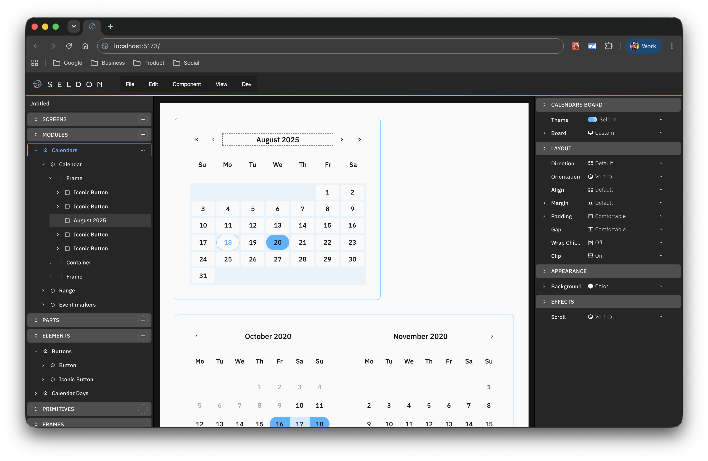

# Seldon · Core, Factory, and Editor

[License: PolyForm Noncommercial](LICENSE.md)

Seldon is a component-based design engine. You give it an input, it processes that input, and it returns an output. The output is deterministic.



A Seldon workspace is a single JSON file. Every change to it, whether a person clicks in the Editor or an AI agent calls a tool, runs through one reducer engine in Core and comes back as validated JSON. The Factory turns that workspace into production code and assets. There is no Docker setup and no external database in this repo. That is intentional.

## What you can do with it

- Design with a catalog of components, properties, and theme tokens.
- Edit locally in a browser Editor that needs no API, database, auth, or cloud service.
- Export production code and assets with the Factory. React is the default target.
- Drive the same edits from an AI agent, because a human and an agent both go through the same Core engine.
- Connect an AI client such as Cursor, Codex CLI, or Claude Code over MCP.

---

## The three parts

The [Seldon Core](packages/core/README.md) is the engine that defines component-based design systems. It ships a catalog of component building blocks, properties, and the theme models those components use. It is also the processing engine for design workspace files. Core owns design state and rules. Editors, agents, and other tools load a workspace, apply typed actions through Core, and get validated JSON back. A workspace can then go to the Factory for code and asset generation at any time.

The [Seldon Factory](packages/factory/README.md) turns a Seldon workspace into production code. It consumes a workspace file and produces components, CSS, and processed assets. Factory reads design-time state from Core, resolves properties and themes, and generates output. It does not change the workspace file. Factory can be extended beyond one platform, since multiple factory pipelines can be supported. React is the default for now.

The [Seldon Editor](packages/editor/shared/README.md) is a browser design client for Seldon workspaces. It runs locally on your computer, creates and stores workspaces, and needs no API, database, auth, or cloud service. It ships as two mirrored apps that share the same logic and workspace files: a [React build](packages/editor/apps/react/README.md) on `localhost:5173` and a [Vue build](packages/editor/apps/vue/README.md) on `localhost:5174`. A user opens a workspace, edits components, and each action flows through the same Core reducer an agent would use. The Editor in this repo serves three purposes: it gives users a graphical way to edit components, it consumes components for dogfooding, and it proves no special code blocks an agent from running the same actions.

---

## The Monorepo and packages

This repo is an npm-workspaces monorepo. The parts above live under `packages`, and three bundle packages compose them for consumers:

| Package | Pulls in | Choose when |
| --- | --- | --- |
| `@seldon/terminus` | core + factory | Headless load, edit, and export. No AI, no Editor. Use this if all you need to do is process Seldon workspace.json files for automated workflows. |
| `@seldon/hari` | core + factory + ai | Allows for AI Agentic editing using local open source models via Ollama and Pi. If you want to use frontier models, then this allows for MCP 2.0 using `seldon-mcp` within your own IDE or other AI Agent product |
| `@seldon/foundation` | core + factory + ai + editor | The full package, plus the Editor as a locally hosted web app to be used on your computer. |

To hack on Seldon itself, clone this repo and run the Editor. See [Run locally](#run-locally). To use Seldon inside your own app, install one of the bundles. See [Use Seldon in your own app](#use-seldon-in-your-own-app).

---

## Prerequisites

Install [Node.js](https://nodejs.org/en/download) 22 and [npm](https://docs.npmjs.com/downloading-and-installing-node-js-and-npm) before you run the Editor. This repo pins Node 22 through [Volta](https://volta.sh/).

Some Editor features, folder export and per-project workspace stores, use the browser File System Access API. Use a Chromium browser such as Chrome or Edge for those. Everything else works in any modern browser.

## Run locally

Once you have Node.js and npm, clone the repository from GitHub:

```bash
git clone https://github.com/SeldonDigital/seldon.git
```

Or over SSH:

```bash
git clone git@github.com:SeldonDigital/seldon.git
```

Then from your terminal:

```bash
cd seldon
npm install
npm run dev
```

Open `http://localhost:5173` in your browser. The Editor is now running locally.

The Editor is a single-page app built with [Vite](https://vite.dev/) and [React Router](https://reactrouter.com/). Its dependencies install when you run `npm install` on this repo, so you do not install them separately. Run the Vue build with `npm run dev:vue` on `http://localhost:5174`.

`@seldon/core` and `@seldon/factory` are not tied to the Editor. If you build your own editor, use any React setup or no React at all for headless tooling.

## Use Seldon in your own app

Install one bundle for your case. Each is independent, so you update it on its own.

Headless engine, load, edit, and export with no AI and no editor:

```bash
npm install @seldon/terminus
```

```typescript
import { exportWorkspace, loadWorkspace, workspaceReducer } from "@seldon/terminus"
```

Headless engine with local-model chat, plus the `seldon-mcp` bin so an AI client can drive the design:

```bash
npm install @seldon/hari
```

```typescript
import { chatToActions, loadWorkspace, workspaceReducer } from "@seldon/hari"
```

The full platform with the embeddable Editor UI. It ships as source for your bundler, so use it from a bundler-based app such as Vite or Next, not a plain Node script:

```bash
npm install @seldon/foundation
```

```typescript
import { chatToActions, loadWorkspace } from "@seldon/foundation"
```

Guides for each bundle:

- Terminus, load, edit, and export flow: [packages/bundles/terminus/README.md](packages/bundles/terminus/README.md)
- Hari, chat and the AI loop: [packages/bundles/hari/README.md](packages/bundles/hari/README.md)
- Foundation, embedding the Editor: [packages/bundles/foundation/README.md](packages/bundles/foundation/README.md)

## Connect an AI agent

`@seldon/hari` ships the `seldon-mcp` bin. It serves a project's workspace store to an MCP client such as Cursor, Codex CLI, or Claude Code, so an agent reads and edits the design through Core and Factory. From your project root:

```bash
npm install @seldon/hari
npx seldon-mcp init
```

`init` creates the `.seldon/workspaces` store, adds a `seldon` server to `.cursor/mcp.json`, and seeds a starter workspace. Set this up per project, not globally, so the server runs only where the store is.

- Per-client setup and troubleshooting: [packages/bundles/hari/README.md](packages/bundles/hari/README.md)
- How the MCP server works and its deployment scenarios: [docs/mcp-guide.md](docs/mcp-guide.md)

---

## Scripts

CI runs five checks on every pull request to `main`. One command runs all five in the same order, so a green run locally means a green run in CI:

```bash
npm ci
npm run check
```

Unit tests run on [Vitest](https://vitest.dev/) under Node. You do not need another runtime.

Run a single check for a faster loop.

Format:

```bash
npm run format:check
```

To fix formatting instead of only checking it:

```bash
npm run format
```

Lint every package:

```bash
npm run lint:all
```

Typecheck every package:

```bash
npm run typecheck:all
```

Unit tests:

```bash
npm test
```

Reference bindings, which fail when a committed manifest falls behind the code that drives it:

```bash
npm run bindings:check
```

Every package also has its own `lint` and `typecheck`. At the root, a plain name targets the React editor and a `:vue` suffix targets the Vue one, so `npm run lint` and `npm run lint:vue` each lint one app. `npm run lint:shared` covers the framework-neutral `packages/editor/shared`.

---

## Where to go from here

At the time of this writing, Seldon is just getting off the ground. It is missing a few features, behaviors, code export for Swift and and other platforms. But rather than wait until it's all done, building all of this in a closed environment, we're going to build it out in the open and evolve it based on your feedback. Hopefully many of you will become contributors as well.

There's a lot to do. We need feedback on what is working, what is not, and what should be added sooner rather than later. "It's a process," as they say. By the end of the first year, we expect to have a fairly robust codebase that will do a whole host of things not easily possible today, including a robust, locally run Editor that works as well as any design tool on the market.

### The Vault

If you want the lowdown, these documents are a great way to get into what this codebase offers, and where it is going.

- `packages/core` [packages/core/README.md](packages/core/README.md): the workspace, theme, and reducer logic an editor or agent uses to mutate workspace.json files
- `packages/factory` [packages/factory/README.md](packages/factory/README.md): component export, CSS, and code generation from a valid workspace.json file
- `packages/editor` [packages/editor/shared/README.md](packages/editor/shared/README.md): the visual editor that runs on localhost
- `packages/ai` [packages/ai/README.md](packages/ai/README.md): local-model orchestration, the shared tool registry, and the MCP server

### The Prime Radiant

- `packages/core/workspace` [packages/core/workspace/README.md](packages/core/workspace/README.md): TypeScript shapes for saved workspace files, rules, behaviors, and processing
- `packages/core/components` [packages/core/components/README.md](packages/core/components/README.md): schema shapes, hierarchy, and composition rules
- `packages/core/properties` [packages/core/properties/README.md](packages/core/properties/README.md): property types and values
- `packages/core/themes` [packages/core/themes/README.md](packages/core/themes/README.md): token sections, references, and stock themes
- `packages/core/font-collections` [packages/core/font-collections/README.md](packages/core/font-collections/README.md): font family collections, origins, and stacks
- `packages/core/icon-sets` [packages/core/icon-sets/README.md](packages/core/icon-sets/README.md): icon set catalog and icon ids

---

## Licensing

Seldon is offered under the **PolyForm Noncommercial License 1.0.0** by default, with a separate commercial license for commercial use.

| Use | Requirement |
| --- | --- |
| Noncommercial use | PolyForm Noncommercial License 1.0.0 |
| Commercial use | Paid commercial license |

### 1. Noncommercial license

The default software license is the **PolyForm Noncommercial License 1.0.0**.

- You may use, copy, and modify this software for **noncommercial purposes** such as research, education, and personal projects.
- Commercial use is **not permitted** under this license.
- See [license/noncommercial/LICENSE.md](license/noncommercial/LICENSE.md).

### 2. Commercial license

Commercial use covers proprietary software, SaaS platforms, internal business tools, and use as training data for AI or LLMs. You need a **commercial license** for these.

The commercial license may grant:

- Use in commercial or for-profit contexts.
- Ability to create proprietary derivative works as stated in your agreement.
- Long-term support, security updates, and priority bug fixes if offered by the licensor.
- Optional custom terms negotiated with the licensor.
- See [COMMERCIAL-LICENSE.md](license/commercial/COMMERCIAL-LICENSE.md).

To obtain a commercial license, contact:

- **Licensor:** Seldon Digital, B.V.
- **Email:** [info@seldon.digital](mailto:info@seldon.digital)

---

## Notice for AI and LLM Training

You may not use this software, or any derivative works of it, in whole or in part, for the purposes of training, fine-tuning, or otherwise improving (directly or indirectly) any machine learning or artificial intelligence system without written permission.
