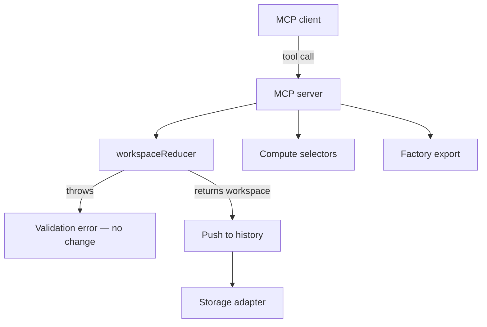

# Seldon · MCP Server

This guide shows how to wire an MCP server to `@seldon/core`. The server lets an AI client load a workspace, change it through actions, read computed values, and export code. It does everything the editor does without the browser UI.

Core owns design state and rules. The editor adds gestures, history, selection, and local storage on top of Core. An MCP server replaces the editor shell with server-side state and exposes Core through MCP tools.

---

## The Contract

The editor and an MCP server follow the same contract. Both hold a **workspace** object in memory, send typed **actions** to change it, read **computed** values for display, and serialize the result to JSON. Neither patches workspace maps by hand outside the reducer.

This means an MCP server is a headless editor. It imports the same Core entry points the editor imports. It does not fork or reimplement any design logic.



---

## What Core Provides

The MCP server wraps these Core entry points directly. None of them require a browser.

| Capability | Core entry point | Module |
| --- | --- | --- |
| Create a workspace | `createEmptyWorkspace` | `@seldon/core` |
| Apply one action | `workspaceReducer` | `@seldon/core` workspace reducers |
| Apply a batch of actions | `applyActions` | `@seldon/core` workspace reducers |
| Action contract | `WorkspaceAction` | `workspace/reducers/types.ts` |
| Read computed node values | `computeNodeProperties` | `@seldon/core/workspace/compute` |
| Read computed themes | `getComputedTheme`, `computeWorkspaceThemes` | `@seldon/core/workspace/compute` |
| Validate an operation | `validateCoreOperation`, `validateComponentInsertionForUI` | `helpers/validation` |
| Read a schema | `getComponentSchema` | `@seldon/core/components/catalog` |
| Export code and assets | `exportWorkspace` | `@seldon/factory` |

---

## What The Server Owns

The editor keeps a few runtime concerns that Core does not. The MCP server must provide its own version of each one.

| Concern | Editor source | Server replacement |
| --- | --- | --- |
| Persistence | IndexedDB through `idb-keyval` | File, database, or in-memory store |
| Undo and redo | History snapshot stack | Snapshot array per session |
| Selection | Active board, node, and theme | Explicit ids on each tool call |
| Preview | Transient workspace | Optional, usually skip |

Reducers return a new workspace object on each call. A history stack is a plain array of those snapshots.

---

## Runtime

Run the server under Node or Bun. Core resolves through `node` export conditions and depends on `immer` and `chroma-js`, so it does not run in a plain browser context here.

React is a peer dependency. Editing and compute do not need React. Pull React in only when the server renders CSS through Factory helpers.

---

## Tool Surface

You do not need one tool per action. Two layers cover every editor capability.

### Edit tool

Every editor gesture is one `WorkspaceAction`. A single `apply_actions` tool covers all of them.

```typescript
import { applyActions } from "@seldon/core"

type ApplyActionsInput = {
  actions: WorkspaceAction[]
}

function applyActionsTool(session: Session, input: ApplyActionsInput) {
  try {
    const next = applyActions(session.workspace, input.actions)
    session.history.push(session.workspace)
    session.workspace = next
    return { ok: true, workspace: next }
  } catch (error) {
    // A WorkspaceValidationError leaves state unchanged.
    return { ok: false, error: String(error) }
  }
}
```

This mirrors the editor dispatch loop. Validation and verification run inside the reducer, so the server gets the same safety the editor gets. A rejected action throws before state changes.

For ergonomics, add thin typed wrappers such as `add_component`, `set_node_properties`, `insert_default_instance`, and `set_theme_override`. Each wrapper builds one action payload and calls the same reducer.

### Lifecycle tools

| Tool | Maps to |
| --- | --- |
| `workspace_create` | `createEmptyWorkspace` |
| `workspace_open` | storage adapter, then `set_workspace` action |
| `workspace_save` | storage adapter |
| `workspace_export` | `exportWorkspace` |
| `undo` and `redo` | history stack |

Load and import flows run the loaded JSON through `set_workspace` so migration can upgrade `metadata.version` and verification can check integrity.

### Read tools

These tools let the client see what the editor panels show.

| Tool | Maps to |
| --- | --- |
| `get_workspace` | raw workspace JSON |
| `get_computed_node` | `computeNodeProperties` |
| `get_computed_theme` | `getComputedTheme` |
| `list_catalog` | catalog exports |
| `get_schema` | `getComponentSchema` |
| `can_insert` | `validateComponentInsertionForUI` |

The workspace file stores overrides and templates only. Use the compute tools when the client needs the values that should render on screen.

---

## Action Input Schema

The `apply_actions` tool needs a schema for its `actions` argument. Core can generate one from the action union.

```bash
cd packages/core
npm run generate:action-schema
```

This writes `workspace/reducers/generated-workspace-action-schema.json` from the `WorkspaceAction` type. Use that JSON Schema as the tool input schema.

Important: the generated file is a permissive placeholder until the schema generator runs on a clean typecheck. Until then, hand-author input schemas for the common actions you expose.

---

## Session Model

Choose one of two models.

- **Stateful session.** Keep `currentWorkspace` and `history` per session, the way the editor keeps one open workspace. Tools take ids and act on the held workspace.
- **Stateless calls.** Each tool takes and returns the full workspace JSON. This is simpler but sends larger payloads.

A stateful session matches the editor model and keeps undo and redo cheap.

```typescript
type Session = {
  workspace: Workspace
  history: Workspace[]
}
```

Drop selection state. Pass `nodeId`, `boardId`, and `themeId` directly on each tool call instead of tracking an active target.

---

## From Workspace To Code

The server produces a valid workspace. Factory turns that workspace into files.

1. Finish editing through `apply_actions`.
2. Run compute so inheritance, themes, and computed cells resolve.
3. Call `exportWorkspace` with target options such as React plus CSS.

```typescript
import { exportWorkspace } from "@seldon/factory"

const files = await exportWorkspace(session.workspace, {
  target: { framework: "react", styles: "css-properties" },
  output: {
    componentsFolder: "/src/components",
    assetsFolder: "/public/assets",
    assetPublicPath: "/assets",
  },
})
```

---

## Further Reading

| Topic | Document |
| --- | --- |
| Core kernel | [core/CORE.md](./core/CORE.md) |
| Editor shell | [editor/EDITOR.md](./editor/EDITOR.md) |
| Reducer actions | [core/workspace/reducers/README.md](./core/workspace/reducers/README.md) |
| Workspace compute | [core/workspace/compute/README.md](./core/workspace/compute/README.md) |
| Workspace file spec | [core/workspace/WORKSPACE.md](./core/workspace/WORKSPACE.md) |
| Factory export | [factory/FACTORY.md](./factory/FACTORY.md) |
| Vocabulary | [GLOSSARY.md](../GLOSSARY.md) |
