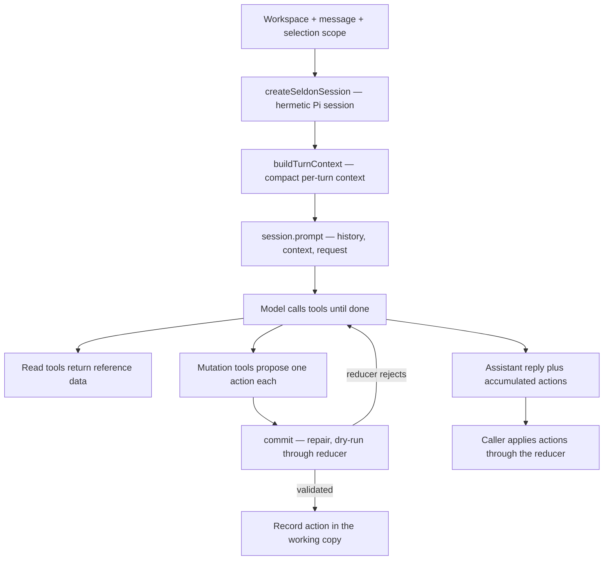

# Seldon · AI

Seldon AI explores turning a chat message into Seldon **workspace actions** with a local model. It reads a workspace for context, runs a tool-calling agent loop with [Pi](https://pi.dev) against a local model through Ollama, and returns a list of `WorkspaceAction` payloads. The editor applies those actions through the same reducer every gesture uses. Nothing leaves the machine, and the package never writes the workspace file itself.

Core owns the workspace and its rules. This package only reads a workspace and proposes actions.

---

## Requirements

The assistant talks to a local model, so two things must be in place before the chat palette works.

- **Ollama.** Install and run [Ollama](https://ollama.com). It serves the local model the agent calls. Without a running Ollama, the palette has nothing to talk to.
- **Pi packages.** Run `npm install` from the repo root. This pulls the Pi harness packages the agent is built on, `@earendil-works/pi-ai` and `@earendil-works/pi-coding-agent`.

Pull at least one model so the palette has something to run:

```bash
ollama pull gpt-oss:20b
```

Every model you pull into Ollama appears in the model menu in the chat palette. Pull more models to switch between them per turn, with no editor restart.

---

## Important

This package is in research mode. Everything here is exploratory and may change or be removed. Treat the entry points, prompts, and model choice as experiments, not stable API. Do not depend on it in production.

---

## What The Package Contains

The package groups a few parts that work together:

| Area | Role | Reference |
| --- | --- | --- |
| **Orchestration** | Run one chat turn from request to actions | [orchestrate.ts](./orchestrate.ts) |
| **Turn loop** | Stream one Pi turn and collect its actions | [pi/orchestrate.ts](./pi/orchestrate.ts) |
| **Session** | Build the hermetic Pi session and gate thinking | [pi/session.ts](./pi/session.ts) |
| **System prompt** | Hold the static rules for the agent | [pi/system-prompt.ts](./pi/system-prompt.ts) |
| **Editor context** | Build the per-turn editor context by scope | [pi/editor-context.ts](./pi/editor-context.ts) |
| **Tools** | Mutation and read tools the model calls | [pi/tools/](./pi/tools) |
| **Context sections** | Build the reusable context blocks | [prompt/context-sections/](./prompt/context-sections) |
| **Repair** | Fix common shape mistakes before validation | [repair/normalize-actions.ts](./repair/normalize-actions.ts) |
| **Action schema** | List the allowed actions and their payload specs | [schema/action-schema.ts](./schema/action-schema.ts) |
| **Model** | Resolve the local Ollama model for Pi | [pi/model.ts](./pi/model.ts) |

The package imports workspace types, catalogs, and compute from `@seldon/core`. It does not fork property or theme rules.

---

## Local Model

Pi targets a local Ollama model through its OpenAI-compatible endpoint at `http://127.0.0.1:11434/v1`. The endpoint needs no API key. The default model is `gpt-oss:20b`. Tool-calling on small models is the main open question, so a turn may need a larger model.

The chat palette lists every model present in Ollama. Pick one from the model menu to set the model for the next turn. The default model loads first when nothing is chosen.

Install [Ollama](https://ollama.com) and start it:

```bash
brew install ollama
ollama serve
```

On Linux, install Ollama with the official script instead of Homebrew:

```bash
curl -fsSL https://ollama.com/install.sh | sh
```

Pull each model you want to appear in the model menu:

```bash
ollama pull gpt-oss:20b
ollama pull qwen3:8b
```

---

### Environment variables

Pi reads these from `process.env` in [pi/model.ts](./pi/model.ts). An explicit call argument wins first, then the environment variable, then the default.

| Variable | Default | Purpose |
| --- | --- | --- |
| `SELDON_AI_MODEL` | `gpt-oss:20b` | Model id the agent requests |
| `OLLAMA_HOST` | `http://127.0.0.1:11434` | Base URL of the Ollama server |

The agent runs inside the editor dev server. Set a variable inline when you start it from the repo root with `npm run dev`:

```bash
# Use a larger model for one run
SELDON_AI_MODEL="qwen3:8b" npm run dev

# Point at Ollama on another machine
OLLAMA_HOST="http://192.168.1.20:11434" npm run dev
```

Export a variable to reuse it across every command in the shell session:

```bash
export SELDON_AI_MODEL="qwen3:8b"
npm run dev
```

---

## How Callers Use It

The entry point is `chatToActions`. It takes a workspace, a message, and the active board, and returns actions with a short reply.

```typescript
import { chatToActions } from "@seldon/ai"

const { actions, reply } = await chatToActions({
  workspace,
  message: "Make the title use the primary color",
  activeBoardKey,
})
```

`chatToActions` builds a hermetic Pi session with the Seldon tools, injects the per-turn editor context with the user request, and lets the model call tools until it is done. The caller applies the returned actions. This function never changes state.

---

## The Turn Loop

One turn runs through the Pi harness in [pi/orchestrate.ts](./pi/orchestrate.ts). It builds a session, sends one prompt, streams the model's output, and returns the actions the tools collected. The model drives the loop by calling tools. The harness only sets it up and records the result.



- **Session** is hermetic. [pi/session.ts](./pi/session.ts) turns off every file, skill, and extension tool, exposes only the Seldon tools, and runs the model in memory with compaction and retry off. The system prompt is a stable override, so its prefix stays cache-warm across turns.
- **Context** is built once per turn by scope. See [Selection Scope](#selection-scope).
- **Loop** is the model calling tools. Read tools return reference data. Mutation tools each propose one `WorkspaceAction`.
- **Commit** validates each proposed action. See [Working Copy And Validation](#working-copy-and-validation).
- **Return** hands back the accumulated actions and a short reply. The caller applies the actions through the reducer. The harness never writes state.

---

## Selection Scope

The editor classifies what the user selected into a `SelectionScope` and passes it in. Scope sets the harness's expected reach for the turn, so the context, the tool set, and the write default follow one explicit signal instead of guesswork from ids. The type lives in [types.ts](./types.ts).

| Scope | Context the model sees | Edit behavior |
| --- | --- | --- |
| `workspace` | Every board, walked shallow | Broad, cross-board edits, no permission ask |
| `board` | The selected board and its variants | Prefer the default variant or source so edits cascade |
| `variant` | The variant subtree | Global within the variant, `set_properties` scope `all` |
| `instance` | The selected node and its descendants | Local override, `set_properties` scope `instance` |
| `theme` | The selected theme entry or its board's entries | `set_theme_override` on token values |
| `fontCollection` | The selected collection or its board's entries | Font family and weight tools |
| `iconSet` | The selected set or its board's entries | Icon subcategory and single-icon tools |
| `media` | None | The agent does not edit media |

The context starts at the narrowest useful scope and stays small. An instance turn sees only the selected node's subtree, a variant turn only that variant's tree, and a board turn only that board. The model widens one level at a time when it needs more. See [Finding A Target](#finding-a-target).

---

## Context

The context is a small summary, not the full workspace file. It carries the node tree for the selection's scope with the ids to target, the settable values and value shapes for the selected component, the theme ids, and a scope directive that tells the model how edits behave this turn. The model needs identity and structure, not every property override.

Each part is one context section under [prompt/context-sections/](./prompt/context-sections). [pi/editor-context.ts](./pi/editor-context.ts) builds the compact per-turn context, and the read tools in [pi/tools/context/](./pi/tools/context) surface the larger sections on demand, one tool per file. A section drops out when it has nothing to say. Keeping the heavy lists behind tools keeps the prompt small and the system-prompt cache warm, so the model pulls only what a given edit needs.

---

## Finding A Target

The narrow context means the target is not always on screen. Two mechanisms widen the search without bloating every prompt.

- **`widen_scope`** climbs one level up the hierarchy. An instance widens to its parent, then the variant, then the board, then the whole workspace. A resource entry widens to its board's other entries, then the workspace. The model calls it when the current scope lacks the target.
- **Target resolution** in [pi/tools/resolve-target.ts](./pi/tools/resolve-target.ts) turns a target into a node id, or a single terminal directive when it cannot. A miss returns a clarification, a candidate list, a permission ask, or a not-found. The tool makes no edit on a directive, so a scope miss ends in one deterministic step instead of a re-search loop. Node search also matches a node's visible string values, so a request like "the ABC heading" can find the node by its text.

---

## Working Copy And Validation

The model never writes the workspace. All file tools are off, and each mutation tool only proposes a `WorkspaceAction`. The tools share one in-memory working copy seeded from the request workspace, in [pi/tools/turn-state.ts](./pi/tools/turn-state.ts).

`commit` in [pi/tools/mutations/commit.ts](./pi/tools/mutations/commit.ts) handles each proposed action:

1. Run the deterministic shape repair from [repair/normalize-actions.ts](./repair/normalize-actions.ts).
2. Dry-run the action against the working copy through the same reducer the editor uses.
3. On a reducer rejection, throw so Pi feeds the exact error text back to the model, which is how the model self-corrects.
4. On a validated action that changes nothing, report it without recording it, so the model retargets instead of the caller applying a no-op.
5. On a real change, advance the working copy and record the action.

The reducer validates every payload again when the editor applies the returned actions, so an invalid action never changes real state.

---

## Tools

Tools come in two groups, assembled per turn in [pi/tools/](./pi/tools), one tool per file. Read tools are always present. Mutation tools for a resource are gated to that resource's scope, plus workspace, so a node or board turn keeps a small schema.

**Mutation tools** propose actions from the curated subset in [schema/action-schema.ts](./schema/action-schema.ts).

| Tool | Proposes |
| --- | --- |
| `set_properties` | Property values on a node or its component source |
| `add_component` | Add a catalog component to the workspace as its own board |
| `insert_component` | Insert a catalog component under a parent, creating its board if needed |
| `insert_variant_instance` | Insert an instance of a specific existing variant |
| `duplicate_component` | Paste a copy under a parent, or duplicate a node in place |
| `move_component` | Relocate an instance under a new parent in the same variant |
| `reorder_component` | Reposition an instance among its siblings |
| `remove_instance` | Delete an instance |
| `set_board_label` | Rename a board |
| `apply_actions` | A batch of raw actions, the escape hatch for the long tail |
| `set_theme_override` | A theme token value |
| `set_font_collection_family_preset` / `set_font_collection_family_variant` | Toggle families and weights |
| `set_icon_set_subcategory_preset` / `set_icon_set_override` | Toggle a subcategory or a single icon |

**Read tools** surface reference data on demand.

| Tool | Returns |
| --- | --- |
| `get_active_board`, `get_selection`, `describe_node`, `get_node_properties`, `get_selection_ancestry` | The current board and selection detail |
| `widen_scope` | The next level up the hierarchy |
| `list_boards`, `find_nodes`, `board_summary` | Boards and nodes across the workspace |
| `get_component_vocabulary` | Settable properties and value shapes for a component |
| `list_theme_tokens`, `search_theme_tokens` | Theme token ids and paths |
| `search_icons` | Enabled icon ids for the symbol property |
| `list_catalog_ids` | Component catalog ids |
| `list_action_types`, `get_action_spec`, `suggest_action` | Action reference for `apply_actions` |

---

## Streaming, Metrics, And Warm-Up

The turn streams events as the model produces them, so the editor animates the reply instead of waiting for the whole turn. The `onEvent` callback on the input receives each `AgentStreamEvent`: `thinking` and `thinkingDone` for the reasoning pass, `text` for the reply, and `tool` and `toolResult` for each tool call. A `signal` on the input aborts the turn, which stops the local model instead of letting it finish in the background.

Each turn returns `AgentMetrics` for the log: total time, prompt and output tokens, output tokens per second, and `firstTokenMs`, the wall time before the first streamed event. `firstTokenMs` covers model load and prompt prefill, so it measures the gap before the UI shows anything.

`warmModel` loads the model and prefills the stable system prompt without running an edit, so the first real turn skips the cold load and reuses the cached prefix. The editor calls it when the chat palette opens.

---

## Thinking And Clamp

Some local models run a reasoning pass before the reply. [pi/model.ts](./pi/model.ts) knows which: the qwen3 family and gpt-oss support thinking, and other models treat the level as a no-op. The config endpoint offers levels from `minimal` to `xhigh`, and the chat palette picks one per turn.

Clamp forces the least reasoning a model supports for a turn. qwen3 reads the chat-template `enable_thinking` kwarg, so Clamp turns it fully off. gpt-oss always reasons over Ollama's endpoint and only takes an effort, so Clamp maps it to the lowest effort instead. Clamp is the editor's control for cutting overthinking on a direct edit.

---

## Further Reading

| Topic | Document |
| --- | --- |
| Core | [../core/README.md](../core/README.md) |
| Factory | [../factory/README.md](../factory/README.md) |
| Editor | [../editor/README.md](../editor/README.md) |
| Vocabulary | [GLOSSARY.md](../../GLOSSARY.md) |

---

## Licensing

Seldon is offered under the **PolyForm Noncommercial License 1.0.0** by default, with a separate commercial license for commercial use.

### 1. Noncommercial license

The default software license is the **PolyForm Noncommercial License 1.0.0**.

- You may use, copy, and modify this software for **noncommercial purposes** such as research, education, and personal projects.
- Commercial use is **not permitted** under this license.
- See [license/noncommercial/LICENSE.md](../../license/noncommercial/LICENSE.md) for the summary and link to the full PolyForm text.

### 2. Commercial license

Commercial use covers proprietary software, SaaS platforms, internal business tools, and use as training data for AI or LLMs. You need a **commercial license** for these.

The commercial license may grant:

- Use in commercial or for-profit contexts.
- Ability to create proprietary derivative works as stated in your agreement.
- Long-term support, security updates, and priority bug fixes if offered by the licensor.
- Optional custom terms negotiated with the licensor.

See [COMMERCIAL-LICENSE.md](../../license/commercial/COMMERCIAL-LICENSE.md).

### 3. Obtaining a commercial license

Contact:

- **Licensor:** Seldon Digital, B.V.
- **Email:** info@seldon.digital

### 4. Summary

| Use | Requirement |
| --- | --- |
| Noncommercial use | PolyForm Noncommercial License 1.0.0 |
| Commercial use | Paid commercial license |

---

## Links

- [Core](../core/README.md)
- [Factory](../factory/README.md)
- [Editor](../editor/README.md)
- [Official Website](https://seldon.digital)
- [Issues & Discussions](https://github.com/seldon/issues)

---

## Notice for AI and LLM Training

You may not use this software, or any derivative works of it, in whole or in part, for the purposes of training, fine-tuning, or otherwise improving (directly or indirectly) any machine learning or artificial intelligence system without written permission.
