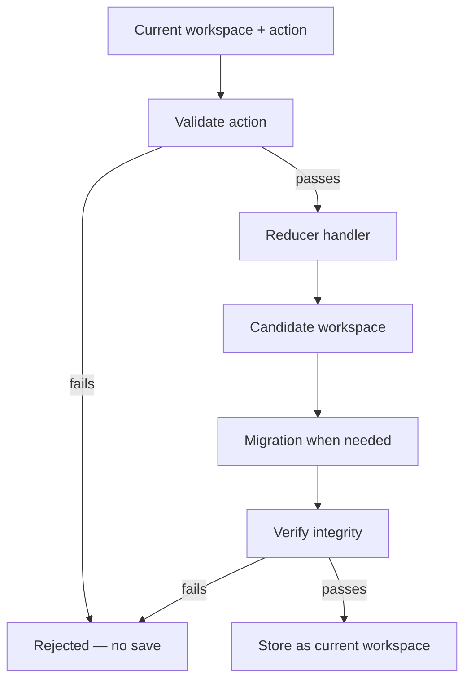

# Seldon · Core

Seldon Core is the kernel for component-based design systems. It ships the **catalog** of building blocks, the **property** and **theme** models those blocks use, and the **workspace** engine that stores and changes a design file. Editors, agents, and other tools load a workspace, apply typed **actions** through a reducer, and save JSON. When the design is ready, that workspace passes to **Factory** for React, CSS, and assets.

Core owns design-time state and rules. Factory owns export and production code generation.

---

## What Core Contains

Core groups four ideas that work together:

| Area | Role | Deep reference |
| --- | --- | --- |
| **Components** | Packaged schemas: identity, level, default properties, composition trees | [COMPONENTS.md](./components/COMPONENTS.md) |
| **Properties** | Typed style and behavior values, merge rules, compute | [PROPERTIES.md](./properties/PROPERTIES.md) |
| **Themes** | Design tokens components reference with `@` paths | [THEMES.md](./themes/THEMES.md) |
| **Workspace** | Serialized design file: boards, nodes, themes, resources | [WORKSPACE.md](./workspace/WORKSPACE.md) |

The **catalog** lives under `packages/core/` (component schemas, stock themes, font collections, icon sets, media). A workspace **points into** the catalog. It does not replace it. Default nodes and default themes always align with catalog structure. Customization happens through **variants**, **instances**, and **overrides**. See [WORKSPACE.md](./workspace/WORKSPACE.md) for the file shape and integrity rules.

---

## How Editors And Agents Use Core

An editor UI and an autonomous agent follow the same contract. Both hold a **workspace** object in memory, send **actions** to change it, and persist the result as JSON. Neither should patch workspace maps by hand outside the reducer.

### Load

1. Read a workspace JSON file or call `createEmptyWorkspace`.
2. Dispatch `set_workspace` (or run the reducer through middleware on open) so **migration** can upgrade `metadata.version` and normalize the file.
3. Keep the returned workspace as the current snapshot.

### Edit

Each user gesture or agent step becomes one **workspace action**: a `type` plus a `payload`. Examples include adding a component board, setting node property overrides, moving an instance, or editing a theme token.

```typescript
// Illustrative shape — see workspace/reducers/types.ts for the full union
{
  type: "set_node_properties",
  payload: {
    nodeId: "component-button-7f3a9c12",
    properties: {
      color: { type: "theme.categorical", value: "@swatch.primary" },
    },
  },
}
```

---

**Dispatch path**



- **Validation** runs before the handler. Illegal targets or broken rules throw before state changes.
- **Handlers** return a new workspace. They persist **raw** authoring data only: templates, overrides, tree refs. They do not write computed CSS or resolved colors back into the file.
- **Verification** scans ids, templates, and trees after the handler returns.

---

Editors, agents, and other tools all use the same contract: **`WorkspaceAction`** payloads and **`workspaceReducer`**. The editor usually dispatches one action per gesture. Callers with a list of changes use [`applyActions`](./workspace/reducers/apply-actions.ts) to fold them through the same reducer pipeline.

Action names and payloads are documented in [workspace/reducers/README.md](./workspace/reducers/README.md). Services under [workspace/services/](./workspace/services/) implement tree edits, propagation, and property writes that handlers call.

---

### Display values

The workspace file stores overrides and templates only. Panels and previews usually need **computed** values — what should actually render on screen.

Call Core compute and resolve helpers after you load or change workspace state. They merge catalog defaults, templates, themes, and computed property rules using the same types, guards, and validation as export.

Do not merge properties or resolve tokens on your own. You will drift from Core and break when schemas or themes change.

Start with [workspace/compute/README.md](./workspace/compute/README.md) for node and board property snapshots. Use [helpers/README.md](./helpers/README.md) when you need plain strings and numbers for CSS or UI controls.

### Save

Serialize the workspace object to JSON using the key order in [WORKSPACE.md](./workspace/WORKSPACE.md). That file is the handoff artifact for collaboration, version control, and Factory.

---

## The Four Pillars within Core at a Glance

### Components

A **component schema** is a static recipe: what properties exist, default values, and optional child trees. When a designer places a button, the workspace holds a **variant** or **instance** node that references that schema through `template: catalog:{ComponentId}` or `template: node:{nodeId}`.

Schemas define what is possible. The workspace records what was chosen. Hierarchy levels, frames, and composition rules are in [COMPONENTS.md](./components/COMPONENTS.md).

### Properties

Properties control appearance and behavior. Values use tagged **value types** such as `EMPTY`, `INHERIT`, `EXACT`, `OPTION`, `COMPUTED`, `THEME_CATEGORICAL`, and `THEME_ORDINAL`. Properties can be atomic, compound, shorthand, or layered paint stacks.

Only keys declared on a schema may be set for that component. **Overrides** on nodes store diffs from the template. Merge and path rules are in [PROPERTIES.md](./properties/PROPERTIES.md).

### Themes

A **theme** bundles tokens: color, type, spacing, looks, and more. Component properties reference tokens with paths like `@swatch.primary` or `@fontSize.medium`. Workspace theme entries use `template: catalog:{ThemeTemplateId}` or `template: theme:{themeId}` plus optional **overrides**.

Stock themes ship with Core. Workspace theme rows customize them. Full token tables and stock ids are in [THEMES.md](./themes/THEMES.md).

### Workspace

A **workspace** is one design file: `metadata`, `components` (catalog rows), `nodes`, `themes`, `font-collections`, `icon-sets`, and `media`. **Catalog rows** index boards. **Entry nodes** in `nodes` hold `type`, `template`, `theme`, and `overrides`. Variant trees on rows list child node ids; the flat `nodes` map holds each node's payload.

Precedence for styling: prefer **variant**-level edits when a change should flow to all instances. Use **instance** overrides only for one-off differences. Instance overrides win over variant values. Theme switching follows the same idea. Details and examples are in [WORKSPACE.md](./workspace/WORKSPACE.md).

---

## From Workspace To Factory

Factory consumes a **workspace** object and produces exportable files. The usual path:

1. Finish editing in Core (valid workspace after verification).
2. Run workspace and property **compute** so inheritance, themes, and `COMPUTED` cells are resolved.
3. Call `exportWorkspace` from `@seldon/factory` with target options (for example React plus CSS).

Factory builds style registries, discovers exportable variants, processes assets, and generates components. It does not mutate the workspace file. Pipeline detail lives in [../factory/README.md](../factory/README.md).

```typescript
import { exportWorkspace } from "@seldon/factory"

const files = await exportWorkspace(workspace, {
  target: { framework: "react", styles: "css-properties" },
  output: {
    componentsFolder: "/src/components",
    assetsFolder: "/public/assets",
    assetPublicPath: "/assets",
  },
})
```

---

## Further Reading

| Topic | Document |
| --- | --- |
| Vocabulary | [GLOSSARY.md](./GLOSSARY.md) |
| Workspace file spec | [WORKSPACE.md](./workspace/WORKSPACE.md) |
| Reducer actions | [workspace/reducers/README.md](./workspace/reducers/README.md) |
| Rules and propagation | [rules/README.md](./rules/README.md) |
| Code-oriented examples | [TECHNICAL.md](./TECHNICAL.md) |
| Factory export | [../factory/README.md](../factory/README.md) |

---

## Licensing

License and contributor documents live at the repository root under [`license/`](../../license/README.md). Links in this section resolve from `packages/core/` via `../../license/…`.

This project uses a **layered licensing model**:

- **Repository Access** → Paid fee to access the private GitHub repository. See [REPOSITORY-ACCESS.md](../../license/access/REPOSITORY-ACCESS.md)
- **Noncommercial Use** → Licensed under the [PolyForm Noncommercial License](../../license/noncommercial/LICENSE.md) after lawful access
- **Commercial Use** → Requires a separate paid license. See [Commercial License Options](../../license/commercial/COMMERCIAL-LICENSE-README.md)
- **Contributors** → Must follow [Contributing Guidelines](../../license/contributors/CONTRIBUTING.md) and sign the [Contributor License Agreement](../../license/contributors/CLA.md)

### Quick Links

- [License index](../../license/README.md)
- [Repository access terms](../../license/access/REPOSITORY-ACCESS.md)
- [Noncommercial License (default)](../../license/noncommercial/LICENSE.md)
- [Licensing overview](../../README.md#licensing-overview)
- [Commercial License – Overview](../../license/commercial/COMMERCIAL-LICENSE-README.md)
- [Commercial license terms (full text)](../../license/commercial/COMMERCIAL-LICENSE.md)
- [Commercial license short-form template](../../license/commercial/COMMERCIAL-LICENSE-SHORT-FORM.md)
- [Commercial license long-form template](../../license/commercial/COMMERCIAL-LICENSE-LONG-FORM.md)
- [CLA – Contributor License Agreement](../../license/contributors/CLA.md)
- [Official repository notice](../../license/NOTICE.md)

**Reminder:** Repository access does not grant commercial-use rights. If you use this software in a business, SaaS product, or any commercial context, you **must obtain a commercial license**.

---

## Links

- [COMPONENTS.md](./components/COMPONENTS.md)
- [PROPERTIES.md](./properties/PROPERTIES.md)
- [THEMES.md](./themes/THEMES.md)
- [WORKSPACE.md](./workspace/WORKSPACE.md)
- [Official Website](https://seldon.digital)
- [Documentation](https://docs.seldon.digital)
- [Issues & Discussions](https://github.com/seldon/issues)
