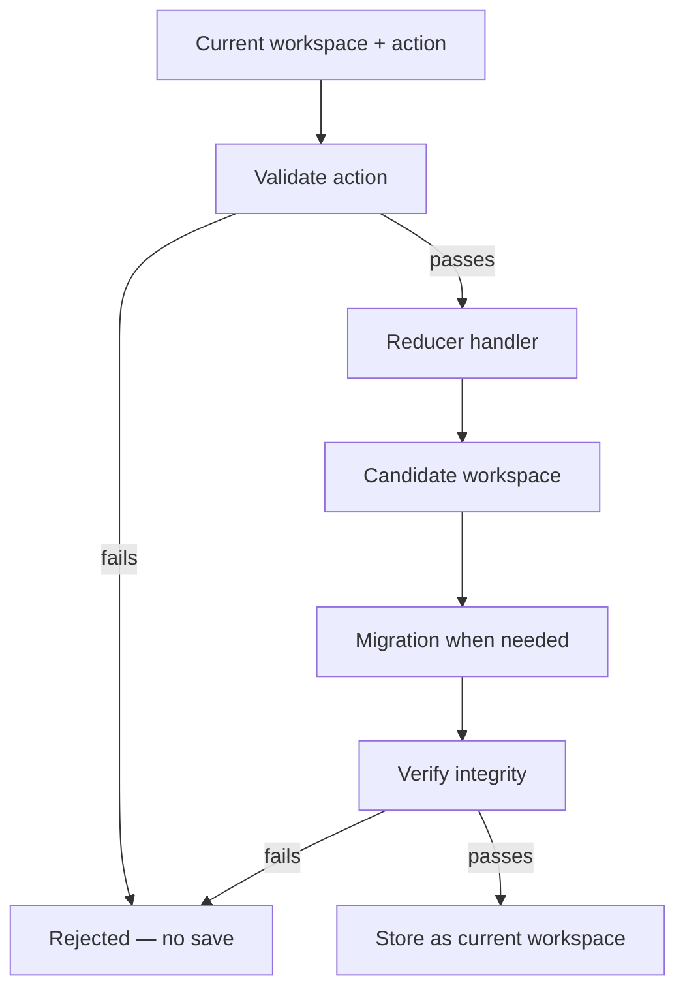

# Seldon · Core

Seldon Core is the engine for component-based design systems. It ships a **catalog** of building blocks, the **property** and **theme** models those blocks use, and the **workspace** engine that stores and changes a design file. Editors, agents, and other tools load a workspace, apply typed **actions** through a reducer, and save JSON. When the design is ready, that workspace passes to **Factory** for React, CSS, and asset generation.

Core owns design-time state and rules. Factory owns export and production code generation.

---

## What Core Contains

Core groups four ideas that work together:

| Area | Role | Deep reference |
| --- | --- | --- |
| **Components** | Packaged schemas: identity, level, default properties, composition trees | [components/README.md](./components/README.md) |
| **Properties** | Typed style and behavior values, merge rules, compute | [properties/README.md](./properties/README.md) |
| **Themes** | Design tokens components reference with `@` paths | [themes/README.md](./themes/README.md) |
| **Workspace** | Serialized design file: boards, nodes, themes, resources | [workspace/README.md](./workspace/README.md) |

The **catalog** lives under `packages/core/` as component schemas, stock themes, font collections, and icon sets. A workspace **points into** the catalog. It does not replace it. Default nodes and default themes always align with catalog structure. Customization happens through **variants**, **instances**, and **overrides**. See [workspace/README.md](./workspace/README.md) for the file shape and integrity rules.

---

## How Editors And Agents Use Core

An editor and an autonomous agent follow the same contract. Both hold a **workspace** object in memory, send **actions** to change it, and persist the result as JSON. Neither should patch workspace maps by hand outside the reducer.

### Load

1. Read a workspace JSON file or call `createEmptyWorkspace`.
2. Dispatch `set_workspace`, or run the reducer through middleware on open, so **migration** can upgrade `metadata.version` and normalize the file.
3. Keep the returned workspace as the current snapshot.

### Edit

Each user gesture or agent step becomes one **workspace action**: a `type` plus a `payload`. Examples include adding a component board, setting node property overrides, moving an instance, or editing a theme token.

```typescript
// Illustrative shape — see workspace/reducers/types.ts for the full union
{
  type: "set_node_properties",
  payload: {
    nodeId: "component-button-7f3a9c12",
    properties: {
      color: { type: "theme.categorical", value: "@swatch.primary" },
    },
  },
}
```

---

**Dispatch path**



- **Validation** runs before the handler. Illegal targets or broken rules throw before state changes.
- **Handlers** return a new workspace. They persist **raw** authoring data only: templates, overrides, tree refs. They do not write computed CSS or resolved colors back into the file.
- **Verification** scans ids, templates, and trees after the handler returns.

---

Editors, agents, and other tools all use the same contract: **`WorkspaceAction`** payloads and **`workspaceReducer`**. The editor usually dispatches one action per gesture. Callers with a list of changes use [`applyActions`](./workspace/reducers/apply-actions.ts) to fold them through the same reducer pipeline.

Action names and payloads are documented in [workspace/reducers/README.md](./workspace/reducers/README.md). Services under [workspace/services/](./workspace/services/) implement tree edits, propagation, and property writes that handlers call.

---

### Display values

The workspace file stores overrides and templates only. Panels and previews usually need **computed** values. These are the values that should render on screen.

Call Core compute and resolve helpers after you load or change workspace state. They merge catalog defaults, templates, themes, and computed property rules using the same types, guards, and validation as export.

Do not merge properties or resolve tokens on your own. You will drift from Core and break when schemas or themes change.

Start with the compute selectors under [workspace/compute/](./workspace/compute/) for node and board property snapshots. Use the modules under [helpers/](./helpers/) when you need plain strings and numbers for CSS or UI controls.

### Save

Serialize the workspace object to JSON using the key order in [workspace/README.md](./workspace/README.md). That file is the handoff artifact for collaboration, version control, and Factory.

---

## The Four Pillars within Core at a Glance

### Components

A **component schema** is a static recipe: what properties exist, default values, and optional child trees. When a designer places a button, the workspace holds a **variant** or **instance** node that references that schema through `template: catalog:{ComponentId}` or `template: node:{nodeId}`.

Schemas define what is possible. The workspace records what was chosen. Hierarchy levels, frames, and composition rules are in [components/README.md](./components/README.md).

### Properties

Properties control appearance and behavior. Values use tagged **value types** such as `EMPTY`, `INHERIT`, `EXACT`, `OPTION`, `COMPUTED`, `THEME_CATEGORICAL`, and `THEME_ORDINAL`. Properties can be atomic, compound, shorthand, or layered paint stacks.

Only keys declared on a schema may be set for that component. **Overrides** on nodes store diffs from the template. Merge and path rules are in [properties/README.md](./properties/README.md).

### Themes

A **theme** bundles tokens: color, type, spacing, looks, and more. Component properties reference tokens with paths like `@swatch.primary` or `@fontSize.medium`. Workspace theme entries use `template: catalog:{ThemeTemplateId}` or `template: theme:{themeId}` plus optional **overrides**.

Stock themes ship with Core. Workspace theme rows customize them. Full token tables and stock ids are in [themes/README.md](./themes/README.md).

### Workspace

A **workspace** is one design file: `metadata`, `boards` (catalog rows), `nodes`, `themes`, `font-collections`, `icon-sets`, and `media`. **Catalog rows** index boards. **Entry nodes** in `nodes` hold `type`, `template`, `theme`, and `overrides`. Variant trees on rows list child node ids. The flat `nodes` map holds each node's payload.

Precedence for styling: prefer **variant**-level edits when a change should flow to all instances. Use **instance** overrides only for one-off differences. Instance overrides win over variant values. Theme switching follows the same idea. Details and examples are in [workspace/README.md](./workspace/README.md).

---

## From Workspace To Factory

Factory consumes a **workspace** object and produces exportable files. The usual path:

1. Finish editing in Core so the workspace is valid after verification.
2. Run workspace and property **compute** so inheritance, themes, and `COMPUTED` cells are resolved.
3. Call `exportWorkspace` from `@seldon/factory` with target options such as React plus CSS.

Factory builds style registries, discovers exportable variants, processes assets, and generates components. It does not mutate the workspace file. Pipeline detail lives in [../factory/README.md](../factory/README.md).

```typescript
import { exportWorkspace } from "@seldon/factory/export/export-workspace"

const files = await exportWorkspace(workspace, {
  rootDirectory: "/path/to/repo",
  target: { framework: "react", styles: "css-properties" },
  output: {
    componentsFolder: "/src/components",
    assetsFolder: "/public/assets",
    assetPublicPath: "/assets",
  },
})
```

---

## Further Reading

| Topic | Document |
| --- | --- |
| Vocabulary | [GLOSSARY.md](../../GLOSSARY.md) |
| Workspace file spec | [workspace/README.md](./workspace/README.md) |
| Reducer actions | [workspace/reducers/README.md](./workspace/reducers/README.md) |
| Rules and propagation | [rules/README.md](./rules/README.md) |
| Factory | [../factory/README.md](../factory/README.md) |

---

## Licensing

Seldon is offered under the **PolyForm Noncommercial License 1.0.0** by default, with a separate commercial license for commercial use.

### 1. Noncommercial license

The default software license is the **PolyForm Noncommercial License 1.0.0**.

- You may use, copy, and modify this software for **noncommercial purposes** such as research, education, and personal projects.
- Commercial use is **not permitted** under this license.
- See [license/noncommercial/LICENSE.md](../../license/noncommercial/LICENSE.md) for the summary and link to the full PolyForm text.

### 2. Commercial license

Commercial use covers proprietary software, SaaS platforms, internal business tools, and use as training data for AI or LLMs. You need a **commercial license** for these.

The commercial license may grant:

- Use in commercial or for-profit contexts.
- Ability to create proprietary derivative works as stated in your agreement.
- Long-term support, security updates, and priority bug fixes if offered by the licensor.
- Optional custom terms negotiated with the licensor.

See [COMMERCIAL-LICENSE.md](../../license/commercial/COMMERCIAL-LICENSE.md).

### 3. Obtaining a commercial license

Contact:

- **Licensor:** Seldon Digital, B.V.
- **Email:** info@seldon.digital

### 4. Summary

| Use | Requirement |
| --- | --- |
| Noncommercial use | PolyForm Noncommercial License 1.0.0 |
| Commercial use | Paid commercial license |

---

## Links

- [Core](./README.md)
- [Factory](../factory/README.md)
- [Editor](../editor/README.md)
- [Official Website](https://seldon.digital)
- [Issues & Discussions](https://github.com/seldon/issues)

---

## Notice for AI and LLM Training

You may not use this software, or any derivative works of it, in whole or in part, for the purposes of training, fine-tuning, or otherwise improving (directly or indirectly) any machine learning or artificial intelligence system without written permission.
