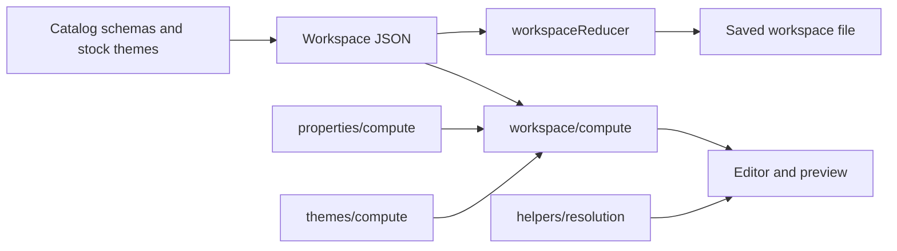

# Seldon Core (`@seldon/core`)

Seldon Core is the design-time kernel: the **catalog** of components, the **property** and **theme** models, and the **workspace** engine that stores and edits a design file. Editors and tools load workspace JSON, dispatch **actions** through a reducer, and read computed values for UI and export. Factory handles production export separately.

---

## Related Docs

- [`CORE.md`](./CORE.md)
- [`GLOSSARY.md`](./GLOSSARY.md)

---

## Major areas

| Area | Folder | README | Deep reference |
| --- | --- | --- | --- |
| Components | `components/` | [components/README.md](./components/README.md) | [COMPONENTS.md](./components/COMPONENTS.md) |
| Properties | `properties/` | [properties/README.md](./properties/README.md) | [PROPERTIES.md](./properties/PROPERTIES.md) |
| Themes | `themes/` | [themes/README.md](./themes/README.md) | [THEMES.md](./themes/THEMES.md) |
| Workspace | `workspace/` | [workspace/README.md](./workspace/README.md) | [WORKSPACE.md](./workspace/WORKSPACE.md) |
| Rules | `rules/` | [rules/README.md](./rules/README.md) | — |
| Helpers | `helpers/` | [helpers/README.md](./helpers/README.md) | — |

---

## Flow

---

## Package entry exports

| Type or Function | File | Purpose and use |
| --- | --- | --- |
| `Seldon.Constants` | `index.ts` | Merges component and property constants for the `Seldon` namespace. Used by callers that import `@seldon/core` as `Seldon`. |
| `Seldon.Values` | `index.ts` | Re-exports property value enums and helpers. Used alongside `Seldon.Constants` in editor and factory code. |
| `catalog` exports | `components/catalog.ts` | `getComponentSchema`, `getComponentExportConfig`, and catalog types. Re-exported from `index.ts`. |
| `properties` barrel | `properties/index.ts` | Property types, values, schemas, helpers, and named value enums. Re-exported from `index.ts`. |
| `workspace` types and services | `workspace/types`, `workspace/services` | Workspace shapes and mutation services. Re-exported from `index.ts`. |
| `workspace/compute` | `workspace/compute` | Theme and node property compute for selectors. Re-exported from `index.ts`. |
| `createEmptyWorkspace` | `workspace/helpers/create-empty-workspace.ts` | Builds a new empty workspace snapshot. Used on new file creation. |
| `ensureWorkspaceEditableThemeEntry` | `workspace/helpers/themes/workspace-editable-theme.ts` | Ensures the editable theme row exists. Used when opening or migrating workspaces. |

---

## Notes

- Import paths use `@seldon/core` and subpaths such as `@seldon/core/workspace/compute`.
- Licensing for this package is described in the [repository README](../../README.md#licensing-overview) and [license/](../../license/README.md).
