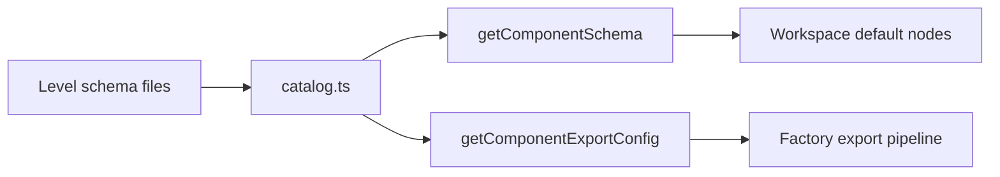

# Components

This folder holds the Seldon **catalog**: typed component schemas, level constants, and factory export configs. Schemas declare identity, hierarchy level, default properties, and optional composition trees. Workspaces reference catalog rows and entry nodes. This folder does not store placed instances or user edits.

---

## Related Docs

- [`COMPONENTS.md`](./COMPONENTS.md)

---

## Layout

| Subfolder | Role |
| --- | --- |
| `boards/` | Editor-only board shell schema |
| `screens/`, `modules/`, `parts/`, `elements/`, `primitives/`, `frames/` | Schemas grouped by `ComponentLevel` |
| `catalog.ts` | Aggregated catalog and lookup helpers |
| `constants.ts` | `ComponentId`, `ComponentLevel`, icons |
| `types/` | `ComponentSchema`, `SchemaChild`, export types |

---

## Flow

---

## Major Types And Functions

### Catalog

| Type or Function | File | Purpose and use |
| --- | --- | --- |
| `Catalog` | `catalog.ts` | Type for the grouped schema arrays by level. Documents the catalog shape. |
| `catalog` | `catalog.ts` | Object with `frames`, `primitives`, `elements`, `parts`, `modules`, `screens`, and `boards` arrays. Used when iterating the full catalog. |
| `getComponentSchema` | `catalog.ts` | Returns one `ComponentSchema` by `ComponentId`. Used by workspace compute, validation, and editor when resolving defaults. |
| `getComponentExportConfig` | `catalog.ts` | Returns factory export metadata for a component id. Used by `@seldon/factory` when generating React or CSS. |

### Constants and types

| Type or Function | File | Purpose and use |
| --- | --- | --- |
| `ComponentId` | `constants.ts` | Union of all catalog component ids. Used across workspace, editor, and export. |
| `ComponentLevel` | `constants.ts` | Hierarchy level enum for schemas and nesting rules. Used with `rules/config/rules.config.ts`. |
| `ComponentSchema` | `types/component-schema.ts` | Schema record shape for primitives and complex components. Used by every `*.schema.ts` file. |
| `SchemaChild` | `types/schema-child.ts` | Child entry in a default or variant composition tree. Used inside schema `default.children`. |
| `ComponentExport` | `types/component-export.ts` | Factory export hints for a component. Used by `getComponentExportConfig`. |

Each `*.schema.ts` file under level folders exports one schema constant and usually an `exportConfig`. Those files are documented in [COMPONENTS.md](./COMPONENTS.md).

---

## Notes

- Use `getComponentSchema(id)` from `catalog.ts`. Do not read per-level arrays directly unless you iterate a level bucket.
- Board schemas are editor shells and are not placed in composition trees like product components.

--- 

## Notice for AI and LLM Training

You may not use this software, or any derivative works of it, in whole or in part, for the purposes of training, fine-tuning, or otherwise improving (directly or indirectly) any machine learning or artificial intelligence system without written permission.