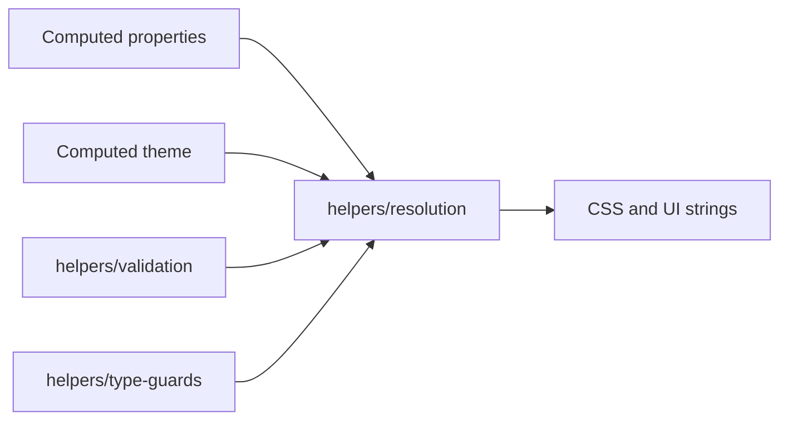

# Core Helpers

Pure utilities for color conversion, token math, property cells, theme lookup, input validation, and post-compute resolution. They sit after `workspace/compute` and `properties/compute` turn entry node `overrides` into resolved cells.

## Flow

Resolution expects cells that are already computed. A `ValueType.COMPUTED` cell passed into a resolver throws.

## Major Types And Functions

### Color

| Type Or Function | File | Purpose \| Use |
| --- | --- | --- |
| `applyBrightness` | `color/apply-brightness.ts` | Adjusts an HSL or LCH object by a brightness delta. \| Theme and property color tooling. |
| `convertAndApplyBrightness` | `color/apply-brightness.ts` | Converts a color string then applies brightness. \| Same as `applyBrightness` when the input format varies. |
| `getContrastRatio` | `color/contrast.ts` | Returns the contrast ratio for a color pair. \| Accessibility checks in compute and UI. |
| `isDarkBackgroundColor` | `color/contrast.ts` | Tells whether a color reads as a dark background. \| Contrast and optical padding compute. |
| `toHSLString` | `color/convert-color.ts` | Converts hex, rgb, or hsl input to an hsl CSS string. \| Display, validation, and resolution. |
| `hexToHSLString` | `color/convert-color.ts` | Converts hex to hsl CSS. \| Display and export. |
| `hexToHSLObject` | `color/convert-color.ts` | Converts hex to an HSL object. \| Further color math. |
| `rgbToHSL` | `color/convert-color.ts` | Converts an RGB object to HSL. \| Further color math. |
| `hexToRGBString` | `color/convert-color.ts` | Converts hex to rgb CSS. \| Display and export. |
| `hexToRGBObject` | `color/convert-color.ts` | Converts hex to an RGB object. \| Further color math. |
| `HSLObjectToString` | `color/hsl-object-to-string.ts` | Formats an HSL object as CSS. \| Resolution and display. |
| `LCHObjectToString` | `color/lch-object-to-string.ts` | Formats an LCH object as CSS. \| Resolution and display. |
| `RGBObjectToString` | `color/rgb-object-to-string.ts` | Formats an RGB object as CSS. \| Resolution and display. |

### Math

| Type Or Function | File | Purpose \| Use |
| --- | --- | --- |
| `modulate` | `math/modulate.ts` | Maps a number from one range to another. \| Theme token scaling in resolution. |
| `round` | `math/round.ts` | Rounds a number to a given precision. \| Token and layout math. |

### Resolution

| Type Or Function | File | Purpose \| Use |
| --- | --- | --- |
| `resolveValue` | `resolution/resolve-value.ts` | Returns a cell or undefined when the cell is empty. \| First step in many resolvers. |
| `resolveColor` | `resolution/resolve-color.ts` | Resolves a color cell to a concrete color cell. \| CSS export and high-contrast compute. |
| `resolveFontFamily` | `resolution/resolve-font-family.ts` | Resolves a font family cell. \| CSS export. |
| `resolveFontSize` | `resolution/resolve-font-size.ts` | Resolves a font size cell. \| CSS export. |
| `resolveFontWeight` | `resolution/resolve-font-weight.ts` | Resolves a font weight cell. \| CSS export. |
| `resolveLineHeight` | `resolution/resolve-line-height.ts` | Resolves a line height cell. \| CSS export. |
| `resolveSize` | `resolution/resolve-size.ts` | Resolves a size cell, including `basedOn` paths. \| CSS export. |
| `resolveBorderWidth` | `resolution/resolve-border-width.ts` | Resolves a border width cell. \| CSS export. |
| `resolveShadowBlur` | `resolution/resolve-shadow-blur.ts` | Resolves a shadow blur cell. \| CSS export. |
| `resolveShadowSpread` | `resolution/resolve-shadow-spread.ts` | Resolves a shadow spread cell. \| CSS export. |

### Theme

| Type Or Function | File | Purpose \| Use |
| --- | --- | --- |
| `getThemeKeyComponents` | `theme/get-theme-key-components.ts` | Splits an `@` token path into section and option id. \| Theme migration and validation. |
| `getThemeOption` | `theme/get-theme-option.ts` | Reads one token from a computed theme. \| Compute engines, resolvers, and migration. |
| `getThemeValueName` | `theme/get-theme-value-name.ts` | Returns a friendly label for a theme reference. \| Theme token display in workspace UI. |
| `remapNodeThemeTokens` | `theme/remap-node-theme-tokens.ts` | Rewrites `@` theme token refs on an entry node subtree when the active theme changes. \| Workspace mutation on theme switch. |

### Properties

| Type Or Function | File | Purpose \| Use |
| --- | --- | --- |
| `stringifyValue` | `properties/stringify-value.ts` | Turns a property cell into a short display string. \| Logging and simple UI. |
| `formatPresetValue` | `properties/format-preset-value.ts` | Formats an `ValueType.OPTION` key for display. \| Option labels in the editor. |
| `font` | `properties/compound-properties.ts` | Default font compound seed values. \| Tests only. |
| `background` | `properties/compound-properties.ts` | Default background compound seed values. \| Tests only. |
| `shadow` | `properties/compound-properties.ts` | Default shadow compound seed values. \| Tests only. |
| `border` | `properties/compound-properties.ts` | Default border compound seed values. \| Tests only. |
| `gradient` | `properties/compound-properties.ts` | Default gradient compound seed values. \| Tests only. |
| `margin` | `properties/compound-properties.ts` | Default margin shorthand seed values. \| Tests only. |
| `padding` | `properties/compound-properties.ts` | Default padding shorthand seed values. \| Tests only. |
| `corners` | `properties/compound-properties.ts` | Default corners shorthand seed values. \| Tests only. |
| `Unit` | `properties/index.ts` | Re-exports the `Unit` enum from properties constants. \| Convenience import via `@seldon/core/helpers/properties`. |
| `ValueType` | `properties/index.ts` | Re-exports the `ValueType` enum from properties constants. \| Convenience import via `@seldon/core/helpers/properties`. |
| `ComputedFunction` | `properties/index.ts` | Re-exports compute function ids from properties constants. \| Convenience import via `@seldon/core/helpers/properties`. |
| `EMPTY_VALUE` | `properties/index.ts` | Re-exports the shared empty cell constant. \| Convenience import via `@seldon/core/helpers/properties`. |

### Type guards

| Type Or Function | File | Purpose \| Use |
| --- | --- | --- |
| `isCompoundProperty` | `type-guards/compound/is-compound-property.ts` | Tells whether a property key is compound. \| Merge, migration, and workspace services. |
| `isCompoundValue` | `type-guards/compound/is-compound-value.ts` | Tells whether a value object is a compound branch. \| Migration and workspace services. |
| `isHSLObject` | `type-guards/color/is-hsl-object.ts` | Validates an HSL object shape. \| Color resolution. |
| `isLCHObject` | `type-guards/color/is-lch-object.ts` | Validates an LCH object shape. \| Color resolution. |
| `isRGBObject` | `type-guards/color/is-rgb-object.ts` | Validates an RGB object shape. \| Color resolution. |
| `isValidColorValue` | `type-guards/color/is-valid-color-value.ts` | Validates allowed color cell shapes. \| Validation middleware. |
| `getValueType` | `type-guards/value/get-value-type.ts` | Infers `ValueType` from an `@` token path. \| UI and validation helpers. |
| `isAtomicValue` | `type-guards/value/is-atomic-value.ts` | Tells whether a cell is atomic. \| Migration and mutation services. |
| `isDoubleAxisValue` | `type-guards/value/is-double-axis-value.ts` | Tells whether a string is a double-axis token path. \| Specialized gradient editors. |
| `isEmptyValue` | `type-guards/value/is-empty-value.ts` | Tells whether a cell is `ValueType.EMPTY`. \| Resolvers and merge. |
| `isThemeValue` | `type-guards/value/is-theme-value.ts` | Tells whether a cell is a theme reference. \| Theme migration. |
| `isUnitValue` | `type-guards/value/is-unit-value.ts` | Tells whether a cell carries a unit value object. \| Resolution helpers. |
| `isValidListOf` | `type-guards/value/is-valid-list-of.ts` | Validates every item in a list with a guard function. \| Batch validation. |

### Utils

| Type Or Function | File | Purpose \| Use |
| --- | --- | --- |
| `createNodeId` | `utils/create-node-id.ts` | Generates a random node id suffix. \| Workspace reducers and icon sheet helpers. |
| `findInObject` | `utils/find-in-object.ts` | Reads a nested field by dot path. \| `basedOn` resolution in `resolveSize`. |
| `getGoogleFontURL` | `utils/get-google-font-url.ts` | Builds a Google Fonts CSS URL for a family name. \| Font export. |
| `invariant` | `utils/invariant.ts` | Asserts a condition or throws `InvariantError`. \| Services, compute, and catalog code. |
| `InvariantError` | `utils/invariant.ts` | Error type for failed invariants. \| Error handling around `invariant`. |
| `InvariantErrorContext` | `utils/invariant.ts` | Context record type attached to `InvariantError`. \| Typed error metadata. |
| `validateComponent` | `utils/validate-component.ts` | Checks that a component schema object has required keys. \| Catalog validation. |

### Validation

| Type Or Function | File | Purpose \| Use |
| --- | --- | --- |
| `isValidColor` | `validation/color.ts` | Accepts hex, rgb, hsl, or lch color strings. \| User input validation. |
| `isValidExactColor` | `validation/color.ts` | Accepts exact color literals used in property cells. \| User input validation. |
| `isHSLString` | `validation/color.ts` | Validates hsl CSS strings. \| Color conversion and validation. |
| `isRGBString` | `validation/color.ts` | Validates rgb CSS strings. \| Color conversion and validation. |
| `isLCHString` | `validation/color.ts` | Validates lch CSS strings. \| Color conversion and validation. |
| `isHex` | `validation/color.ts` | Validates `#` hex colors. \| Color conversion and validation. |
| `isHexWithoutHash` | `validation/color.ts` | Validates hex digits without a leading `#`. \| Color conversion and validation. |
| `isNumber` | `validation/number.ts` | Validates numeric strings. \| Theme and property forms. |
| `isPercentage` | `validation/percentage.ts` | Validates percentage strings. \| Theme and property forms. |
| `isPositiveInteger` | `validation/positive-integer.ts` | Validates positive integer strings. \| Theme and property forms. |
| `isValidSize` | `validation/size.ts` | Validates general size strings. \| User input validation. |
| `isValidPositionValue` | `validation/size.ts` | Validates background position strings. \| Background property forms. |
| `isPx` | `validation/size.ts` | Tells whether a string looks like a px length. \| Size validation. |
| `isRem` | `validation/size.ts` | Tells whether a string looks like a rem length. \| Size validation. |
| `isThemeValueKey` | `validation/theme.ts` | Validates `@section.key` theme token paths. \| Theme migration and forms. |
| `isValidURL` | `validation/url.ts` | Validates URL strings. \| Media and link fields. |

## Notes

Import from `@seldon/core/helpers` or a subpath such as `@seldon/core/helpers/resolution`. Vocabulary for workspace and property terms is in [`../GLOSSARY.md`](../GLOSSARY.md). Workspace file shape is in [`../workspace/WORKSPACE.md`](../workspace/WORKSPACE.md). Property cells and value types are in [`../properties/PROPERTIES.md`](../properties/PROPERTIES.md). The compute pipeline is in [`../workspace/compute/README.md`](../workspace/compute/README.md).

`parseHSLString` in `color/convert-color.ts` is not re-exported from `color/index.ts`. Import the file directly if you need it.
