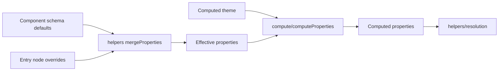

# Properties

This folder defines how component **properties** are typed, merged, validated, and computed. Property cells use tagged `ValueType` values. Theme references use `@` paths. Workspace entry nodes store overrides. Compute merges schema defaults, templates, themes, and overrides into effective and computed snapshots.

---

## Related Docs

- [`PROPERTIES.md`](./PROPERTIES.md)

---

## Layout

| Subfolder | README | Role |
| --- | --- | --- |
| `types/` | [types/README.md](./types/README.md) | Property keys and TypeScript shapes |
| `values/` | [values/README.md](./values/README.md) | Tagged value modules per property family |
| `constants/` | [constants/README.md](./constants/README.md) | `ValueType`, compound metadata, display order |
| `schemas/` | [schemas/README.md](./schemas/README.md) | Property schema catalog for UI and validation |
| `helpers/` | [helpers/README.md](./helpers/README.md) | Merge, path lookup, preset helpers |
| `compute/` | [compute/README.md](./compute/README.md) | `computeProperties` and compute engines |

---

## Flow

---

## Major entry points

| Type or Function | File | Purpose and use |
| --- | --- | --- |
| `properties` barrel | `index.ts` | Re-exports constants, types, values, schemas, and helpers. Main import for property types outside compute. |
| Named value enums | `index.ts` | Re-exports such as `Display`, `Color`, `BorderStyle` from `values/`. Used by editor controls and tests. |
| `computeProperties` | `compute/` | Resolves `COMPUTED` cells and theme refs. Used by workspace compute and factory. See [compute/README.md](./compute/README.md). |
| `mergeProperties` | `helpers/` | Merges two property snapshots. Used by reducers and effective-property paths. |

---

## Notes

- Saved workspace files store raw overrides only. Computed results are not persisted.
- Full property inventory and merge rules live in [PROPERTIES.md](./PROPERTIES.md).
