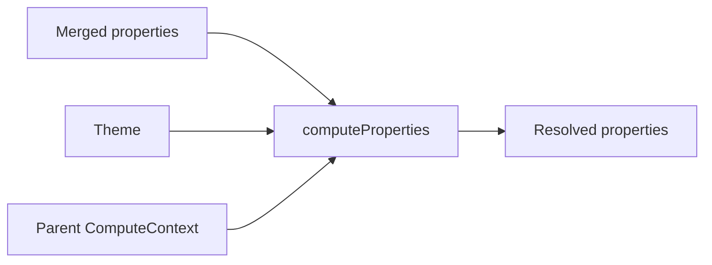

# Compute

This folder resolves `ValueType.COMPUTED` cells on an already-merged `Properties` object. Engines read the current node, an optional parent chain, and a theme. Output keeps the same keys with computed slots replaced by concrete tagged values.

---

## Flow

## Major Types And Functions

| Type or Function | File | Purpose and use |
| --- | --- | --- |
| `computeProperties` | `compute-properties.ts` | Walks one properties object and resolves every computed cell. Low-level pass after merge when context is already built. |
| `getBasedOnValue` | `get-based-on-value.ts` | Resolves one `basedOn` path to a primitive tagged value. Shared input lookup for all compute engines. |
| `computeAutoFit` | `compute-auto-fit.ts` | Scales a numeric or theme ordinal input by `factor`. Dispatched from `computeProperties` for `ComputedFunction.AUTO_FIT`. |
| `AUTO_FIT_DISPLAY_NAME` | `compute-auto-fit.ts` | Editor label for auto fit. Entry in `COMPUTED_FUNCTION_DISPLAY_NAMES`. |
| `computeHighContrastColor` | `compute-high-contrast-color.ts` | Picks a readable foreground swatch against a background color. Dispatched for `ComputedFunction.HIGH_CONTRAST_COLOR`. |
| `HIGH_CONTRAST_COLOR_DISPLAY_NAME` | `compute-high-contrast-color.ts` | Editor label for high contrast color. Entry in `COMPUTED_FUNCTION_DISPLAY_NAMES`. |
| `computeOpticalPadding` | `compute-optical-padding.ts` | Maps an input through side-specific ratios and `factor`. Dispatched for `ComputedFunction.OPTICAL_PADDING`. |
| `OPTICAL_PADDING_DISPLAY_NAME` | `compute-optical-padding.ts` | Editor label for optical padding. Entry in `COMPUTED_FUNCTION_DISPLAY_NAMES`. |
| `computeMatch` | `compute-match.ts` | Returns the resolved primitive at `basedOn`. Dispatched for `ComputedFunction.MATCH`. |
| `MATCH_DISPLAY_NAME` | `compute-match.ts` | Editor label for match. Entry in `COMPUTED_FUNCTION_DISPLAY_NAMES`. |
| `COMPUTED_FUNCTION_DISPLAY_NAMES` | `index.ts` | Maps each `ComputedFunction` to its editor label. Computed property pickers in the UI. |
| `ComputeContext` | `types.ts` | Holds node properties, theme, and optional parent context. Argument to every compute engine. |
| `ComputeKeys` | `types.ts` | Names the property key and optional facet for dispatch. Optical padding reads `subPropertyKey` for side ratios. |
| `computeLayeredPaintStack` | `compute-layered-paint.ts` | Resolves computed facets on each paint layer in order. Called from `computeProperties` for background and shadow arrays. |
| `DispatchComputedFn` | `compute-layered-paint.ts` | Function type for delegating one computed cell to an engine. Internal typing for layered paint traversal. |

---

## Notes

- Import from `@seldon/core/properties/compute` or `@seldon/core`. The main `properties` barrel omits compute to avoid import cycles.
- Workspace-aware merge and compute live in `computeNodeProperties` at `@seldon/core/workspace/compute`. That function builds parent context, merges template and overrides, then calls `computeProperties`. Results stay in memory and are not written to the workspace file.
- `basedOn` paths use `#` for the current node and `#parent.` for the immediate parent. Runtime paths use dot segments such as `background.0.color`.
- When a `#parent.` path resolves to a missing path, `EMPTY`, `INHERIT`, or explicit `transparent`, `getBasedOnValue` walks up the parent chain until a contributing value appears.
- `computeHighContrastColor` falls back to a pure white reference surface when its `basedOn` path cannot be resolved or resolves to an empty or transparent color. A root node with no parent context computes against white and returns the theme black swatch.
- Pass `{ stage: "effective" }` to `computeNodeProperties` to stop after merge and before computed resolution. The properties UI uses that mode for editor status.
- Pass `{ rootParentFallback: "board" }` to `computeNodeProperties` or `getNodeComputeContext` to make a node without a composition parent resolve `#parent.*` paths against its owning board. The editor canvas opts in. Export leaves this off, so exported CSS never depends on board styling.

---

## Related Docs

- [`README.md`](../README.md)
