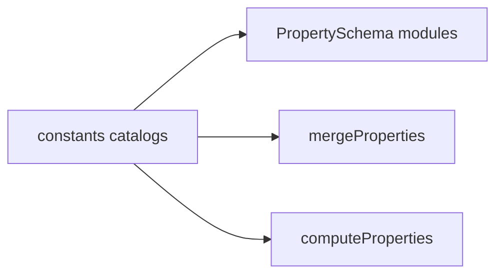

# Constants

This folder holds shared enums and catalogs for the property system. It defines wire `ValueType` strings, measurement units, computed function ids, compound and shorthand parent lists, and editor display ordering.

---

## Flow

## Major Types And Functions

### Wire enums and sentinels

| Type or Function | File | Purpose and use |
| --- | --- | --- |
| `ValueType` | `shared/value-types.ts` | Enum of wire storage type strings on property cells. Tagged values in workspace JSON and merge logic. |
| `Unit` | `shared/units.ts` | Enum of unit suffixes for measured numbers. Exact value payloads and schema `units` metadata. |
| `ComputedFunction` | `shared/computed.ts` | Enum of compute engine ids stored on computed cells. `ValueType.COMPUTED` payloads and compute dispatch. |
| `EMPTY_VALUE` | `shared/empty.ts` | Shared empty cell object. Default unset cells and merge skip rules. |

### Compound and shorthand catalogs

| Type or Function | File | Purpose and use |
| --- | --- | --- |
| `PROPERTY_COMPOUND_CATALOG` | `shared/compound-properties.ts` | Ordered list of compound parents with `nodeStorage` metadata. Classifies facet maps versus layered paint stacks. |
| `PropertyCompoundCatalogEntry` | `shared/compound-properties.ts` | Type of one compound catalog row. Typing for catalog entries and filters. |
| `PropertyCompoundCatalogKey` | `shared/compound-properties.ts` | Union of compound parent key strings. Runtime checks against compound keys. |
| `isCompoundCatalogProperty` | `shared/compound-properties.ts` | Returns true when a key is a compound catalog parent. Used by `getPropertyCategory` and path helpers. |
| `PROPERTY_SHORTHAND_KEYS` | `shared/shorthand-properties.ts` | List of shorthand parent keys. Marks margin, padding, corners, and position shorthands. |
| `PropertyShorthandCatalogKey` | `shared/shorthand-properties.ts` | Union of shorthand parent key strings. Runtime shorthand key typing. |
| `isShorthandCatalogProperty` | `shared/shorthand-properties.ts` | Returns true when a key is a shorthand parent. Used by `getPropertyCategory` before compound checks. |

### Editor display

| Type or Function | File | Purpose and use |
| --- | --- | --- |
| `PropertyDisplayCategory` | `property-display.ts` | Const object and type union of panel category ids. Groups properties in the inspector and types section metadata. |
| `PROPERTY_DISPLAY_ORDER` | `property-display.ts` | Ordered blocks of catalog keys per panel category. Source order for `PROPERTY_SCHEMAS` and sections. |
| `PropertyDisplayMeta` | `property-display.ts` | Display category and sort index attached to a schema. Merged onto each `PropertySchema` entry. |
| `PROPERTY_DISPLAY_META` | `property-display.ts` | Lookup of display metadata by flattened catalog key. Attached when building `PROPERTY_SCHEMAS`. |
| `attachPropertyDisplayMetadata` | `property-display.ts` | Adds display category and order to a schema map. Called when assembling `PROPERTY_SCHEMAS`. |
| `NODE_FIELD_DISPLAY_ORDER` | `property-display.ts` | Order of leading node-entry fields shown before the property rows: `theme` then `reference`. These are node metadata, not `Properties` keys. |

### Typography assets

| Type or Function | File | Purpose and use |
| --- | --- | --- |
| `GoogleFontFamily` | `typography/font-families.ts` | Shape of one bundled Google font family record. Font family pickers and export font lists. |
| `GOOGLE_FONT_FAMILIES` | `typography/font-families.ts` | List of bundled Google font families. Default font options in typography properties. |

---

## Notes

- `background` and `shadow` use `nodeStorage: "layered"` in `PROPERTY_COMPOUND_CATALOG`. Other compounds use `nodeStorage: "facets"`.
- `position` is listed in `PROPERTY_SHORTHAND_KEYS` but stores a facet map like margin and padding.

---

## Related Docs

- [`README.md`](../README.md)
