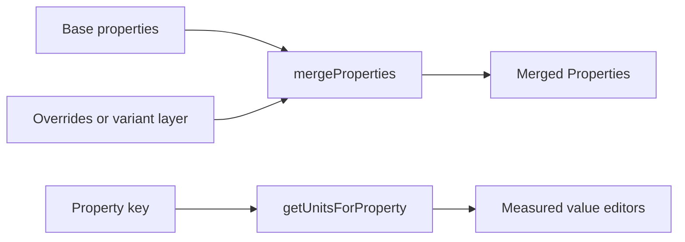

# Helpers

This folder provides merge and unit helpers for property snapshots. `mergeProperties` combines template data with overrides. Unit helpers read schema metadata for measured values.

---

## Flow

## Major Types And Functions

| Type or Function | File | Purpose and use |
| --- | --- | --- |
| `mergeProperties` | `merge-properties.ts` | Layers one `Properties` object onto another with optional facet and paint-slot merging. Workspace merge, variant layering, and schema default combination. |
| `getUnitsForProperty` | `unit-utils.ts` | Lists allowed unit suffixes for a property key or facet path. Property editors when inserting measured values. |
| `getDefaultUnitForProperty` | `unit-utils.ts` | Returns the default unit for a measured property. New exact values in the inspector. |
| `getNumberValidation` | `unit-utils.ts` | Returns whether input allows numbers, percentages, or both. Numeric field validation in the editor. |

---

## Notes

- `mergeProperties` skips patch cells with `ValueType.EMPTY` so base or catalog defaults can show through.
- Paint stacks merge by array index when `mergeSubProperties` is true. Object facet maps merge field by field.
- Unit helpers resolve dotted paths through `getCompoundSubPropertySchema` before reading `PropertySchema.units`.

---

## Related Docs

- [`PROPERTIES.md`](../PROPERTIES.md)
