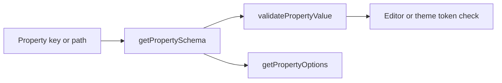

# Schemas

This folder holds the flattened property schema catalog, inspector section grouping, and lookup helpers. Each `PropertySchema` drives validation, picker data, and optional unit rules for one catalog key.

---

## Flow

## Major Types And Functions

### Catalog and sections

| Type or Function | File | Purpose and use |
| --- | --- | --- |
| `PROPERTY_SCHEMAS` | `data/property-schemas.ts` | Flat map from catalog key to merged `PropertySchema`. Primary registry for validation and pickers. |
| `PropertyName` | `data/property-schemas.ts` | Union of keys in `PROPERTY_SCHEMAS`. Typing for catalog lookups. |
| `PropertySectionSchema` | `sections.ts` | One inspector panel section with ordered catalog keys. Describes Attributes, Layout, and other blocks. |
| `PROPERTY_SECTIONS` | `sections.ts` | Ordered list of panel sections from `PROPERTY_DISPLAY_ORDER`. Inspector navigation and section APIs. |
| `getAllPropertySectionSchemas` | `sections.ts` | Returns all sections sorted by `order`. Lists every inspector block. |

### Lookup and category

| Type or Function | File | Purpose and use |
| --- | --- | --- |
| `getPropertySchema` | `helpers/get-property-schema.ts` | Returns one schema by flattened catalog key. Validation, pickers, and unit helpers. |
| `PropertyCategory` | `helpers/property-category.ts` | Union of `atomic`, `compound`, and `shorthand`. Classifies storage shape for a top-level key. |
| `getPropertyCategory` | `helpers/property-category.ts` | Returns atomic, compound, or shorthand for a key. Merge, compute, and UI branching. |
| `getCompoundSubPropertySchema` | `helpers/property-category.ts` | Resolves a schema for a compound facet and returns joined catalog key. Dot-path editors and `borderColor`-style keys. |

### Paths and wire typing

| Type or Function | File | Purpose and use |
| --- | --- | --- |
| `getCatalogKeyForPropertyPath` | `helpers/property-path.ts` | Maps a dot or bracket path to one flattened catalog key. Path-based validation and picker routing. |
| `joinCompoundFacetKey` | `helpers/property-path.ts` | Flattens a compound facet to its catalog key, such as `border` plus `color` to `borderColor`. |

### Options and validation

| Type or Function | File | Purpose and use |
| --- | --- | --- |
| `getPropertyOptions` | `helpers/property-options.ts` | Lists allowed values for one storage shape on a property. Inspector pickers for option and theme types. |
| `getPresetOptions` | `helpers/property-options.ts` | Lists `ValueType.OPTION` choices for a property. Option pickers on property fields. |
| `getPresetOptionsAsLabelValue` | `helpers/property-options.ts` | Returns preset options as label-value pairs for UI. Dropdown rendering in the editor. |
| `validatePropertyValue` | `helpers/validate-property-value.ts` | Runs the schema validator for one key, storage shape, and payload. Editor saves and theme token checks. |
| `isThemeTokenFiniteNumber` | `helpers/shared/theme-token-atomic-validators.ts` | Validates finite numeric theme token payloads. Theme schema validation delegates here. |
| `isThemeTokenPercentageNumber` | `helpers/shared/theme-token-atomic-validators.ts` | Validates percentage numeric theme token payloads. Theme token exact validators. |
| `isThemeTokenBoolean` | `helpers/shared/theme-token-atomic-validators.ts` | Validates boolean theme token payloads. Theme token exact validators. |
| `isThemeTokenText` | `helpers/shared/theme-token-atomic-validators.ts` | Validates text theme token payloads. Theme token exact validators. |
| `isThemeTokenColor` | `helpers/shared/theme-token-atomic-validators.ts` | Validates color theme token payloads. Theme token exact validators. |
| `isThemeTokenEnumValue` | `helpers/shared/theme-token-atomic-validators.ts` | Validates enum theme token payloads against allowed keys. Theme token option validators. |
| `isThemeTokenPxRemLength` | `helpers/shared/theme-token-atomic-validators.ts` | Validates px or rem length theme token payloads. Theme size and spacing validators. |

---

## Notes

- Node paths use dot form such as `border.color`. The registry uses joined keys such as `borderColor`.
- `PropertyValueType` uses camelCase. Stored cells use wire strings such as `theme.categorical` on `ValueType`.
- Schema callback `presetOptions` lists `ValueType.OPTION` choices. Compound facet key `preset` holds theme LOOK references and is unrelated.
- Theme token schemas with `propertyKey` bridge into this catalog through `resolveThemeTokenSchema` in `@seldon/core/themes/schemas`.

---

## Related Docs

- [`README.md`](../README.md)
