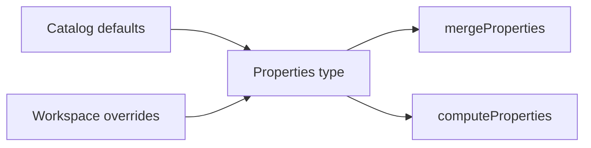

# Types

This folder defines TypeScript contracts for node `Properties`. It covers the document shape, path unions, tagged value unions, and `PropertySchema` metadata types. Workspace entries store overrides against these shapes. Merge, schema lookup, and compute read the same types.

---

## Flow

## Major Types And Functions

### Document and paths

| Type or Function             | File               | Purpose and use                                                                                                     |
| ---------------------------- | ------------------ | ------------------------------------------------------------------------------------------------------------------- |
| `Properties`                 | `properties.ts`    | Partial map of top-level property keys to stored cells. Typed shape for workspace overrides and merged node state.  |
| `PropertyKey`                | `property-keys.ts` | Union of every top-level key on `Properties`. Runtime checks and compute context property keys.                     |
| `BorderSideCompoundKey`      | `property-keys.ts` | Union of border compound keys that repeat the full facet set. Classifies border-side storage for merge and compute. |
| `ShorthandPropertyKey`       | `property-keys.ts` | Union of `margin`, `padding`, and `corners`. Identifies shorthand parents in catalog and walkers.                   |
| `ObjectFacetPropertyKey`     | `property-keys.ts` | Keys whose node value is a flat facet object. Drives facet-by-facet merge and compute traversal.                    |
| `OBJECT_FACET_PROPERTY_KEYS` | `property-keys.ts` | Set of object-facet property keys. Shared guard used by merge and compute.                                          |
| `isObjectFacetMapProperty`   | `property-keys.ts` | Returns true when a key uses flat facet map storage. Called before object spread merge or facet walks.              |
| `CompoundSubPropertyKey`     | `property-keys.ts` | Allowed facet names under compounds and paint layers. Types sub-keys for schema and path helpers.                   |
| `ShorthandSubPropertyKey`    | `property-keys.ts` | Allowed side or corner names under shorthands. Types margin, padding, and corners facets.                           |
| `SubPropertyKey`             | `property-keys.ts` | Union of compound and shorthand facet names. Used by `ComputeKeys` and editor path typing.                          |
| `LayeredPaintKey`            | `property-keys.ts` | Union of `background`, `gradient`, and `shadow`. Marks ordered paint stacks on nodes.                               |
| `LAYERED_PAINT_KEYS`         | `property-keys.ts` | Set of layered paint top-level keys. Shared guard for array merge and compute.                                      |
| `isLayeredPaintProperty`     | `property-keys.ts` | Returns true for layered paint stack keys. Called when merging or computing paint arrays.                           |
| `CompoundPropertyKey`        | `property-keys.ts` | Any top-level key with nested facets or layers. Broad compound key union for tooling.                               |
| `CompoundPropertyPath`       | `property-keys.ts` | Type-level paths for compound facets including bracket indices. Editor and validator path unions.                   |
| `ShorthandPropertyPath`      | `property-keys.ts` | Type-level paths for shorthand sides and corners. Editor path unions for margin, padding, corners.                  |
| `PropertyPath`               | `property-keys.ts` | Union of all accepted nested property paths. Static path validation across the property system.                     |

### Value shapes

| Type or Function           | File                        | Purpose and use                                                                                           |
| -------------------------- | --------------------------- | --------------------------------------------------------------------------------------------------------- |
| `Value`                    | `value.ts`                  | Union of atomic tag, compound branch, or shorthand payload. Top-level cell typing on nodes.               |
| `AtomicValue`              | `value-atomic.ts`           | Union of every single-tag property payload. Narrows stored cells that carry one `type` field.             |
| `ThemeValue`               | `theme-reference-values.ts` | Atomic payloads that store `@` theme token references. Pairs with theme reference key unions.             |
| `ObjectFacetCompoundValue` | `value-compound.ts`         | Stored facet map for border or font compounds. Typed border and font objects on `Properties`.             |
| `PaintStackLayerValue`     | `value-compound.ts`         | One layer object inside a paint stack array. Types one background, gradient, or shadow layer.             |
| `CompoundBranchPayload`    | `value-compound.ts`         | Union of facet maps and single paint layers. Compound branch of the top-level `Value` union.              |
| `ShorthandValue`           | `value-shorthand.ts`        | Union of margin, padding, position, and corners objects. Shorthand branch of the top-level `Value` union. |

### Schema metadata

| Type or Function    | File         | Purpose and use                                                                                                                           |
| ------------------- | ------------ | ----------------------------------------------------------------------------------------------------------------------------------------- |
| `PropertyValueType` | `schema.ts`  | CamelCase labels for storage shapes a schema supports. `PropertySchema.supports` and validation helpers.                                  |
| `PropertySchema`    | `schema.ts`  | Validation, picker lists, units, and display metadata for one catalog key. Built in `values/` modules and merged into `PROPERTY_SCHEMAS`. |

---

## Notes

- Runtime compute and merge paths use dot segments such as `background.0.color`. Type literals may use bracket form such as `background[0].color`.
- Compound interfaces such as `BorderCompound` are defined in `values/` and imported here.

---

## Related Docs

- [`PROPERTIES.md`](../PROPERTIES.md)
