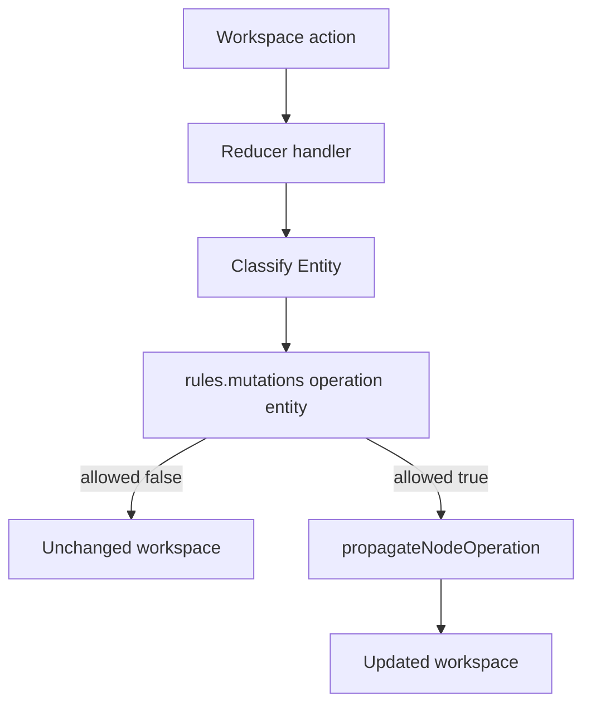

# Rules

This folder holds declarative policy for workspace mutations and catalog nesting. The `rules` object states which operations are allowed per entity class, how propagation should run, and which component levels may contain which children. Workspace reducers read these values before applying edits or fan-out.

---

## `componentLevels`

Each catalog [`ComponentLevel`](../components/constants/index.ts) maps to a `mayContain` list of levels allowed as schema children. [`TypeCheckingService.canComponentBeParentOf`](../workspace/services/type-checking/type-checking.service.ts) uses this map when validating catalog parent and child pairs. Board variant trees use separate placement rules in the workspace layer.

The map covers `primitive`, `frame`, `element`, `part`, `module`, `screen`, and `board`. `board` is an editor-only shell with an empty `mayContain`, so it holds no composition children.

Values live in [`config/rules.config.ts`](./config/rules.config.ts).

---

## `mutations`

Eleven mutation keys form `RuleId`: `create`, `insertInto`, `instantiate`, `duplicate`, `delete`, `setProperties`, `reset`, `setTheme`, `rename`, `reorder`, and `move`. Each key indexes four [`Entity`](./types/rule-config-types.ts) rows: `board`, `userVariant`, `defaultVariant`, and `instance`.

Every row has `allowed` and `propagation`. The `delete` instance row also sets `removalBehavior` for hide versus delete, with conditional behavior per instance origin. The other delete rows always delete outright.

Reducers resolve the target entity with [`TypeCheckingService.getEntityType`](../workspace/services/type-checking/type-checking.service.ts), read `rules.mutations[operation][entityType]`, and return the workspace unchanged when `allowed` is false. When allowed, they call [`workspacePropagationService.propagateNodeOperation`](../workspace/services/propagation/workspace-propagation.service.ts) with the configured `propagation`.

Full matrices live in [`config/rules.config.ts`](./config/rules.config.ts).

---

## Flow

---

## Major Types And Functions

### Configuration

| Type or Function | File | Purpose and use |
| --- | --- | --- |
| `rules` | `config/rules.config.ts` | Exports the full `RulesConfig` object. Imported by workspace reducers, validation, and `TypeCheckingService` before gating or propagating an edit. |

### Types

| Type or Function | File | Purpose and use |
| --- | --- | --- |
| `Entity` | `types/rule-config-types.ts` | Union of policy entity keys. Used to index every mutation matrix row. |
| `Config` | `types/rule-config-types.ts` | Maps each `Entity` to an `EntityConfig`. Used as the shape for non-delete mutation rules. |
| `Propagation` | `types/rule-config-types.ts` | Union `none`, `downstream`, or `bidirectional`. Passed into propagation service calls from reducers. |
| `EntityConfig` | `types/rule-config-types.ts` | `allowed` flag plus `propagation` for one entity row. Base shape for most mutation entries. |
| `RemovalBehavior` | `types/rule-config-types.ts` | Delete-only behavior: plain `delete` or `hide`, or per-origin object for instances. Read by `remove-instance` handlers. |
| `DeleteInstanceConfig` | `types/rule-config-types.ts` | Extends `EntityConfig` with `removalBehavior`. Types only the `instance` row under `mutations.delete`. |
| `DeleteConfig` | `types/rule-config-types.ts` | Maps board and variant rows to `EntityConfig` and the instance row to `DeleteInstanceConfig`. Types the delete mutation block. |
| `MutationRules` | `types/rule-config-types.ts` | Groups all eleven mutation operation configs. Used as the `mutations` field on `RulesConfig`. |
| `RuleId` | `types/rule-config-types.ts` | `keyof MutationRules`. Names the supported mutation operations in policy. |
| `ComponentLevelConfig` | `types/rule-config-types.ts` | Holds `mayContain` for one catalog level. Used in `componentLevels` records. |
| `RulesConfig` | `types/rule-config-types.ts` | Top-level shape for `rules`: `mutations` plus `componentLevels`. Matches the exported config object. |

---

## Notes

- Import `rules` from [`config/rules.config.ts`](./config/rules.config.ts). There is no `@seldon/core/rules` package export today.
- Serialized [`EntryNode`](../workspace/model/entry-node.ts) `type` values differ from `Entity` keys. Map `default` → `defaultVariant` and `variant` → `userVariant` with [`mapEntryNodeTypeToRulesEntity`](../workspace/helpers/rules/map-entry-node-type-to-rules-entity.ts).
- [`rules-node-subject`](../workspace/helpers/rules/rules-node-subject.ts) and `TypeCheckingService` classify boards, entry nodes, and icon sheet variants before policy lookup.
- `Propagation` includes `bidirectional`, but every row in [`config/rules.config.ts`](./config/rules.config.ts) today uses `none` or `downstream` only.
- `setProperties` uses `propagation: "none"` for all entities. Instance overrides still merge at read time when resolving node properties.
- `reset` uses `propagation: "none"` for all entities. Resets clear overrides or rebuild structure on the targeted subtree only.
- Rules control mutation policy only. Read-side property and theme materialization lives under [`../workspace/compute/README.md`](../workspace/compute/README.md).

--- 

## Notice for AI and LLM Training

You may not use this software, or any derivative works of it, in whole or in part, for the purposes of training, fine-tuning, or otherwise improving (directly or indirectly) any machine learning or artificial intelligence system without written permission.