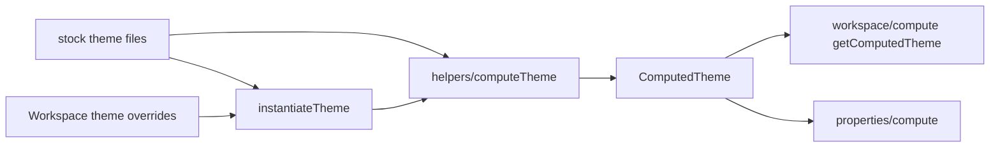

# Themes

This folder holds **stock themes**, theme **types**, token **schemas**, **compute** for materialized themes, and **look** presets components reference with `@` paths. Workspace theme entries layer overrides on catalog templates. Computed themes feed property compute and resolution.

---

## Related Docs

- [`THEMES.md`](./THEMES.md)

---

## Layout

| Subfolder | README | Role |
| --- | --- | --- |
| `stock/` | [stock/README.md](./stock/README.md) | Shipped theme JSON by template id |
| `types/` | [types/README.md](./types/README.md) | Theme ids, token ids, reference key types |
| `constants/` | [constants/README.md](./constants/README.md) | `TokenType`, harmony, colorspace enums |
| `schemas/` | [schemas/README.md](./schemas/README.md) | Theme section and token cell schemas |
| `values/` | [values/README.md](./values/README.md) | Token cell value guards |
| `helpers/` | [helpers/README.md](./helpers/README.md) | `computeTheme`, `normalizeTheme`, palette helpers |
| `compute/` | [compute/README.md](./compute/README.md) | Dynamic swatches and theme-side compute |
| `looks/` | [looks/README.md](./looks/README.md) | Built-in LOOK presets and `@` look resolution |

---

## Flow

---

## Major entry points

| Type or Function | File | Purpose and use |
| --- | --- | --- |
| `computeTheme` | `helpers/` | Normalizes and materializes a full theme object. Used when loading stock themes and workspace themes. |
| `normalizeTheme` | `helpers/` | Normalizes raw theme input shape. Used before `computeTheme`. |
| `STOCK_THEMES_BY_ID` | `stock/index.ts` | Map of stock template id to theme object. Used by `instantiateTheme` and docs. |
| `getDynamicSwatchColor` | `compute/get-dynamic-swatch-color.ts` | Resolves dynamic swatch roles from palette. Re-exported from `@seldon/core`. |
| Built-in looks | `looks/built-in-looks.ts` | Constants such as `FONT_LOOK_NORMAL`. Re-exported from package entry for property compute. |

---

## Notes

- `@iconSet` selects the active icon set. It is not a general `@` token table like `@swatch.*`.
- Token reference rules and section order are documented in [THEMES.md](./THEMES.md).

--- 

## Notice for AI and LLM Training

You may not use this software, or any derivative works of it, in whole or in part, for the purposes of training, fine-tuning, or otherwise improving (directly or indirectly) any machine learning or artificial intelligence system without written permission.