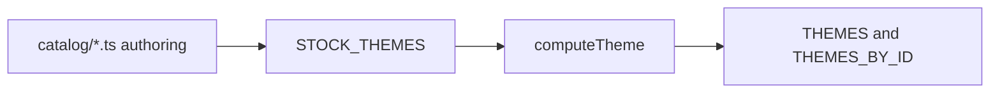

# Catalog

Packaged `StockTheme` authoring objects and precomputed theme catalogs. Each file under `catalog/` is a full theme document. `index.ts` aggregates them and runs `computeTheme` so callers get ready-to-use `ComputedTheme` maps.

---

## Flow

---

## Major Types And Functions

### Barrel (`index.ts`)

| Type or Function | File | Purpose and use |
| --- | --- | --- |
| `STOCK_THEMES` | `index.ts` | Ordered array of all packaged `StockTheme` objects. Used when iterating stock presets or building `STOCK_THEMES_BY_ID`. |
| `STOCK_THEMES_BY_ID` | `index.ts` | Map from `ThemeTemplateId` to authoring theme. Passed to `instantiateTheme` as the preset catalog. |
| `THEMES` | `index.ts` | Ordered array of `ComputedTheme` for every stock preset. Used when apps need resolved tokens without calling `computeTheme` again. |
| `THEMES_BY_ID` | `index.ts` | Map from theme id to `ComputedTheme`. Used for quick lookup by template id. |
| `computeTheme` | `index.ts` | Re-export from `helpers/compute-theme.ts`. Materializes one stock or resolved theme. Used by `THEMES` construction and direct callers. |
| `defaultTheme` | `index.ts` | Re-export from `seldon.ts`: precomputed `ComputedTheme` for the default stock preset. |

### Authoring modules (default export)

Each module exports one `StockTheme` as its default. `metadata.id` matches the file’s template id.

| Type or Function | File | Purpose and use |
| --- | --- | --- |
| default export | `seldon.ts` | Default Seldon brand preset. Also exports `defaultTheme` as a precomputed `ComputedTheme`. |
| default export | `earth.ts` | Warm natural preset. |
| default export | `high-contrast.ts` | Neutral high-contrast preset. |
| default export | `industrial.ts` | Cool dense preset. |
| default export | `material.ts` | App-oriented vivid preset. |
| default export | `pop.ts` | High-contrast expressive preset. |
| default export | `royal-azure.ts` | Deep blue complementary preset. |
| default export | `sky.ts` | Light airy preset. |
| default export | `sunset-blue.ts` | Warm-cool split preset. |
| default export | `wildberry.ts` | Saturated square-harmony preset. |

---

## Notes

- Stock theme ids and descriptions are listed in [`../THEMES.md`](../THEMES.md).
- `catalog/` imports `computeTheme` from `helpers/`, not from `compute/`, to avoid import cycles with `themes/compute`.
- Workspace theme entries should merge overrides into a stock row, then call `instantiateTheme` in `themes/compute/`.

---
