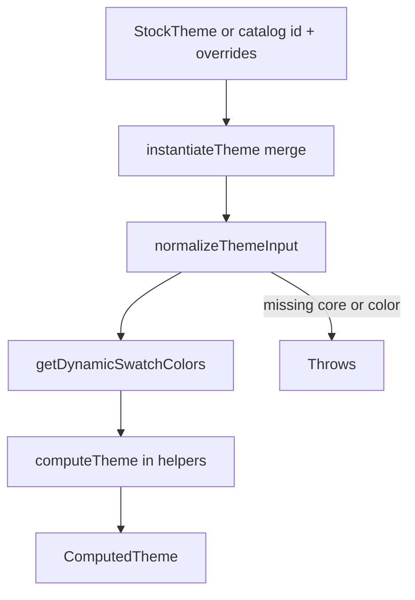

# Compute

Normalizes packaged theme rows, runs palette harmony math, and supports `instantiateTheme` when a catalog id plus overrides must become a `ComputedTheme`. This folder is not `properties/compute`. It does not walk component `Properties` or resolve `@` picks on nodes.

Prefer `computeTheme` from `@seldon/core/themes/helpers` for the usual materialize-one-theme path. Import this package when you need `instantiateTheme`, normalization helpers, or palette utilities without pulling `catalog/` into a cycle.

---

## Flow

---

## Major Types And Functions

### Instantiation and normalization

| Type or Function | File | Purpose and use |
| --- | --- | --- |
| `PresetThemesById` | `instantiate-theme.ts` | Map of `ThemeTemplateId` to `StockTheme`. Pass `STOCK_THEMES_BY_ID` from `catalog/`. |
| `instantiateTheme` | `instantiate-theme.ts` | Deep-merges overrides into a stock preset, then `computeTheme`. Used for workspace theme variants and catalog-driven authoring. |
| `normalizeThemeInput` | `normalize-theme.ts` | Coerces loose JSON into `ThemePipelineInput` shape. Throws when `core` or `color` is missing. Called before palette math and from `normalizeTheme` in helpers. |
| `normalizeThemeNumber` | `normalize-theme-value.ts` | Strips unit objects and strings to plain numbers. Used while walking theme tables during normalize. |
| `normalizeThemeExactValue` | `normalize-theme-value.ts` | Normalizes length-shaped exact cells for scale slots. Used by `normalizeThemeInput`. |
| `normalizeThemeSwatchParameters` | `normalize-theme-swatch-parameters.ts` | Coerces swatch parameter payloads before compute. Used on swatch cells during normalization. |

### Palette and color math

| Type or Function | File | Purpose and use |
| --- | --- | --- |
| `colorspaceLiteralToHsl` | `colorspaces.ts` | Converts `ColorSpaceLiteral` to HSL for palette input. Used by dynamic swatch generation. |
| `parseColorspaceLiteral` | `colorspaces.ts` | Parses unknown color JSON into `ColorSpaceLiteral`. Used during normalize and color edits. |
| `getPalette` | `get-dynamic-swatch-color.ts` | Builds five harmony HSL colors from base color and `Harmony`. Used by `getDynamicSwatchColors`. |
| `getDynamicSwatchColors` | `get-dynamic-swatch-color.ts` | Returns neutrals plus harmony slots for all dynamic palette roles. Called from `computeTheme`. |
| `selectColorFromPalette` | `get-dynamic-swatch-color.ts` | Picks one palette index with harmony rules. Used inside palette generation. |
| `getWhiteColor` | `get-dynamic-swatch-color.ts` | Computes neutral white HSL from `color` anchors. |
| `getGrayColor` | `get-dynamic-swatch-color.ts` | Computes neutral gray HSL from `color` anchors. |
| `getBlackColor` | `get-dynamic-swatch-color.ts` | Computes neutral black HSL from `color` anchors. |
| `getDynamicSwatchName` | `get-dynamic-swatch-names.ts` | Human-readable label for a dynamic palette role. Used when `computeTheme` fills swatch `name` fields. |

### Re-export

| Type or Function | File | Purpose and use |
| --- | --- | --- |
| `computeTheme` | `index.ts` → `../helpers/compute-theme.ts` | Materializes `ComputedTheme` from `StockTheme` or resolved theme. Re-exported here for `@seldon/core/themes/compute` imports. |

---

## Notes

- `instantiateTheme` with empty overrides skips merge and only runs `computeTheme` on the base preset.
- Property resolution for `@fontSize.medium` and similar paths uses `properties/compute` with a `ComputedTheme` on context.
- Workspace theme rows should become a patch plus `instantiateTheme`, not a second persisted computed JSON blob. See [`../../workspace/WORKSPACE.md`](../../workspace/WORKSPACE.md).

---
