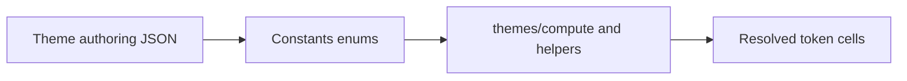

# Constants

Shared enums for theme token cells, palette harmony, modulation ratio, and color space tags. Property compute and theme pipelines import these values so authoring JSON and TypeScript stay aligned.

---

## Flow

---

## Major Types And Functions

| Type or Function | File | Purpose and use |
| --- | --- | --- |
| `TokenType` | `token-type.ts` | Tags each theme token cell shape (`MODULATED`, `SWATCH`, `LOOK`, etc.). Used by `values/` guards and `computeTheme` when materializing swatches. |
| `Harmony` | `enums.ts` | Names palette geometry modes for `color.harmony`. Used by `getPalette` and dynamic swatch generation in `compute/`. |
| `Ratio` | `enums.ts` | Names modulation ratio steps for `core.ratio`. Used by stock themes and `modulateWithTheme`. |
| `Colorspace` | `colorspace.ts` | Tags swatch parameters as HSL, RGB, LCH, hex, or named color. Used when `computeTheme` writes dynamic swatch parameters. |

---

## Notes

- `types/index.ts` re-exports `TokenType`, `Harmony`, `Ratio`, and `Colorspace` for one-stop theme imports.
- Ordinal step labels for the token schema catalog live in `schemas/data/theme-step-orders.ts`, not here.

---
