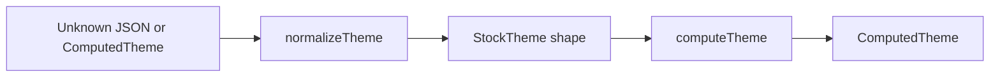

# Helpers

Runtime entry points to coerce theme JSON, materialize `ComputedTheme`, and run modulation math. Most apps import `computeTheme` and `normalizeTheme` from `@seldon/core/themes` or this folder. The barrel also re-exports theme token schema helpers from `schemas/` for editor wiring.

---

## Flow

---

## Major Types And Functions

### Theme materialization

| Type or Function | File | Purpose and use |
| --- | --- | --- |
| `computeTheme` | `compute-theme.ts` | Normalizes input, resolves dynamic swatches, returns `ComputedTheme`. Used by `stock/index.ts`, workspace read paths, and factory when a full theme is needed. |
| `normalizeTheme` | `normalize-theme.ts` | Coerces unknown or resolved theme JSON into `StockTheme` via `normalizeThemeInput`. Used before merge or recompute when workspace data is loose. |
| `isResolvedTheme` | `to-recomputable-stock.ts` | Detects whether swatch cells are already materialized. Used by `toRecomputableStockInput` before recompute. |
| `toRecomputableStock` | `to-recomputable-stock.ts` | Strips resolved dynamic swatches back to `StockTheme` shape. Used when recomputing from a `ComputedTheme`. |
| `toRecomputableStockInput` | `to-recomputable-stock.ts` | Picks stock or recomputed stock input for the compute pipeline. Called from `computeTheme` and `normalizeTheme`. |

### Modulation

| Type or Function | File | Purpose and use |
| --- | --- | --- |
| `modulate` | `modulate.ts` | Re-export of core math `modulate`. Scales a step with ratio and base size. |
| `modulateWithTheme` | `modulate.ts` | Runs `modulate` using `theme.core.ratio` and `theme.core.size`. Used when token tables need live scale values from a theme instance. |

### Schema helpers (re-exported from `schemas/`)

| Type or Function | File | Purpose and use |
| --- | --- | --- |
| `THEME_TOKEN_SCHEMAS` | `../schemas/data/theme-token-schemas.ts` | Static token schema map. Used by theme token editors. |
| `THEME_TOKEN_SCHEMA_CATALOG` | `../schemas/data/theme-token-schemas.ts` | Alias of `THEME_TOKEN_SCHEMAS`. |
| `getAllThemeTokenSchemas` | `../schemas/helpers/get-all-theme-token-schemas.ts` | Merges static and dynamic schemas for one theme. Used when listing all editable keys. |
| `getStoredThemeTokenSchema` | `../schemas/helpers/get-theme-token-schema.ts` | Returns a static catalog entry without `propertyKey` merge. |
| `getThemeTokenSchema` | `../schemas/helpers/get-theme-token-schema.ts` | Returns one schema with property defaults merged. |
| `getThemeTokenSchemasBySection` | `../schemas/helpers/get-theme-token-schemas-by-section.ts` | Lists schemas for one UI section and optional theme. |
| `resolveThemeTokenEntry` | `../schemas/helpers/resolve-theme-token-entry.ts` | Resolves static or dynamic catalog entry by key. |
| `resolveThemeTokenSchema` | `../schemas/helpers/resolve-theme-token-schema.ts` | Fills label, supports, and validation from `PROPERTY_SCHEMAS` when `propertyKey` is set. |
| `validateThemeTokenValue` | `../schemas/helpers/validate-theme-token-value.ts` | Validates a raw token value for a key. Delegates to property validation when bridged. |

---

## Notes

- Import `instantiateTheme` from `@seldon/core/themes/compute`, not from here, so `stock/` does not cycle through this barrel.
- `normalizeThemeInput` lives in `compute/normalize-theme.ts`. `normalizeTheme` wraps it with `toRecomputableStockInput`.
- Property `@` resolution uses a `ComputedTheme` on `ComputeContext`. That path is in `properties/compute`, not this folder.

---
