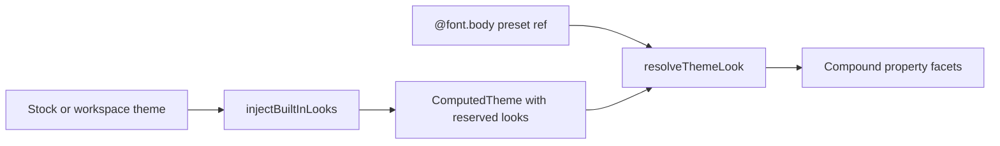

# Looks

This folder defines **built-in theme LOOK presets** and helpers to resolve `@` look references on compound properties. Stock themes gain reserved tokens such as `@shadow.none` and `@font.normal` at compute time. Property presets and the editor use these helpers to apply or clear a full compound from one theme look.

---

## Flow

---

## Major Types And Functions

### Built-in look tokens

| Type or Function | File | Purpose and use |
| --- | --- | --- |
| `SHADOW_LOOK_NONE` | `built-in-looks.ts` | Reserved `@shadow.none` path. Re-exported from `@seldon/core` for property defaults and tests. |
| `GRADIENT_LOOK_NONE` | `built-in-looks.ts` | Reserved `@gradient.none` path. Re-exported from `@seldon/core`. |
| `BACKGROUND_LOOK_NONE` | `built-in-looks.ts` | Reserved `@background.none` path. Re-exported from `@seldon/core`. |
| `BORDER_LOOK_NONE` | `built-in-looks.ts` | Reserved `@border.none` path. Re-exported from `@seldon/core`. |
| `FONT_LOOK_NORMAL` | `built-in-looks.ts` | Reserved `@font.normal` path. Re-exported from `@seldon/core`. |
| `BuiltInLookSection` | `built-in-looks.ts` | Union of look sections: `shadow`, `gradient`, `background`, `border`, `font`. Used by injection and picker code. |
| `BUILT_IN_LOOK_SECTIONS` | `built-in-looks.ts` | Ordered list of built-in look sections. Used when iterating sections during injection. |
| `getBuiltInLookId` | `built-in-looks.ts` | Returns the reserved id for a section (`none` or `normal`). Used by pickers and validation. |
| `getBuiltInLookToken` | `built-in-looks.ts` | Returns the full `@` token for a built-in look. Used when matching preset refs. |
| `isBuiltInLookSection` | `built-in-looks.ts` | Type guard for a look section name. Used when parsing `@` paths. |
| `getBuiltInLookSectionForPropertyKey` | `built-in-looks.ts` | Maps a compound property key to a look section. Maps border shorthands to `border`. Used by editor property UI. |
| `injectBuiltInLooks` | `built-in-looks.ts` | Inserts reserved look cells into each LOOK section. Called from `computeTheme` in `helpers/compute-theme.ts`. |
| `isReservedThemeLookId` | `built-in-looks.ts` | Tells whether an id is a built-in reserved slot for a section. Used to avoid user collisions on `none` / `normal`. |

### Look resolution and presets

| Type or Function | File | Purpose and use |
| --- | --- | --- |
| `ThemeLookPreset` | `resolve-theme-look.ts` | Shape of a LOOK cell with `name` and optional `parameters`. Used when applying presets to compounds. |
| `isThemeLookPreset` | `resolve-theme-look.ts` | Type guard for a LOOK cell object. Used before reading preset parameters. |
| `parseThemeLookRef` | `resolve-theme-look.ts` | Parses `@section.id` into section and id. Used by validation and resolution. |
| `themeLookRefIsValid` | `resolve-theme-look.ts` | Checks that a ref exists on a theme for a section. Used when validating preset picks. |
| `validateThemeLookPresetRef` | `resolve-theme-look.ts` | Validates a preset ref for one section. Used by workspace property helpers. |
| `listThemeLookIds` | `resolve-theme-look.ts` | Lists look ids in a section with built-in id first. Used to populate theme look pickers. |
| `getThemeLookSection` | `resolve-theme-look.ts` | Returns the theme object for a property's LOOK section. Used as input to resolution. |
| `resolveThemeLook` | `resolve-theme-look.ts` | Loads a LOOK preset by `@` ref or display name. Used by `compound-presets.ts` when applying theme presets. |
| `getThemeLookPickerToken` | `resolve-theme-look.ts` | Builds `@section.id` for picker values. Used by `property-picker-options.ts`. |
| `isBuiltInClearedLookToken` | `resolve-theme-look.ts` | Tells whether a preset ref selects the built-in cleared look. Used by `property-status.ts` in the editor. |
| `isThemeLookPresetSchemaName` | `resolve-theme-look.ts` | Tells whether a schema name is a `*Preset` look schema. Used when wiring property schemas. |
| `resolveBuiltInLookApplyName` | `resolve-theme-look.ts` | Maps UI labels such as `None` or `Normal` to built-in apply names. Used when applying built-in clears from the editor. |
| `readPresetThemeLookRef` | `resolve-theme-look.ts` | Reads `preset` as a `THEME_CATEGORICAL` look ref from a compound layer. Used when resolving layered paint presets. |

---

## Notes

- Import from `@seldon/core/themes/looks` or the `themes` barrel. Package entry re-exports the five `*_LOOK_*` constants from `built-in-looks.ts` only.
- Built-in looks clear every facet on the target compound. Stock LOOK tokens from theme files behave like other `@font.*` and `@shadow.*` presets once injected.
- Deeper theme token rules live in [../THEMES.md](../THEMES.md). Theme materialization lives in [../helpers/README.md](../helpers/README.md).
