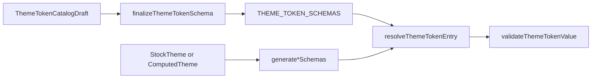

# Schemas

Theme token catalog entries describe how editors present and validate values on a `StockTheme` or `ComputedTheme`. Each `ThemeTokenSchema` maps a stable key such as `core.ratio` or `shadow.medium.offsetX` to supports, validation, and UI metadata. These entries are not component `PropertySchema` rows, though many entries bridge into `PROPERTY_SCHEMAS` through `propertyKey`.

---

## Flow

---

## Major Types And Functions

### Catalog map and sections

| Type or Function                 | File                          | Purpose and use                                                                                  |
| -------------------------------- | ----------------------------- | ------------------------------------------------------------------------------------------------ |
| `THEME_TOKEN_SCHEMAS`            | `data/theme-token-schemas.ts` | Static key to `ThemeTokenSchema` map. Populated at module load from static schema arrays.        |
| `THEME_TOKEN_SCHEMA_CATALOG`     | `data/theme-token-schemas.ts` | Alias of `THEME_TOKEN_SCHEMAS`.                                                                  |
| `THEME_TOKEN_SECTIONS`           | `sections.ts`                 | Ordered UI sections for token lists. Order is defined explicitly in `THEME_TOKEN_SECTION_ORDER`. |
| `getThemeTokenSectionSchema`     | `sections.ts`                 | Returns one section definition by id.                                                            |
| `getAllThemeTokenSectionSchemas` | `sections.ts`                 | Returns every section definition.                                                                |

### Lookup, resolve, and validate

| Type or Function                | File                                            | Purpose and use                                                                              |
| ------------------------------- | ----------------------------------------------- | -------------------------------------------------------------------------------------------- |
| `getStoredThemeTokenSchema`     | `helpers/get-theme-token-schema.ts`             | Static catalog entry only, without property merge.                                           |
| `getThemeTokenSchema`           | `helpers/get-theme-token-schema.ts`             | Static entry with `propertyKey` defaults merged.                                             |
| `getAllThemeTokenSchemas`       | `helpers/get-all-theme-token-schemas.ts`        | Static plus dynamic schemas for one optional theme.                                          |
| `getThemeTokenSchemasBySection` | `helpers/get-theme-token-schemas-by-section.ts` | Schemas grouped for one `ThemeTokenSectionId`.                                               |
| `resolveThemeTokenSchema`       | `helpers/resolve-theme-token-schema.ts`         | Fills label, supports, validation, and control hints from property schema when bridged.      |
| `resolveThemeTokenEntry`        | `helpers/resolve-theme-token-entry.ts`          | Resolves static or per-theme dynamic entry by key.                                           |
| `validateThemeTokenValue`       | `helpers/validate-theme-token-value.ts`         | Validates raw token storage. Delegates to `validatePropertyValue` when `propertyKey` is set. |
| `buildThemeTokenValidation`     | `helpers/finalize-theme-token-schema.ts`        | Builds per-support validators from a draft `valueType`.                                      |
| `finalizeThemeTokenSchema`      | `helpers/finalize-theme-token-schema.ts`        | Expands a catalog draft into full `ThemeTokenSchema`.                                        |

### Dynamic generators

| Type or Function        | File                            | Purpose and use                                                                  |
| ----------------------- | ------------------------------- | -------------------------------------------------------------------------------- |
| `ThemeOrStock`          | `data/theme-dynamic-schemas.ts` | `StockTheme` or `ComputedTheme` input for dynamic catalog builders.              |
| `generateSwatchSchemas` | `data/theme-dynamic-schemas.ts` | Per-swatch editor entries from theme `swatch` keys.                              |
| `generateLookSchemas`   | `data/theme-dynamic-schemas.ts` | Per-look parent and facet entries for one look section, driven by `LOOK_FACETS`. |

### Static schema arrays

| Type or Function     | File                           | Purpose and use                                      |
| -------------------- | ------------------------------ | ---------------------------------------------------- |
| `coreSchemas`        | `data/theme-static-schemas.ts` | Finalized schemas for `core.*` and `color.*` inputs. |
| `sizeSchemas`        | `data/theme-static-schemas.ts` | Modulated size slot step and parameters keys.        |
| `dimensionSchemas`   | `data/theme-static-schemas.ts` | Dimension scale slot schemas.                        |
| `marginSchemas`      | `data/theme-static-schemas.ts` | Margin scale slot schemas.                           |
| `paddingSchemas`     | `data/theme-static-schemas.ts` | Padding scale slot schemas.                          |
| `gapSchemas`         | `data/theme-static-schemas.ts` | Gap scale slot schemas.                              |
| `borderWidthSchemas` | `data/theme-static-schemas.ts` | Border width step schemas.                           |
| `cornersSchemas`     | `data/theme-static-schemas.ts` | Corner radius scale slot schemas.                    |
| `fontSizeSchemas`    | `data/theme-static-schemas.ts` | Font size scale slot schemas.                        |
| `lineHeightSchemas`  | `data/theme-static-schemas.ts` | Line height step schemas.                            |
| `fontWeightSchemas`  | `data/theme-static-schemas.ts` | Font weight numeric schemas.                         |
| `blurSchemas`        | `data/theme-static-schemas.ts` | Shadow blur scale slot schemas.                      |
| `spreadSchemas`      | `data/theme-static-schemas.ts` | Shadow spread scale slot schemas.                    |

### Step order constants

| Type or Function     | File                        | Purpose and use                                          |
| -------------------- | --------------------------- | -------------------------------------------------------- |
| `FONT_WEIGHT_ORDER`  | `data/theme-step-orders.ts` | Slot key order for `fontWeight` static schemas.          |
| `FONT_SIZE_ORDER`    | `data/theme-step-orders.ts` | Slot key order for `fontSize` static schemas.            |
| `SIZE_ORDER`         | `data/theme-step-orders.ts` | Slot key order for `size`, `blur`, and `spread` schemas. |
| `DIMENSION_ORDER`    | `data/theme-step-orders.ts` | Slot key order for `dimension` schemas.                  |
| `SPACING_ORDER`      | `data/theme-step-orders.ts` | Slot key order for margin, padding, gap, and corners.    |
| `LINE_HEIGHT_ORDER`  | `data/theme-step-orders.ts` | Slot key order for `lineHeight` schemas.                 |
| `BORDER_WIDTH_ORDER` | `data/theme-step-orders.ts` | Slot key order for `borderWidth` schemas.                |

### Types re-exported from `types/schema.ts`

| Type or Function                | File                 | Purpose and use                        |
| ------------------------------- | -------------------- | -------------------------------------- |
| `ThemeTokenSchema`              | `../types/schema.ts` | Catalog entry shape.                   |
| `ThemeTokenSchemaSupport`       | `../types/schema.ts` | Raw payload shape tags on an entry.    |
| `ThemeTokenSchemaValidation`    | `../types/schema.ts` | Validator map per support shape.       |
| `ThemeTokenCatalogDraft`        | `../types/schema.ts` | Authoring draft with `valueType` only. |
| `ThemeTokenBridgedCatalogDraft` | `../types/schema.ts` | Draft that sets `propertyKey`.         |
| `ThemeTokenSchemaUnresolved`    | `../types/schema.ts` | Entry before property merge.           |
| `ThemeTokenSectionId`           | `../types/schema.ts` | Section id union for UI grouping.      |
| `ThemeTokenSectionSchema`       | `../types/schema.ts` | Section list metadata.                 |

---

## `key` vs `propertyKey`

- `key` is the path into theme JSON, such as `size.medium.step` or `swatch.primary`.
- `propertyKey` links to one flattened `PROPERTY_SCHEMAS` entry when validation and controls should match a component property.

Explicit fields on the token schema win over derived property defaults.

---

## Notes

- `supports` describes raw token payloads on theme JSON. Node properties still use `ValueType` on `PropertyValue` cells.
- Scrollbar token entries are theme-specific and omit `propertyKey` today.
- Component property editors use `@seldon/core/properties/schemas`. Theme token editors use `@seldon/core/themes/schemas`.
- Human-readable token tables for all stock themes live in [`../README.md`](../README.md).

---
