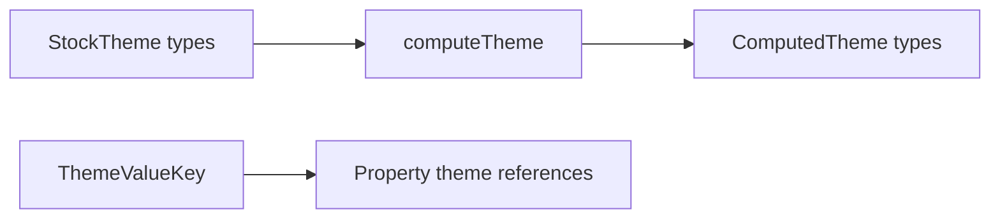

# Types

TypeScript contracts for theme documents, token table slot ids, `@` reference keys, and theme token schema catalog shapes. The barrel in `index.ts` also re-exports token cells from `values/` and enums from `constants/` so theme imports stay in one place.

---

## Flow

---

## Major Types And Functions

### Theme document (`theme.ts`)

| Type or Function     | File       | Purpose and use                                                            |
| -------------------- | ---------- | -------------------------------------------------------------------------- |
| `StockThemeSwatches` | `theme.ts` | Swatch table type on a `StockTheme` with palette slots and `background`.   |
| `ThemeMetadata`      | `theme.ts` | `id`, `name`, `description`, and `intent` for one theme.                   |
| `StockTheme`         | `theme.ts` | Full authoring theme shape from `catalog/`. Includes dynamic swatch cells. |
| `ComputedTheme`      | `theme.ts` | Materialized theme with resolved swatches and `id` at top level.           |
| `Theme`              | `theme.ts` | Alias for `ComputedTheme`. Used in older signatures.                       |
| `ThemePipelineInput` | `theme.ts` | Union accepted by normalize and palette helpers.                           |
| `ThemeOption`        | `theme.ts` | Union of possible token cell shapes on theme tables.                       |

### Catalog ids (`theme-id.ts`)

| Type or Function  | File          | Purpose and use                                                                                        |
| ----------------- | ------------- | ------------------------------------------------------------------------------------------------------ |
| `ThemeTemplateId` | `theme-id.ts` | Union of packaged stock template ids. Used in `STOCK_THEMES_BY_ID` and workspace `catalog:` templates. |
| `ThemeInstanceId` | `theme-id.ts` | Stock template id. Used on computed themes and workspace theme refs.                                   |

### Token table slot ids (`theme-token-ids.ts`)

| Type or Function      | File                 | Purpose and use                                    |
| --------------------- | -------------------- | -------------------------------------------------- |
| `ThemeTokenNamespace` | `theme-token-ids.ts` | First segment of an `@` theme reference path.      |
| `ThemeBorderWidthId`  | `theme-token-ids.ts` | Keys on the `borderWidth` table.                   |
| `ThemeCornersId`      | `theme-token-ids.ts` | Alias of `ThemeSpacingId` for corner radius slots. |
| `ThemeFontFamilyId`   | `theme-token-ids.ts` | `primary` and `secondary` font stack slots.        |
| `ThemeFontId`         | `theme-token-ids.ts` | Named font look slots such as `body` and `title`.  |
| `ThemeFontSizeId`     | `theme-token-ids.ts` | Font size scale slot ids.                          |
| `ThemeFontWeightId`   | `theme-token-ids.ts` | Font weight slot ids.                              |
| `ThemeLineHeightId`   | `theme-token-ids.ts` | Line height slot ids.                              |
| `ThemeSizeId`         | `theme-token-ids.ts` | Size scale slot ids.                               |
| `ThemeDimensionId`    | `theme-token-ids.ts` | Dimension scale slot ids.                          |
| `ThemeSpacingId`      | `theme-token-ids.ts` | Margin, padding, and gap slot ids.                 |
| `ThemeStaticSwatchId` | `theme-token-ids.ts` | `background` plus custom swatch keys.              |
| `ThemeSwatchId`       | `theme-token-ids.ts` | All swatch keys including palette roles.           |
| `ThemeCustomSwatchId` | `theme-token-ids.ts` | `customN` swatch naming pattern.                   |
| `ThemeShadowId`       | `theme-token-ids.ts` | Shadow look slot ids.                              |
| `ThemeGradientId`     | `theme-token-ids.ts` | Gradient look slot ids.                            |
| `ThemeScrollbarId`    | `theme-token-ids.ts` | Scrollbar look slot ids.                           |
| `ThemeBorderId`       | `theme-token-ids.ts` | Border look slot ids.                              |
| `ThemeOptionId`       | `theme-token-ids.ts` | Union of ids used as theme option references.      |

### Branded reference keys (`theme-reference-keys.ts`)

| Type or Function      | File                      | Purpose and use                                                           |
| --------------------- | ------------------------- | ------------------------------------------------------------------------- |
| `ThemeBlurKey`        | `theme-reference-keys.ts` | Branded `@blur.*` path.                                                   |
| `ThemeBorderKey`      | `theme-reference-keys.ts` | Branded `@border.*` path.                                                 |
| `ThemeBorderWidthKey` | `theme-reference-keys.ts` | Branded `@borderWidth.*` path.                                            |
| `ThemeCornersKey`     | `theme-reference-keys.ts` | Branded `@corners.*` path.                                                |
| `ThemeDimensionKey`   | `theme-reference-keys.ts` | Branded `@dimension.*` path.                                              |
| `ThemeFontKey`        | `theme-reference-keys.ts` | Branded `@font.*` path.                                                   |
| `ThemeFontSizeKey`    | `theme-reference-keys.ts` | Branded `@fontSize.*` path.                                               |
| `ThemeFontWeightKey`  | `theme-reference-keys.ts` | Branded `@fontWeight.*` path.                                             |
| `ThemeFontFamilyKey`  | `theme-reference-keys.ts` | Branded `@fontFamily.*` path.                                             |
| `ThemeGapKey`         | `theme-reference-keys.ts` | Branded `@gap.*` path.                                                    |
| `ThemeGradientKey`    | `theme-reference-keys.ts` | Branded `@gradient.*` path.                                               |
| `ThemeLineHeightKey`  | `theme-reference-keys.ts` | Branded `@lineHeight.*` path.                                             |
| `ThemeMarginKey`      | `theme-reference-keys.ts` | Branded `@margin.*` path.                                                 |
| `ThemePaddingKey`     | `theme-reference-keys.ts` | Branded `@padding.*` path.                                                |
| `ThemeScrollbarKey`   | `theme-reference-keys.ts` | Branded `@scrollbar.*` path.                                              |
| `ThemeShadowKey`      | `theme-reference-keys.ts` | Branded `@shadow.*` path.                                                 |
| `ThemeSizeKey`        | `theme-reference-keys.ts` | Branded `@size.*` path.                                                   |
| `ThemeSpreadKey`      | `theme-reference-keys.ts` | Branded `@spread.*` path.                                                 |
| `ThemeSwatchKey`      | `theme-reference-keys.ts` | Branded `@swatch.*` path.                                                 |
| `ThemeValueKey`       | `theme-reference-keys.ts` | Union of all branded theme reference strings except `ThemeFontFamilyKey`. |

### Token schema catalog (`schema.ts`)

| Type or Function                | File        | Purpose and use                                      |
| ------------------------------- | ----------- | ---------------------------------------------------- |
| `ThemeTokenSectionId`           | `schema.ts` | Section id for grouping token schemas in the UI.     |
| `ThemeTokenSchemaSupport`       | `schema.ts` | Allowed raw payload shapes for one token key.        |
| `ThemeTokenSchemaValidation`    | `schema.ts` | Per-shape validators on a schema entry.              |
| `ThemeTokenSchema`              | `schema.ts` | Full catalog entry for one editable theme token key. |
| `ThemeTokenCatalogDraft`        | `schema.ts` | Authoring draft before `finalizeThemeTokenSchema`.   |
| `ThemeTokenBridgedCatalogDraft` | `schema.ts` | Draft that bridges to a component `propertyKey`.     |
| `ThemeTokenSchemaUnresolved`    | `schema.ts` | Schema before property defaults are merged.          |
| `ThemeTokenSectionSchema`       | `schema.ts` | UI section metadata for token lists.                 |

### Table helpers (`helpers.ts`)

| Type or Function  | File         | Purpose and use                                        |
| ----------------- | ------------ | ------------------------------------------------------ |
| `ThemeCustomKey`  | `helpers.ts` | `customN` key pattern for optional token slots.        |
| `ThemeTokenTable` | `helpers.ts` | Maps slot id union to cell type for one theme section. |

### Barrel re-exports (`index.ts`)

`index.ts` re-exports enums, value cell types, guards, ids, reference keys, and schema types listed above. Import from `@seldon/core/themes/types` or `@seldon/core/themes` when you need types only.

---

## Notes

- `Theme` and `ComputedTheme` are the same shape. Prefer `ComputedTheme` in new code.
- Token cell implementations live in `values/`. This folder defines document and reference shapes.
- Full theme file layout is documented in [`../README.md`](../README.md).

---
