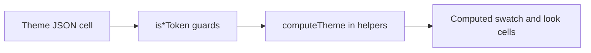

# Values

Tagged theme token cell shapes and runtime type guards. Each cell carries a `TokenType` and a `parameters` or `value` payload. `computeTheme` and theme editors use these types to read and write theme JSON safely.

---

## Flow

---

## Major Types And Functions

### Exact and modulation

| Type or Function | File | Purpose and use |
| --- | --- | --- |
| `ColorSpaceLiteral` | `shared/exact/color-spaces.ts` | Re-export of property color literal unions. Used on `StockTheme.color.baseColor` and swatch inputs. |
| `ThemeExact` | `shared/exact/theme-exact.ts` | Fixed numeric token cell with unit. Used in scale tables and font weight slots. |
| `ThemeExactDimension` | `shared/exact/theme-exact.ts` | Length-shaped exact value with unit. Used for scale `.parameters` slots. |
| `ModulationParameters` | `shared/modulated/theme-modulation.ts` | Step field for modulated tokens. Used inside `ThemeModulation`. |
| `ThemeModulation` | `shared/modulated/theme-modulation.ts` | `TokenType.MODULATED` cell for ordinal scales. Used in size, margin, and similar tables. |
| `BORDER_WIDTH_OPTIONS` | `shared/option/theme-border-width-option.ts` | Allowed hairline option keys. Used by border width option cells and schemas. |
| `BorderWidthOption` | `shared/option/theme-border-width-option.ts` | Union of border width option keys. |
| `ThemeBorderWidthOption` | `shared/option/theme-border-width-option.ts` | `TokenType.OPTION` cell for discrete border widths. |
| `ThemeScaleToken` | `shared/ordinal/theme-scale.ts` | Modulated step or exact length for one scale slot. Used across size and spacing tables. |
| `ThemeBorderWidth` | `shared/ordinal/theme-border-width.ts` | Modulated or option cell for one border width slot. |

### Palette and font stack

| Type or Function | File | Purpose and use |
| --- | --- | --- |
| `ThemeSwatch` | `shared/palette/theme-swatch.ts` | Resolved or explicit swatch cell. Used after `computeTheme` and for static swatches. |
| `ThemePaletteSlot` | `shared/palette/theme-swatch.ts` | Union of dynamic palette role names. Used by dynamic swatch cells and palette math. |
| `THEME_PALETTE_SLOTS` | `shared/palette/theme-swatch.ts` | Array of palette slot ids. Used when iterating harmony roles. |
| `StockSwatchDynamic` | `shared/palette/theme-swatch.ts` | Authoring cell that resolves from `color` at compute time. Used in stock `swatch` tables. |
| `StockThemeSwatch` | `shared/palette/theme-swatch.ts` | Swatch or dynamic swatch on a `StockTheme`. |
| `ThemeSwatchParameters` | `shared/palette/theme-swatch-parameters.ts` | Color payload inside a swatch cell. |
| `ThemeFontFamilyToken` | `shared/font-stack/theme-font-family-token.ts` | Font stack cell for `fontFamily.primary` and `secondary`. |

### Look compounds

| Type or Function | File | Purpose and use |
| --- | --- | --- |
| `BorderParameters` | `appearance/border.ts` | Facets for a border look without preset. |
| `ThemeBorder` | `appearance/border.ts` | `TokenType.LOOK` border recipe row. |
| `FontParameters` | `typography/font.ts` | Typography facets for a font look. |
| `ThemeFont` | `typography/font.ts` | `TokenType.LOOK` font recipe row. |
| `GradientParameters` | `effects/gradient.ts` | Gradient facets without preset. |
| `ThemeGradient` | `effects/gradient.ts` | `TokenType.LOOK` gradient recipe row. |
| `ShadowParameters` | `effects/shadow.ts` | Shadow facets without preset. |
| `ThemeShadow` | `effects/shadow.ts` | `TokenType.LOOK` shadow recipe row. |
| `ScrollbarParameters` | `effects/scrollbar.ts` | Scrollbar track and thumb facets. |
| `ThemeScrollbar` | `effects/scrollbar.ts` | `TokenType.LOOK` scrollbar recipe row. |

### Type guards

| Type or Function | File | Purpose and use |
| --- | --- | --- |
| `isModulatedToken` | `shared/type-guards/theme-token-type-guards.ts` | Narrows to `ThemeModulation`. Used in compute and validation. |
| `isThemeExactToken` | `shared/type-guards/theme-token-type-guards.ts` | Narrows to any `ThemeExact` cell. |
| `isSwatchToken` | `shared/type-guards/theme-token-type-guards.ts` | Narrows to explicit swatch cells. Used when preserving static swatches in `computeTheme`. |
| `isFontFamilyToken` | `shared/type-guards/theme-token-type-guards.ts` | Narrows to font family stack cells. |
| `isOptionToken` | `shared/type-guards/theme-token-type-guards.ts` | Narrows to option cells such as hairline border width. |
| `isDynamicSwatchToken` | `shared/type-guards/theme-token-type-guards.ts` | Narrows to `StockSwatchDynamic`. Used to replace roles with computed HSL. |

### Barrel re-exports

| Type or Function | File | Purpose and use |
| --- | --- | --- |
| `TokenType` | `index.ts` | Re-export from `constants/token-type.ts`. |

---

## Notes

- `TokenType` is defined in `constants/`, not in this folder.
- `types/index.ts` re-exports most types and guards here for a single import path.
- Resolving `@font.body` into CSS strings is property-side work in `properties/compute`, not in this folder.

---
