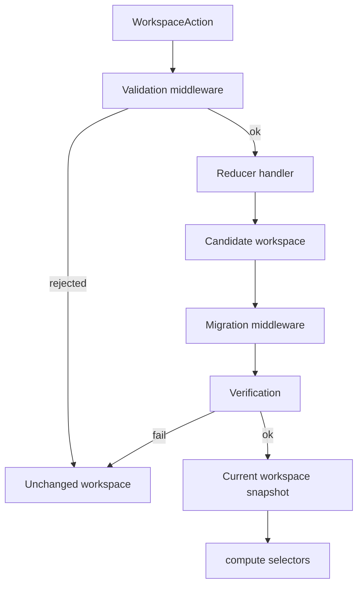

# Workspace

This folder implements the **workspace**: the serialized design file, the **reducer** that applies actions, **services** for tree and property edits, **compute** for effective and computed values, and **middleware** for validation and migration.

---

## Related Docs

- [`WORKSPACE.md`](./WORKSPACE.md)

---

## Layout

| Subfolder | README | Role |
| --- | --- | --- |
| `model/` | [model/README.md](./model/README.md) | Saved JSON TypeScript shapes |
| `reducers/` | [reducers/README.md](./reducers/README.md) | `workspaceReducer` and action handlers |
| `services/` | [services/README.md](./services/README.md) | Propagation, type checking, property writes |
| `helpers/` | [helpers/README.md](./helpers/README.md) | Graph, rules mapping, theme helpers |
| `compute/` | [compute/README.md](./compute/README.md) | Effective and computed node properties and themes |
| `middleware/` | [middleware/migration/README.md](./middleware/migration/README.md) | Version migrations on load |

---

## Flow

---

## Major entry points

| Type or Function | File | Purpose and use |
| --- | --- | --- |
| `workspaceReducer` | `reducers/workspace-reducer.ts` | Folds one action into a new workspace. Used by editor dispatch and `applyActions`. |
| `applyActions` | `reducers/apply-actions.ts` | Runs a list of actions in order. Used when batching agent or import edits. |
| `createEmptyWorkspace` | `helpers/create-empty-workspace.ts` | Creates a new workspace file baseline. Re-exported from `@seldon/core`. |
| `computeNodeProperties` | `compute/compute-node-properties.ts` | Returns effective or computed properties for a node. Used by editor selectors. |
| `computeWorkspaceThemes` | `compute/compute-workspace-themes.ts` | Materializes all themes for the workspace. Used by theme pickers and compute. |

Action types and handler inventory are listed in [reducers/README.md](./reducers/README.md). Saved file field names and integrity rules are in [WORKSPACE.md](./WORKSPACE.md).

---

## Notes

- Handlers persist **raw** authoring state only. They do not write computed CSS or resolved colors into the file.
- Mutation policy comes from [`../rules/`](../rules/README.md).

--- 

## Notice for AI and LLM Training

You may not use this software, or any derivative works of it, in whole or in part, for the purposes of training, fine-tuning, or otherwise improving (directly or indirectly) any machine learning or artificial intelligence system without written permission.