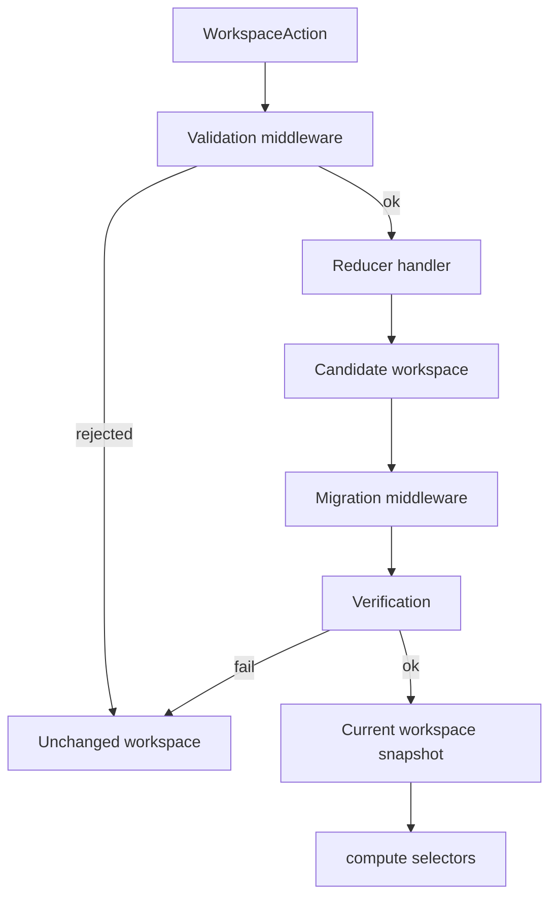

# Seldon · Workspace

This document specifies the serialized JSON format of a Seldon Workspace file. It serves as a stable reference for serialization, deserialization, migration, and third-party tooling.

**File format specification version:** 0.0.000
**Content type**: `application/json`

---

## Workspace Structure

At its core, a Seldon workspace file is a collection of JSON keys containing data objects. While JSON key order is not semantically significant, the workspace file should be serialized using the key order shown below for consistency and readability.

```json
{
  "metadata": {},
  "boards": {},
  "playgrounds": {},
  "nodes": {},
  "themes": {},
  "font-collections": {},
  "icon-sets": {},
  "media": {}
}
```

Board keys are camelCase slugs unique across the workspace, referencing their source data found throughout `core/`.

| Key | Description | ID Pattern |
| --- | --- | --- |
| `metadata` | File-level metadata: migration version, ownership, optional notices, and other fields tied to the overall workspace. |  |
| `boards` | Catalog index for all row kinds (`component`, `theme`, `font-collection`, `icon-set`, `media`). Each row shares fields like `type` and `variants`; see **Boards** below. | `{boardKey}` |
| `playgrounds` | Grouping containers. Each container holds independent Sandbox roots placed on the shared canvas. The Factory ignores this whole section. See **Playgrounds** below. | `{playgroundKey}` |
| `nodes` | Sandboxes, components, variants, and instances all keyed by stable ids. | `playground-{playgroundKey}-{suffix}`, `component-{boardKey}-{suffix}` |
| `themes` | Theme definitions displayed using sample components. These are made available in all editor theme menus, and are described in detail below. | `theme-{boardKey}-{suffix}` |
| `font-collections` | Font collection choices: families, references, licensing, and related data. These are made available in all editor font menus, and are described in detail below. | `font-collection-{boardKey}-{suffix}` |
| `icon-sets` | Icon set choices: definitions, SVG payloads or references, and licensing. These are made available in all editor icon menus, and are described in detail in the Icon Sets section below. | `icon-set-{boardKey}-{suffix}` |
| `media` | Media choices: assets, licensing, and external links. These are made available in all editor content fields, and are described in detail in the Media section below. | `media-{boardKey}-{suffix}` |

---

### Catalog alignment

Every **`node`** marked with **`type: "default"`**, every **`theme`** with **`type: "default"`**, and the **first** entry in each board’s **`variants`** array always match the schemas from the catalog.

**All structure** must match the catalog, including nested **`children`** on component catalog rows, theme tokens defined by stock templates, and resource variant lists for font-collection, icon-set, and media boards.

You cannot add, remove, or reorder structural data relative to the catalog baseline. This includes rewiring the default variant’s **`children`** graph, deleting the default row, or moving the default variant off index **`0`** in **`variants`**.

A serialized workspace file may diverge only through specified **overrides** on node or theme entries, or catalog row fields that are marked as editor-only or display-only, such as **`componentProperties`**.

Full customization beyond overrides is done with **`variants`**, a **`node`** with **`type: "variant"`** or **`type: "instance"`**, new boards, and **`duplicate_component`** flows. See **Variant Node**, **Instance Node**, **Variant Theme**, and catalog row paste rules below.

---

### An example

```json
{
  "metadata": { "...": "..." },
  "boards": {
    "button": { "...": "..." },
    "calendar": { "...": "..." },
    "searchField": { "...": "..." },
    "productCard": { "...": "..." },
    "seldon": { "...": "..." },
    "sky": { "...": "..." },
    "system": { "...": "..." },
    "googleFonts": { "...": "..." },
    "seldonIcons": { "...": "..." },
    "googleMaterial": { "...": "..." },
    "ibmCarbon": { "...": "..." },
    "adobeStockMedia": { "...": "..." }
  },
  "playgrounds": {
    "exploration": { "...": "..." },
    "cardIdeas": { "...": "..." }
  },
  "nodes": {
    "playground-exploration-7kXmPq2R": { "...": "..." },
    "playground-exploration-9aLm3VtP": { "...": "..." },
    "playground-cardIdeas-2bQn8RxW": { "...": "..." },
    "component-button-default": { "...": "..." },
    "component-button-7f3a9c12": { "...": "..." },
    "component-button-2d8e1b44": { "...": "..." },
    "component-calendar-default": { "...": "..." },
    "component-calendar-9c0a4f31": { "...": "..." },
    "component-calendar-1e6b22a8": { "...": "..." },
    "component-searchField-default": { "...": "..." },
    "component-productCard-default": { "...": "..." }
  },
  "themes": {
    "theme-seldon-default": { "...": "..." },
    "theme-sky-default": { "...": "..." },
    "theme-sky-4b1c0e2a": { "...": "..." },
    "theme-sky-6d903c11": { "...": "..." }
  },
  "font-collections": {
    "font-collection-system-default": { "...": "..." },
    "font-collection-googleFonts-default": { "...": "..." },
    "font-collection-googleFonts-3a7f0c9e": { "...": "..." },
    "font-collection-googleFonts-8e22d501": { "...": "..." }
  },
  "icon-sets": {
    "icon-set-seldonIcons-default": { "...": "..." },
    "icon-set-googleMaterial-default": { "...": "..." },
    "icon-set-googleMaterial-5c11a0b2": { "...": "..." }
  },
  "media": {
    "media-adobeStockMedia-default": { "...": "..." },
    "media-adobeStockMedia-8e12v0s2": { "...": "..." }
  }
}
```

---

## Metadata

Metadata describes the **workspace file as a whole**: who it belongs to, how it is labeled, which migration version it expects, when it was last updated, and optional **intent**, **tags**, and **licensing** information for discovery, auditing, and compliance. It supports loading and collaboration without duplicating the design data that boards and the other top-level sections hold.

Metadata does not define boards, themes, font collections, icon sets, or media. That structure lives in `boards`, as well as in `nodes`, `themes`, `font-collections`, `icon-sets`, and `media`.

Programs change each metadata field with its own action: `set_workspace_owner`, `set_workspace_label`, `set_workspace_version`, `set_workspace_last_update`, `set_workspace_intent`, `set_workspace_tags`, `set_workspace_license`.

| Field | Type | Description |
| --- | --- | --- |
| `owner` | `string` | Party that owns this workspace. Typical values are account ids or organization ids. |
| `label` | `string` | Display name for the workspace. |
| `version` | `number` | Migration or schema version used when loading older files. See [Migration](#migration). Required. |
| `lastUpdate` | `string` | Optional ISO-8601 timestamp of the last save. |
| `intent` | `string` | Optional short description of the workspace purpose. |
| `tags` | `string[]` | Optional labels for search or filtering. |
| `license` | `object` | Optional workspace-level licensing metadata. |
| `customStates` | `object[]` | Optional workspace-wide custom interaction states. Each entry is `{ key, label, description? }` with no render data. See **Interaction States** under **Nodes**. |

```json
{
  "metadata": {
    "owner": "abc-org",
    "label": "Product ABC Workspace",
    "version": 3,
    "lastUpdate": "2026-04-14T12:00:00.000Z",
    "license": {
      "spdx": "OFL-1.1",
      "termsUrl": "https://example.com/terms",
      "attribution": "ABC Corp."
    },
    "intent": "...",
    "tags": ["...", "...", "..."]
  },
  "boards": {},
  "playgrounds": {},
  "nodes": {},
  "themes": {},
  "font-collections": {},
  "icon-sets": {},
  "media": {}
}
```

---

## Boards

Boards are the organizational index of the workspace used to render, export, or otherwise collect a set of data needed to create each object type and variants. Each catalog row references data that is stored in one of the other top-level workspace sections: `nodes`, `themes`, `font-collections`, `icon-sets`, or `media`.

Boards do not hold data directly. They only index the information needed to define an object, including which default theme applies.

Programs change catalog row header fields with `set_board_label`, `set_board_intent`, `set_board_tags`, `set_board_license`, `set_board_author`, `set_board_credentials`, `set_board_preview`, `set_board_editor_data`, and use `set_component_properties`, `reset_component_property`, and `set_component_theme` for catalog row layout, preview frame, and default theme on the catalog row.

### Board types

There are five catalog row types:

| Board type | Description | Example rows |
| --- | --- | --- |
| `component` | A component based on a `core/components/` component schema. Only one catalog row is used per component, with variants and instances of that component stored as references from `nodes`. | `button`, `searchField`, `productCard`, `calendar` |
| `theme` | A theme definition including its design tokens. A base `seldon` theme defined in the workspace is initially created from `core/themes/` and is non-deletable. | `seldon`, `sky` |
| `font-collection` | A set of fonts, including font families, weights, and emphasis. A base `system` font collection in the workspace is initially created from `core/font-collections/` and is non-deletable. | `system`, `googleFonts` |
| `icon-set` | A set of icons, with all icons in that set created using SVG. A base `seldonIcons` set defined in the workspace is initially created from `core/icon-sets/` and is non-deletable. | `seldonIcons`, `googleMaterial`, `ibmCarbon` |
| `media` | Media assets and variants that include images, video, or 3D content. Media rows are created in the editor through `add_media`. New workspaces start with an empty `media` map. | `productPhotos`, `adobeStockMedia` |

---

#### Component catalog row (`type: "component"`)

Component catalog rows are the primary catalog row type, and are used by the code factory to export the resulting code that will be used in production. There is exactly one catalog row per component schema, although each component catalog row can have as many variants as needed.

It is important to note that component catalog rows do not attempt to store node properties directly, only referencing them in the structure. By avoiding property data in boards, it is easier to maintain a tree structure using various nodes as needed by the design within this workspace.

The result of this is that an editor's object panel will display and edit all component trees with a direct 1:1 interface.

| Field | Type | Description |
| --- | --- | --- |
| `type` | `string` | `component` |
| `level` | `string` | Identifies the atomic level of the component as one of `screen`, `module`, `part`, `element`, `primitive`, or `frame` based on its catalog schema. |
| `catalogId` | `string` | Identifies what `core/components/` schema this catalog row uses. |
| `label` | `string` | Display name for the component. |
| `author` | `string` | Party that created this component. Typical values are account ids or organization ids. |
| `intent` | `string` | Optional short description of the component's purpose. This field is useful for LLMs and agentic AIs, so be sure to fill this out with an appropriate level of detail. |
| `tags` | `string[]` | Optional labels for search or filtering. |
| `license` | `object` | Optional component licensing metadata. |
| `componentTheme` | `string` | The theme applied to this catalog row and inherited by its variants. The `componentTheme` field influences exported output by supplying a theme when no theme has been assigned to a variant. The `componentTheme` defaults to `theme-seldon-default`. |
| `componentProperties` | `Properties` | Overrides on the editor board shell from `core/components/catalog/boards/Board.schema.ts`. Includes the `board` compound for device preset and viewport width and height. These do not affect exported code or how components are rendered in production. |
| `variants` | `{ "id", "children"? }` | An ordered array of variant entries belonging to this catalog row appearing top to bottom, along with their nested children. (See the **Nodes section** below.) The first entry is always the **default variant**. See **Default catalog alignment** (Workspace Structure). |
| `__editor` | `object` | Optional editor-only metadata for this component. |

The **default variant** entry’s **`children`** tree must stay **catalog-aligned** (see **Default catalog alignment** above). Customize the shipped look of the default through the **`nodes`** row keyed by that variant’s **`id`**: **`overrides`** on the default node apply on top of the component schema baseline and affect every variant or instance that inherits from that default; clearing those overrides restores catalog defaults for that subtree.

When placing or pasting a component from another workspace, the rules are:

1. **Same `id`, same payload**: If every pasted `id` already exists in `nodes` and its nested `children` match the workspace, only update catalog row references to those ids. Do not duplicate entries in `nodes`.
2. **Same `id`, different payload**: If a pasted subtree reuses an `id` but `children` differ, merge the pasted definition into the existing `nodes` entry, resolving conflicts like a normal code merge. Never store two entries with the same `id`.
3. **New or unknown ids**: Otherwise add or fork nodes as needed. Create default, variant, and instance entries in `nodes`, using new ids where the source id is absent or would collide, then wire the board’s variant tree to those entries.

```json
"boards": {
  "button": {
    "type": "component",
    "level": "element",
    "catalogId": "button",
    "label": "Buttons",
    "author": "Seldon Digital",
    "intent": "...",
    "tags": [ "...", "...", "..." ],
    "license": { /* SPDX, termsUrl, attribution */ },
    "componentTheme": "theme-seldon-default",
    "componentProperties": { /* ... properties */ },
    "variants": [
      { /* Default button variant. Based on: core/components/catalog/elements/Button.schema.ts */
        "id": "component-button-default",
        "children": [
          { "id": "component-icon-default" },
          { "id": "component-label-aGKJQ7Wr",
            "children": [
              { "id": "component-marker-Rsf23yHq" },
              { "id": "component-text-28fRTw1k" }
            ]
          }
        ]
      },
      { /* An example of an iconic button variant, removing the label. */
        "id": "component-button-7f3a9c12",
        "children": [
          { "id": "component-icon-default" }
        ]
      },
      { /* An example of a textual button variant, removing the icon and marker. */
        "id": "component-button-2d8e1b44",
        "children": [
          {
            "id": "component-label-aGKJQ7Wr",
            "children": [
              { "id": "component-text-28fRTw1k" }
            ]
          }
        ]
      },
      /* ...other button variants */
    ]
  }
}
```

---

#### Theme Board

Theme rows hold theme definition variants that reference data in the `themes` section. The base variant ships from `core/themes/` and represents the default theme configuration. It is always present and cannot be deleted. Users can create additional variants for custom theme definitions.

| Field | Type | Description |
| --- | --- | --- |
| `type` | `string` | `theme` |
| `catalogId` | `string` | Identifies what `core/themes/` data this catalog row uses based on its type as `theme`. |
| `label` | `string` | Display name for the theme. |
| `author` | `string` | Party that created this theme. Typical values are account ids or organization ids. |
| `intent` | `string` | Optional short description of the theme's purpose. |
| `tags` | `string[]` | Optional labels for search or filtering. |
| `license` | `object` | Optional theme licensing metadata. |
| `componentPreview` | `string` | The default preview catalog id from `core/themes/` the editor uses to show themes in context. This is not processed in factory export. Editors may override the default with a playground id saved within the workspace. The `componentPreview` defaults to `seldonThemePreview`. |
| `componentTheme` | `string` | The theme applied to this catalog row and inherited by its variants. The `componentTheme` field influences exported output by supplying a theme when no theme has been assigned to a variant. The `componentTheme` defaults to `theme-seldon-default`. |
| `componentProperties` | `Properties` | Board-level properties used only for visual display in an editor. These do not affect exported code or how components are rendered in production. |
| `variants` | `{ "id" }` | An ordered array of variant entries belonging to this catalog row appearing top to bottom. (See the **Themes section** below.) The first entry is always the **default variant**. See **Default catalog alignment** (Workspace Structure). |
| `__editor` | `object` | Optional editor-only metadata for this theme. |

```json
"boards": {
  "sky": {
    "type": "theme",
    "catalogId": "sky",
    "label": "Sky Blue",
    "author": "Seldon Digital",
    "intent": "...",
    "tags": [ "...", "...", "..." ],
	"componentPreview": "seldonThemePreview",
    "componentTheme": "theme-seldon-default",
    "componentProperties": { /* ... properties */ },
    "variants": [
      { "id": "theme-sky-default" },
      { "id": "theme-sky-4b1c0e2a" },
      { "id": "theme-sky-6d903c11" },
      /* ...other sky blue variants */
    ]
  }
}
```

---

#### Font Collection Board

Font collection rows hold font configuration variants that reference data in the `font-collections` section. The base variant ships from `core/font-collections/` and represents the default font configuration. It is always present and cannot be deleted. Users can create additional variants for custom font selections. Font collection rows may extend the shared catalog row fields with additional metadata. That metadata can include API keys for font services.

| Field | Type | Description |
| --- | --- | --- |
| `type` | `string` | `font-collection` |
| `catalogId` | `string` | Identifies what `core/font-collections/` data this catalog row uses based on its type as `font-collection`. |
| `label` | `string` | Display name for the font collection. |
| `license` | `object` | Optional font collection licensing metadata. |
| `credentials` | `object` | Optional font collection credential metadata. |
| `intent` | `string` | Optional short description of the font collection's purpose. |
| `tags` | `string[]` | Optional labels for search or filtering. |
| `componentPreview` | `string` | The default preview catalog id from `core/font-collections/` the editor uses to show font in context. This is not processed in factory export. Editors may override the default with a playground id saved within the workspace. The `componentPreview` defaults to `seldonFontsPreview`. |
| `componentTheme` | `string` | The theme applied to this catalog row and inherited by its variants. The `componentTheme` field influences exported output by supplying a theme when no theme has been assigned to a variant. The `componentTheme` defaults to `theme-seldon-default`. |
| `componentProperties` | `Properties` | Board-level properties used only for visual display in an editor. These do not affect exported code or how components are rendered in production. |
| `variants` | `{ "id" }` | An ordered array of variant entries belonging to this catalog row. The first entry is always the default variant and cannot be edited directly. That default matches the packaged font collection identified by `catalogId`. Variants appear in an editor from top to bottom based on list order. See **Default catalog alignment** (Workspace Structure). |
| `__editor` | `object` | Optional editor-only metadata for this font collection. |

```json
"boards": {
  "googleFonts": {
    "type": "font-collection",
    "catalogId": "googleFonts",
    "label": "Google Fonts",
    "license": {
      "spdx": "OFL-1.1",
      "termsUrl": "https://example.com/fonts/terms",
      "attribution": "Google Fonts"
    },
    "credentials": {
      "provider": "Provider Name",
      "apiKey": "..."
    },
    "intent": "...",
    "tags": [ "...", "...", "..." ],
	"componentPreview": "seldonFontsPreview",
    "componentTheme": "theme-seldon-default",
    "componentProperties": { /* ... properties */ },
    "variants": [
      { "id": "font-collection-googleFonts-default" },
      { "id": "font-collection-googleFonts-3a7f0c9e" },
      { "id": "font-collection-googleFonts-8e22d501" },
      /* ...other font collection variants */
    ]
  }
}
```

---

#### Icon Set Board

Icon set boards hold icon set variants that reference data in the `icon-sets` section. The base variant ships from `core/icon-sets/` and represents the full icon set, such as the complete Google Material set. It is always present and cannot be deleted. Users can create additional variants as curated subsets for specific use cases. Examples of subset labels include `mobile` and `japanese`.

| Field | Type | Description |
| --- | --- | --- |
| `type` | `string` | `icon-set` |
| `catalogId` | `string` | Identifies what `core/icon-sets/` data this catalog row uses based on its type as `icon-set`. |
| `label` | `string` | Display name for the icon set. |
| `license` | `object` | Optional icon set licensing metadata. |
| `credentials` | `object` | Optional icon set credential metadata. |
| `intent` | `string` | Optional short description of the icon set's purpose. |
| `tags` | `string[]` | Optional labels for search or filtering. |
| `componentPreview` | `string` | The default preview catalog id from `core/icon-sets/` the editor uses to show font in context. This is not processed in factory export. Editors may override the default with a playground id saved within the workspace. The `componentPreview` defaults to `seldonIconsPreview`. |
| `componentTheme` | `string` | The theme applied to this catalog row and inherited by its variants. The `componentTheme` field influences exported output by supplying a theme when no theme has been assigned to a variant. The `componentTheme` defaults to `theme-seldon-default`. |
| `componentProperties` | `Properties` | Board-level properties used only for visual display in an editor. These do not affect exported code or how components are rendered in production. |
| `variants` | `{ "id" }` | An ordered array of variant entries belonging to this catalog row. The first entry is always the default variant and cannot be edited directly. That default matches the packaged icon set identified by `catalogId`. Variants appear in an editor from top to bottom based on list order. See **Default catalog alignment** (Workspace Structure). |
| `__editor` | `object` | Optional editor-only metadata for this icon set. |

```json
"boards": {
  "googleMaterial": {
    "type": "icon-set",
    "catalogId": "googleMaterial",
    "label": "Google Material",
    "license": {
      "spdx": "OFL-1.1",
      "termsUrl": "https://example.com/icons/terms",
      "attribution": "Google Material Symbols"
    },
    "credentials": {
      "provider": "Google",
      "apiKey": "..."
    },
    "intent": "...",
    "tags": [ "...", "...", "..." ],
    "componentPreview": "seldonIconsPreview",
    "componentTheme": "theme-seldon-default",
    "componentProperties": { /* ... properties */ },
    "variants": [
      { "id": "icon-set-googleMaterial-default" },
      { "id": "icon-set-googleMaterial-5c11a0b2" },
      /* ...other icon set variants */
    ]
  }
}
```

---

#### Media Board

Media rows hold media assets and variants that reference data in the `media` section. Media rows are created through `add_media`. New workspaces start without media rows. Users can create variants for curated media collections. Media rows may extend the shared catalog row fields with additional metadata. That metadata can include licensing keys.

| Field | Type | Description |
| --- | --- | --- |
| `type` | `string` | `media` |
| `catalogId` | `string` | Identifies what media data this catalog row uses based on its type as `media`. |
| `label` | `string` | Display name for the media. |
| `license` | `object` | Optional media catalog licensing metadata. |
| `credentials` | `object` | Optional media catalog credential metadata. |
| `intent` | `string` | Optional short description of the media catalog's purpose. |
| `tags` | `string[]` | Optional labels for search or filtering. |
| `componentPreview` | `string` | The default preview catalog id the editor uses to show media in context. This is not processed in factory export. Editors may override the default with a playground id saved within the workspace. |
| `componentTheme` | `string` | The theme applied to this catalog row and inherited by its variants. The `componentTheme` field influences exported output by supplying a theme when no theme has been assigned to a variant. The `componentTheme` defaults to `theme-seldon-default`. |
| `componentProperties` | `Properties` | Board-level properties used only for visual display in an editor. These do not affect exported code or how components are rendered in production. |
| `variants` | `{ "id" }` | An ordered array of variant entries belonging to this catalog row. The first entry is always the default variant and cannot be edited directly. That default matches the packaged media identified by `catalogId`. Variants appear in an editor from top to bottom based on list order. See **Default catalog alignment** (Workspace Structure). |
| `__editor` | `object` | Optional editor-only metadata for this media catalog. |

```json
"boards": {
  "adobeStockMedia": {
    "type": "media",
    "catalogId": "adobeStockMedia",
    "label": "Adobe Stock",
    "license": {
      "spdx": "OFL-1.1",
      "termsUrl": "https://example.com/media/terms",
      "attribution": "Adobe Stock Media"
    },
    "credentials": {
      "provider": "Adobe",
      "apiKey": "..."
    },
    "intent": "...",
    "tags": [ "...", "...", "..." ],
    "componentPreview": "seldonMediaPreview",
    "componentTheme": "theme-seldon-default",
    "componentProperties": { /* ... properties */ },
    "variants": [
      { "id": "media-adobeStockMedia-default" },
      { "id": "media-adobeStockMedia-8e12v0s2" },
      /* ...other media variants */
    ]
  }
}
```

---

## Playgrounds

The `playgrounds` object is a flat map of grouping containers used for mockups and prototyping. A playground is a sidebar-only container. It does not render its own board. Instead it holds independent Sandbox roots that sit directly on the shared canvas.

The Factory never reads the `playgrounds` section. Playground content, and any styles produced inside it, stays out of every export pass. Playgrounds do not use `display: "exclude"`.

A playground holds Sandbox roots, not variants of one component. There is no default. Each Sandbox is its own entity that behaves like an unconstrained user variant. Each Sandbox root and every node inside it live in the shared `nodes` map.

### Playground Container

| Field | Type | Description |
| --- | --- | --- |
| `type` | `string` | `playground` |
| `id` | `string` | The container key, equal to its key in the `playgrounds` map. |
| `label` | `string` | Display name for the playground. |
| `componentTheme` | `string` | The theme inherited by Sandbox roots that have no theme of their own. Defaults to the workspace editable theme. |
| `componentProperties` | `Properties` | Editor-only display properties. These do not affect export. |
| `variants` | `{ "id", "children"? }` | An ordered list of Sandbox root entries with their nested children. Each entry id is a key in `nodes`. There is no default entry. |
| `__editor` | `object` | Optional editor-only metadata for this playground. |

```json
"playgrounds": {
  "exploration": {
    "type": "playground",
    "id": "exploration",
    "label": "Exploration",
    "componentTheme": "theme-seldon-default",
    "componentProperties": { /* ... display properties */ },
    "variants": [
      {
        "id": "playground-exploration-7kXmPq2R",
        "children": [
          { "id": "component-productCard-default" },
          {
            "id": "component-button-aGKJQ7Wr",
            "children": [
              { "id": "component-icon-Rsf23yHq" },
              { "id": "component-label-28fRTw1k" }
            ]
          }
        ]
      },
      { "id": "playground-exploration-9aLm3VtP" }
    ]
  }
}
```

### Sandbox Roots

A Sandbox root is a node with `type: "variant"`. It reuses the variant machinery for create, insert, reorder, duplicate, and delete. It differs from a board variant in one way: it templates directly from `catalog:sandbox` rather than from a default node, because a playground has no default.

A Sandbox node carries `placement: absolute`, a `position`, and explicit `width` and `height`. Ordinary component instances sit inside a Sandbox the same way they sit inside any variant tree.

```json
"nodes": {
  "playground-exploration-7kXmPq2R": {
    "id": "playground-exploration-7kXmPq2R",
    "type": "variant",
    "level": "frame",
    "label": "Quick Ideas",
    "theme": null,
    "template": "catalog:sandbox",
    "overrides": {
      "placement": { "type": "option", "value": "absolute" },
      "position": {
        "top": { "type": "exact", "value": { "value": 0, "unit": "px" } },
        "left": { "type": "exact", "value": { "value": 0, "unit": "px" } }
      },
      "width": { "type": "exact", "value": { "value": 800, "unit": "px" } },
      "height": { "type": "exact", "value": { "value": 600, "unit": "px" } }
    }
  }
}
```

### Sandbox Constraints

Core validation and verification enforce these rules so the editor and an AI agent both produce valid files:

- A new Sandbox seeds at `width: 800px` and `height: 600px`.
- Sandbox `width` and `height` must be explicit lengths. Fit, Fill, and theme sizes are rejected.
- Sibling Sandboxes within one playground must not overlap.
- The canvas is the infinite shared editor surface. There is no outer boundary, but position offsets and sizes are capped at `100000px` to guard against runaway values.

Validation middleware rejects an offending action and returns the workspace unchanged with a toast-ready message. Verification middleware checks the same invariants after every action, so externally produced files are checked on load.

---

## Nodes

The `nodes` object is a flat map of every default, variant, and instance of a component used in component boards and in playgrounds. It does not contain data for theme, icon set, font collection, or media. Those resources live in their own top-level workspace sections.

Node keys are node ID strings and must match each value's `id` field. All metadata and other important information is retrieved from the node template.

It is important to note that nodes do not attempt to create a tree structure. By avoiding tree structure in nodes, it is easier to maintain metadata and property values for all nodes.

The result of this is that an editor's properties panel will display and edit all node data with a direct 1:1 interface, regardless of where in the tree the edit was made.

| Field | Type | Description |
| --- | --- | --- |
| `id` | `string` | Unique node identifier; must equal the key used for this node in the `nodes` map. |
| `type` | `string` | Node type discriminator. One of: `"default"`, `"variant"`, `"instance"`. |
| `level` | `string` | Identifies the atomic level of the component as one of `screen`, `module`, `part`, `element`, `primitive`, or `frame`. This value must match the level value found in its template. |
| `label` | `string` | Display name for the node. |
| `theme` | `ThemeInstanceId` or `null` | The theme used for this node, or `null` to inherit from its parent. |
| `template` | `string` | Where the node gets its metadata, along with its list of **properties** and subsequent default values which are resolved before `overrides` are applied. This value is either `catalog:{ComponentId}` or `node:{nodeId}`. See **Default Node**, **Variant Node**, and **Instance Node** below. |
| `overrides` | `Properties` | Property overrides for this node, which is derived from either `catalog:{ComponentId}` or `node:{nodeId}`. Can be an empty object `{}`. If a property is not declared in the `template`, the overridden value is ignored. This is the Normal state layer. |
| `states` | `object` | Optional per-state property override bags keyed by interaction-state name. Each bag holds the same `Properties` shape as `overrides`. Sparse: a key exists only when that state carries overrides. Authored on `default` and `variant` nodes only; instances inherit. See **Interaction States** below. |
| `origin` | `string` | Optional creation origin, one of `"schema"` or `"user"`. Only meaningful on `type: "instance"` nodes. The engine sets and maintains it, and it drives removal behavior. See **Instance Node** and **Composition Rules** below. |
| `__editor` | `object` | Editor-only metadata. |

When code consults [`rules.mutations.*`](../rules/config/rules.config.ts), index by internal [`Entity`](../rules/types/rule-config-types.ts) keys (`defaultVariant`, `userVariant`, …), not raw `type` strings. Map serialized `EntryNode.type` with [`mapEntryNodeTypeToRulesEntity`](./helpers/rules/map-entry-node-type-to-rules-entity.ts); see [Rules README](../rules/README.md) (Entity vocabulary vs workspace `nodes`).

---

### Default Node

Default rows follow **Default catalog alignment** (Workspace Structure): catalog-true shape; customize the shipped default through **`overrides`** (and **`label`** where editors allow), not by diverging structure from the component schema.

- The **`template`** field is always **`catalog:{ComponentId}`**. This node's properties and defaults are defined by schemas under `core/components/.../ComponentId.schema.ts`, with the default baseline being the result of `template` properties with `overrides` applied on top.

- The **`overrides`** field applies property values on top of catalog baseline; keys not present in `overrides` use `template` defaults. Property keys should generally not appear in `overrides` unless the template definition allows them.

```json
"nodes": {
  "component-button-default": {
    "id": "component-button-default",
    "type": "default",
    "level": "element",
    "label": "Button",
    "theme": null,
    "template": "catalog:button",
    "overrides": {
      "border": {
        "color": { "type": "theme.categorical", "value": "@swatch.custom6" },
        "style": { "type": "option", "value": "solid" },
        "width": { "type": "theme.ordinal", "value": "@borderWidth.hairline" },
        "preset": { "type": "theme.categorical", "value": "@border.hairline" },
        "opacity": { "type": "exact", "value": { "unit": "%", "value": 100 } },
        "brightness": { "type": "exact", "value": { "unit": "%", "value": 20 } }
      },
      "background": [
        {
          "color": { "type": "theme.categorical", "value": "@swatch.custom6" }
        }
      ],
      "buttonSize": { "type": "theme.ordinal", "value": "@fontSize.small" },
      /* ...other property overrides */
    }
  }
}
```

---

### Variant Node

A user-created variant, with `type` set to `"variant"`. Whenever an editor modifies this variant, changes propagate to other variant or instance nodes that reference this one as their template.

- The **`template`** field for variants is always a **`node:{nodeId}`**. This node's properties and defaults are defined by that node, with the variant baseline being the result of `template` properties applied with `template` overrides, then variant `overrides` applied on top.

- The **`overrides`** field applies property values on top of the `template` baseline; keys not present in `overrides` use `template` defaults. Property keys should generally not appear in `overrides` unless the template definition allows them.

```json
"nodes": {
  "component-button-SXwZYlke": {
    "id": "component-button-SXwZYlke",
    "type": "variant",
    "level": "element",
    "label": "Iconic Button",
    "theme": null,
    "template": "node:component-button-default",
    "overrides": {/* ... property overrides */ }
  }
}
```

---

### Instance Node

An instance is a reference to a default or variant node, used within other nodes, with `type` set to `"instance"`.

Instances allow for deeper customization in larger, more complex components. Custom button styling with contextual text nested inside a calendar or product card is a typical use of an instance. Whenever an editor modifies an instance, it is always modifying this node, which creates the effect of propagating those change to all of the same instance throughout the workspace.

When a component board is first added from the catalog, child instance ids are shared across variant trees when the schema child slot matches the default tree (same component, variant reference, overrides, and nested children). Slots that differ get their own instance row.

An instance also carries an `origin` field set to `"schema"` or `"user"`. `schema` means the instance exists because a component schema composition requires it. `user` means a person inserted, pasted, or duplicated it. The engine sets and maintains `origin`. It is not user editable. The field drives removal behavior, described in **Composition Rules**.

Validation, export, and editors use this node's `template`, not the parent’s.

The **`template`** field then chooses how properties are obtained for the instance:

- **`template`:`catalog:{ComponentId}`**. This node's properties and defaults are defined by schemas under `core/components/../ComponentId.schema.ts`, with the instance being the result of `template` properties with `overrides` applied on top.

```json
"nodes": {
  "component-button-0MgbkNc5": {
    "id": "component-button-0MgbkNc5",
    "type": "instance",
    "level": "element",
    "label": "Simple Button",
    "theme": null,
    "template": "catalog:button",
    "overrides": { /* ... property overrides */ }
  }
}
```

- **`template`:`node:{nodeId}`**. This node's properties and defaults are defined by that node, with the instance being the result of `template` properties applied with `template` overrides, then instance `overrides` applied on top.

```json
"nodes": {
  "component-button-0MgbkNc5": {
    "id": "component-button-0MgbkNc5",
    "type": "instance",
    "level": "element",
    "label": "Iconic Button",
    "theme": null,
    "template": "node:component-button-7f3a9c12",
    "overrides": { /* ... property overrides */ }
  }
}
```

---

### Interaction States

A node's `overrides` field is the Normal state. The optional `states` field adds extra override bags for other interaction states such as hover or disabled. Each state bag holds the same `Properties` shape as `overrides` and layers on top of the Normal layer when that state resolves.

```json
"nodes": {
  "component-button-default": {
    "id": "component-button-default",
    "type": "default",
    "level": "element",
    "label": "Button",
    "theme": null,
    "template": "catalog:button",
    "overrides": {
      "background": [
        { "color": { "type": "theme.categorical", "value": "@swatch.primary" } }
      ]
    },
    "states": {
      "hover": {
        "background": [
          { "color": { "type": "theme.categorical", "value": "@swatch.custom6" } }
        ]
      }
    }
  }
}
```

State names are target-agnostic. The workspace stores only the state name keys and their override bags. It never stores CSS, pseudo-classes, attributes, or class names. Each export pipeline maps a state name to its own target construct. The React and CSS factory maps to CSS selectors. A future Swift or Java pipeline maps the same names its own way.

There are two kinds of state name:

- **Reserved states** are a fixed vocabulary shared by every target: `disabled`, `hover`, `focused`, `active`, `dragged`, `error`, `selected`, and `checked`. The names and labels live in [`model/node-state.ts`](./model/node-state.ts).
- **Custom states** are workspace-wide and live on `metadata.customStates`. Each entry is `{ key, label, description? }` with no render data. A reserved name cannot be a custom-state key.

State authoring is allowed on `default` and `variant` nodes only. Instances inherit their source variant's states and cannot author or clear a state. The [`setStateProperties`](../rules/config/rules.config.ts) rule enforces this: `defaultVariant` and `userVariant` are allowed, `instance` and `board` are blocked.

Programs change states with these actions:

- `set_node_state_properties` merges properties into `states[state]`.
- `reset_node_state_property` drops one property from `states[state]`, removing the state key when its bag becomes empty.
- `reset_node_state` clears the whole `states[state]` bag.
- `add_custom_state`, `rename_custom_state`, and `remove_custom_state` manage the `metadata.customStates` registry. Removing a custom state also strips that key from every node's `states`.

State overrides interleave along the template chain. When a state resolves, each node in the chain contributes its Normal overrides and then its `states[state]` bag, from template to target. State resolution is opt-in: with no state requested, only the Normal layer applies.

---

## Themes

The `themes` object is a flat map of all theme and token overrides used within the workspace. A Seldon theme is always present and stored within each workspace, and cannot be removed. Each theme gets its own catalog row, allowing for variants and customization for different themes added to the workspace.

Theme keys are theme ID strings and must match each value's `id` field. All metadata and other important information is retrieved from the theme template.

| Field | Type | Description |
| --- | --- | --- |
| `id` | `string` | Unique node identifier; must equal the key used for this theme in the `themes` map. |
| `type` | `string` | Node type discriminator. One of: `"default"`, `"variant"`. |
| `label` | `string` | Display name for the node. |
| `template` | `string` | Where the theme gets its metadata, along with its list of **tokens** and subsequent default values, which are resolved before `overrides` are applied. This value is either `catalog:{ThemeTemplateId}` or `theme:{themeId}`. See **Default Theme** and **Variant Theme** below. |
| `overrides` | `Tokens` | Token overrides for this theme, which is derived from either `catalog:{ThemeTemplateId}` or `theme:{themeId}`. Can be an empty object `{}`. If a token is not declared in the `template`, the overridden value is ignored. |
| `__editor` | `object` | Editor-only metadata. |

---

### Default Theme

Default rows follow **Default catalog alignment** (Workspace Structure): token shape stays catalog-true; customize through **`overrides`** (and **`label`** where editors allow).

The root for a theme catalog row, with `type` set to `"default"`. Whenever an editor modifies this default theme, changes propagate to other variant themes that reference this one as their template. Default themes are commonly created through adding catalog themes into the workspace.

- The **`template`** field is always **`catalog:{ThemeTemplateId}`**. This node's tokens and defaults are defined by the stock theme modules under `core/themes/catalog/`, with the default baseline being the result of `template` tokens with `overrides` applied on top.

- The **`overrides`** field applies token values on top of catalog baseline; keys not present in `overrides` use `template` defaults. Token keys should generally not appear in `overrides` unless the template definition allows them.

```json
"themes": {
  "theme-sky-default": {
    "id": "theme-sky-default",
    "type": "default",
    "label": "Sky Blue",
    "template": "catalog:sky",
    "overrides": {
      "color": {
        "angle": 16,
        "step": 12,
        "whitePoint": 98,
        "grayPoint": 55,
        "blackPoint": 8,
        "bleed": 12
      },
      /* ... other token overrides */
    }
  }
}
```

---

### Variant Theme

A user-created variant, with `type` set to `"variant"`. Whenever an editor modifies this variant, changes propagate to other variant themes that reference this one as their template.

- The **`template`** field for variants is always a **`theme:{themeId}`**. This node's properties and defaults are defined by that theme, with the variant baseline being the result of `template` properties applied with `template` overrides, then variant `overrides` applied on top.

- The **`overrides`** field applies token values on top of the `template` baseline; keys not present in `overrides` use `template` defaults. Token keys should generally not appear in `overrides` unless the template definition allows them.

```json
"themes": {
  "theme-sky-4b1c0e2a": {
    "id": "theme-sky-4b1c0e2a",
    "type": "variant",
    "label": "Sky Blue",
    "template": "theme:theme-sky-default",
    "overrides": { /* ... token overrides */ }
  }
}
```

---

## Font Collections

The `font-collections` object is a flat map of all default and variant font collection entries used within the workspace. A `system` font collection is always present and stored within each workspace, and cannot be removed. Each font collection gets its own catalog row, allowing for variants and customization for different collections added to the workspace.

Font collection keys are font collection ID strings and must match each value's `id` field. All metadata and other important information is retrieved from the font collection template.

| Field | Type | Description |
| --- | --- | --- |
| `id` | `string` | Unique entry identifier; must equal the key used for this font collection in the `font-collections` map. |
| `type` | `string` | Entry type discriminator. One of: `"default"`, `"variant"`. |
| `label` | `string` | Display name for the entry. |
| `template` | `string` | Where the font collection gets its metadata, along with its list of **families** and subsequent default values, which are resolved before `overrides` are applied. This value is either `catalog:{FontCollectionTemplateId}` or `font-collection:{collectionId}`. See **Default Font Collection** and **Variant Font Collection** below. |
| `overrides` | `Families` | Family overrides for this font collection, which is derived from either `catalog:{FontCollectionTemplateId}` or `font-collection:{collectionId}`. Can be an empty object `{}`. Custom families live under the `families` map keyed by `familyNN` slots. |
| `__editor` | `object` | Editor-only metadata. |

---

### Default Font Collection

Default rows follow **Default catalog alignment** (Workspace Structure): family shape stays catalog-true; customize through **`overrides`** (and **`label`** where editors allow).

The root for a font collection catalog row, with `type` set to `"default"`. Whenever an editor modifies this default font collection, changes propagate to other variant font collections that reference this one as their template. Default font collections are commonly created through adding catalog collections into the workspace.

- The **`template`** field is always **`catalog:{FontCollectionTemplateId}`**. This entry's families and defaults are defined by the stock modules under `core/font-collections/catalog/`, with the default baseline being the result of `template` families with `overrides` applied on top.

- The **`overrides`** field applies family values on top of catalog baseline; keys not present in `overrides` use `template` defaults.

```json
"font-collections": {
  "font-collection-system-default": {
    "id": "font-collection-system-default",
    "type": "default",
    "label": "Default",
    "template": "catalog:system",
    "overrides": {}
  }
}
```

---

### Variant Font Collection

A user-created variant, with `type` set to `"variant"`. Whenever an editor modifies this variant, changes propagate to other variant font collections that reference this one as their template.

- The **`template`** field for variants is always a **`font-collection:{collectionId}`**. This entry's families and defaults are defined by that collection, with the variant baseline being the result of `template` families applied with `template` overrides, then variant `overrides` applied on top.

- The **`overrides`** field carries a `families` map of user-added families on top of the `template` baseline; keys not present in `overrides` use `template` defaults. Each family slot uses a `familyNN` key, and each entry is a `FontFamilyEntry` with `name`, `origin` (`local` or `remote`), an optional `stack` CSS fallback, and an optional `variants` list of weights and styles.

```json
"font-collections": {
  "font-collection-googleFonts-3a7f0c9e": {
    "id": "font-collection-googleFonts-3a7f0c9e",
    "type": "variant",
    "label": "Google Fonts",
    "template": "font-collection:font-collection-googleFonts-default",
    "overrides": {
      "families": {
        "family01": {
          "name": "Inter",
          "origin": "remote",
          "variants": [ "400", "500", "700" ]
        }
      }
    }
  }
}
```

---

## Icon Sets

The `icon-sets` object is a flat map of all default and variant icon set entries used within the workspace. A `seldonIcons` icon set is always present and stored within each workspace, and cannot be removed. Each icon set gets its own catalog row, allowing for variants and curated subsets added to the workspace.

Icon set keys are icon set ID strings and must match each value's `id` field. All metadata and other important information is retrieved from the icon set template.

| Field | Type | Description |
| --- | --- | --- |
| `id` | `string` | Unique entry identifier; must equal the key used for this icon set in the `icon-sets` map. |
| `type` | `string` | Entry type discriminator. One of: `"default"`, `"variant"`. |
| `label` | `string` | Display name for the entry. |
| `template` | `string` | Where the icon set gets its metadata, along with its list of **icons** and subsequent default values, which are resolved before `overrides` are applied. This value is either `catalog:{IconSetTemplateId}` or `icon-set:{iconSetId}`. See **Default Icon Set** and **Variant Icon Set** below. |
| `overrides` | `object` | Icon selection overrides for this icon set, derived from either `catalog:{IconSetTemplateId}` or `icon-set:{iconSetId}`. Can be an empty object `{}`. The per-icon selection lives under `includedIcons`, a map keyed by icon id where each value is a boolean. An absent icon falls back to the set's default categories. |
| `__editor` | `object` | Editor-only metadata. |

---

### Default Icon Set

Default rows follow **Default catalog alignment** (Workspace Structure): icon shape stays catalog-true; customize through **`overrides`** (and **`label`** where editors allow).

The root for an icon set catalog row, with `type` set to `"default"`. Whenever an editor modifies this default icon set, changes propagate to other variant icon sets that reference this one as their template. Default icon sets are commonly created through adding catalog icon sets into the workspace.

- The **`template`** field is always **`catalog:{IconSetTemplateId}`**. This entry's icons and defaults are defined by the stock set folders under `core/icon-sets/catalog/`, with the default baseline being the result of `template` icons with `overrides` applied on top.

- The **`overrides`** field carries the per-icon selection under `includedIcons`; an icon absent from the map falls back to the set's default categories.

```json
"icon-sets": {
  "icon-set-seldonIcons-default": {
    "id": "icon-set-seldonIcons-default",
    "type": "default",
    "label": "Default",
    "template": "catalog:seldonIcons",
    "overrides": {
      "includedIcons": {
        "seldon-add": true,
        "seldon-close": true
        /* ... other icon selections */
      }
    }
  }
}
```

---

### Variant Icon Set

A user-created variant, with `type` set to `"variant"`. Whenever an editor modifies this variant, changes propagate to other variant icon sets that reference this one as their template.

- The **`template`** field for variants is always an **`icon-set:{iconSetId}`**. This entry's icons and defaults are defined by that icon set, with the variant baseline being the result of `template` icons applied with `template` overrides, then variant `overrides` applied on top.

- The **`overrides`** field carries a `includedIcons` map on top of the `template` baseline. Icons absent from the map fall back to the template selection. Curated subsets turn icons off by setting their value to `false`.

```json
"icon-sets": {
  "icon-set-googleMaterial-5c11a0b2": {
    "id": "icon-set-googleMaterial-5c11a0b2",
    "type": "variant",
    "label": "Mobile",
    "template": "icon-set:icon-set-googleMaterial-default",
    "overrides": {
      "includedIcons": {
        "material-home": true,
        "material-settings": false
        /* ... other icon selections */
      }
    }
  }
}
```

---

## Media

The `media` object contains media definitions and configurations referenced by media boards. Structure TBD.

---

## Composition Rules

This section describes how `component` boards and `playgrounds` compose object trees using `nodes` and how mutations keep them valid. Static structures are defined by component level hierarchy. Mutation rules come from rules configuration found in `packages/core/rules/`, validation middleware, and verification middleware.

---

### Processing Pipeline



---

### Component Tree Hierarchy

A node may contain a child only when the parent level lists the child level. The level hierarchy defines the allowed pairs.

| Parent | Children allowed |
| --- | --- |
| `screen` | `screen`, `module`, `part`, `element`, `primitive`, `frame` |
| `module` | `module`, `part`, `element`, `primitive`, `frame` |
| `part` | `part`, `element`, `primitive`, `frame` |
| `element` | `element`, `primitive`, `frame` |
| `frame` | `module`, `part`, `element`, `primitive`, `frame` |
| `primitive` | none |

A `primitive` is a leaf and holds no children.

A `board` is a shell and is not placed into object trees, but used by editors to provide a canvas to display onto.

A `frame` is a cross-level container and may appear at any level. When a `frame` is inserted, each child already inside the frame is also checked against the new parent. A frame holding a `module` cannot enter an `element`, even though an `element` accepts a `frame`.

A node accepts a child only when its component level `mayContain` rule allows that child level.

A node cannot contain its own component or any ancestor component. This keeps trees acyclic. A `frame` inside a `frame` is the one exception, because a frame carries no component identity.

---

### Mutation Policy

Every structural action resolves the target entity, then reads its policy from `rules.mutations[operation][entity]` in `packages/core/rules/config/rules.config.ts`. A handler that is `Blocked` returns the workspace unchanged.

Each cell states whether the operation is allowed and how far it reaches:

- **Blocked**: not allowed for that entity. The handler is a no-op.
- **Local**: allowed, and changes only the target node.
- **Syncs**: allowed, and also applies to every instance that links to the target.

| Operation | Board | Default Variant | User Variant | Instance |
| --- | --- | --- | --- | --- |
| `create` | Local | Blocked | Local | Syncs |
| `instantiate` | Blocked | Syncs | Syncs | Syncs |
| `insertInto` | Blocked | Blocked | Syncs | Syncs |
| `duplicate` | Blocked | Local | Local | Syncs |
| `reorder` | Blocked | Blocked | Local | Syncs |
| `move` | Blocked | Blocked | Blocked | Syncs |
| `delete` | Syncs | Blocked | Syncs | Syncs\* |
| `setProperties` | Local | Local | Local | Local |
| `reset` | Local | Local | Local | Local |
| `setTheme` | Syncs | Syncs | Syncs | Syncs |
| `rename` | Blocked | Blocked | Syncs | Blocked |

Deleting an instance depends on its `origin` and its root variant. A `schema` instance inside the default variant hides by setting `display` to `EXCLUDE`. Every other instance is deleted, including `schema` instances in user variants. Only the `delete` instance row carries this behavior.

`Local` and `Syncs` map to the `propagation` field, `none` and `downstream`. `setProperties` and `reset` stay `Local`. Instance edits still surface through their source because instance properties merge with the source at read time, not by fan-out at write time.

---

### Default Variant Behavior

The first entry on a board is the default variant. It always references the catalog schema as described in **Catalog alignment**. Its child tree matches the schema and cannot be rewired onto another component board.

The default variant is locked against structural change. These operations are not allowed on a default variant:

- create another default variant
- insert a child into a default variant
- delete a default variant
- rename a default variant
- reorder or move a default variant
- move any variant into or out of index `0`

The default variant still accepts these operations:

- set properties as overrdies
- set theme
- instantiate
- duplicate

---

### User Variant Behavior

A user variant has `type: "variant"`. Its root templates from the default variant root, so default-root changes flow through unless the user variant overrides them.

Creating a user variant also clones each child of the default tree. Each cloned child is an instance that templates from the default variant's matching child, with empty `overrides`. This forms a chain: the component default, then the default-variant child, then the user-variant child.

This chain produces three edit behaviors:

- Editing the component default updates all copies.
- Editing the default-variant child updates that child and the user-variant child, but not the component default.
- Editing the user-variant child updates only that child.

Writing any override at a level shadows inherited values from above that point.

Editors can insert, remove, reorder, and move instances inside a user variant, subject to the same hierarchy and self-containment rules above.

The `reset_user_variant_to_default` action rebuilds a user variant back to the default. It rebuilds the user root's children as a fresh instance chain that templates from the default variant's children with empty `overrides`, the same shape produced at creation. It clears any user `overrides`, sets its `theme` to `null`, and removes node rows that reference nothing. The user variant keeps its own `id`.

---

### Instance Behavior

An instance has `type: "instance"`. It is a reference node whose `template` is `catalog:{ComponentId}` or `node:{nodeId}`. Editing an instance edits that node everywhere the node appears, so the same change shows in every place that uses the instance.

When a board is first added, child instance ids are shared across variant trees where a schema child slot matches the default tree. A slot that differs gets its own instance row.

Instances are the only node type that editors insert, duplicate, reorder, and move inside trees. Default and user variant roots are not moved or reordered inside trees.

Each instance carries an engine-maintained `origin` of `"schema"` or `"user"`. The engine sets it at creation:

- Schema children created when a board is added are `"schema"`.
- User-variant children that mirror the default tree are `"schema"`, and reset to default keeps them `"schema"`.
- Instances created by insert, paste, or duplicate are `"user"`.

Removal of an instance depends on its `origin` and its root variant. A `"schema"` instance inside the default variant hides on removal by setting `display` to `EXCLUDE`. Every other instance deletes on removal, including `"schema"` instances in user variants.

---

### Reordering and Moving

Reorder and move both act on instances only. They differ in whether the parent changes.

| Aspect | Reorder | Move |
| --- | --- | --- |
| Parent | Same parent, new index | New parent and index |
| Applies to | Instances | Instances |
| Default variant | Cannot reorder any instance inside a default variant | Cannot move any instance inside a default variant, or into one |
| Cross-variant | Not applicable | Rejected, must stay in the same root variant |

A reorder keeps the instance under its current parent and changes its index. Reorder is rejected when the instance belongs to a default variant tree, at any depth. Use property overrides on the default, or make a user variant to restructure.

A move places the instance under a new parent. The target must be able to accept the child level, must not be a default variant, and must belong to the same root variant as the source. Move is also rejected when the source instance belongs to a default variant tree, at any depth. Moves across variants are rejected.

Variant order inside a board uses the `reorder_variant_in_board` action. It blocks any move into or out of index `0`, which keeps the default variant at index `0`.

---

### Insertion and Paste

Insertion uses two gates. The target gate asks whether the target can receive children. The source gate asks whether the source can be instantiated. Insertion never targets a default variant.

| Action | Source | Result |
| --- | --- | --- |
| `insert_variant_instance` | a variant | a new instance of the variant under the target |
| `insert_duplicate_instance` | an instance | a duplicate of the instance under the target |
| `insert_default_instance` | a component | an instance of the component's default variant |
| `add_component_and_insert_default_instance` | a component not yet in the workspace | adds the board, then inserts its default variant |

Placement is either inside a node or before or after a sibling. Insertion is blocked anywhere inside a default variant subtree.

Paste in the objects sidebar resolves a target from the current selection:

- A node is selected. Paste tries to go inside the selected node. When the node does not accept the object, paste falls back to placing it as a sibling. Level and cycle rules still apply.
- A board is selected. Only a variant that belongs to that board may paste, which duplicates the variant on the board. Any other paste shows an error.
- Nothing is selected. Paste shows an error.

Pasting a variant creates an instance. Pasting an instance duplicates that instance.

---

### Board and Node Validity Invariants

After every action, the workspace is checked against these invariants:

- Every child ref in a board or playground tree resolves to a node row.
- Every variant ref in a board or playground tree resolves to a node row.
- Every `node:{nodeId}` template target exists.
- Each component board has exactly one default variant root. Playgrounds are exempt, since they have no default.
- Node ids are unique across the `nodes` map.
- No variant node is missing from all board and playground trees.
- No instance node is missing from all board and playground trees.
- No variant override is a computed value that reads from `#parent`.
- Each Sandbox uses explicit `width` and `height` lengths, stays within the `100000px` cap, and does not overlap a sibling Sandbox in the same playground.

See **Referential Integrity** for the static file-level constraints that a stored workspace must satisfy.

---

## Referential Integrity

A valid workspace file must satisfy the following constraints.

### 1. Board variant trees resolve to the correct map

For each catalog row, every **`id`** that appears in **`variants`** and, for `component` boards, in every nested **`children`** array (recursively), must exist as a **key** in exactly one top-level map, determined by **`boards[boardKey].type`**:

| Board `type` | Map that must contain each collected `id` |
| --- | --- |
| `component` | `nodes` |
| `theme` | `themes` |
| `font-collection` | `font-collections` |
| `icon-set` | `icon-sets` |
| `media` | `media` |

For `theme`, `font-collection`, `icon-set`, and `media` boards, each entry in **`variants`** is an object **`{ "id" }`** only: it must not use **`children`**. For `component` boards, each entry may use **`{ "id", "children"? }`** as documented in the catalog row sections.

Each **`playgrounds`** container follows the same rule as a `component` board: every **`id`** in its **`variants`** and nested **`children`** must be a key in **`nodes`**. Playground containers may use **`{ "id", "children"? }`**.

Collect ids by walking **`variants`** in order, and for each object that has **`children`**, walk **`children`** in order and continue depth-first until all reachable **`id`** values are visited. Every visited **`id`** must be a key in the map for that board’s `type`.

### 2. Template references resolve inside the right map

Every object that has a **`template`** field uses the form **`{prefix}:{suffix}`**:

- The **`suffix`** must be a **key** in the map implied by **`prefix`**:
  - `catalog:` means the **`suffix`** is a **catalog id**, a component or theme catalog as defined elsewhere in this spec, not necessarily a workspace map key.
  - `node:` means the **`suffix`** is a key in **`nodes`**.
  - `theme:` means the **`suffix`** is a key in **`themes`**.
  - `font-collection:` means the **`suffix`** is a key in **`font-collections`** when that section is defined.
  - `icon-set:` means the **`suffix`** is a key in **`icon-sets`** when that section is defined.
  - `media:` means the **`suffix`** is a key in **`media`** when that section is defined.

If the **`template`** grammar for a given object type only allows a subset of prefixes (for example, component nodes only use `catalog:` and `node:`), validators must reject any other prefix for that type.

### 3. No illegal cycles

- **`component` boards and `playgrounds`**: The graph formed by **`variants`** and nested **`children`**, with edges **parent → child `id`**, must be **acyclic**. The same **`id`** may appear under multiple parents like a shared instance, but there must be no directed cycle when following child links from any root entry.
- **`themes`**: The graph formed by **`template: theme:{themeId}`** edges must be **acyclic**. Variant themes inherit from default or other theme entries without cycles.

### 4. JSON object keys are unique within each map

Within each top-level object **`boards`**, **`playgrounds`**, **`nodes`**, **`themes`**, **`font-collections`**, **`icon-sets`**, and **`media`**, **keys must be unique** for that object. This does **not** forbid the same **`id`** string from appearing multiple times as an **`id` attribute** inside catalog row variant trees: those are references to a **single** catalog entry in the corresponding map. For example, one **`nodes`** entry keyed by that **`id`**.

---

## Naming Conventions

All identifiers in the workspace file follow consistent naming patterns. Subsections follow the same order as top-level keys in [Workspace Structure](#workspace-structure).

### Metadata

The `metadata` object **must** include a `version` key. The value is a non-negative integer migration counter. See [Migration](#migration). Other fields are optional unless noted elsewhere. See the [Metadata](#metadata) section for the full list and meanings.

### Catalog Strings

The `catalogId` field uses camelCase to identify catalog schemas.

Examples: `button`, `icon`, `label`, `text`, `title`, `input`, `frame`, `barTabs`, `barStatus`, `listItemTree`, `sidebar`, `iconSet`, `theme`

### Template Strings

The **`template`** field uses a `{prefix}:{suffix}` combination to identify template references. A `{hash}` is created for variants and is an 8-character alphanumeric string.

Prefix examples: `catalog`, `node`, `theme`, `font-collection`, `icon-set`, or `media`.

Suffix examples: `component-button-default`, `component-button-{hash}`, or `theme-sky-{hash}`

---

## Migration

`metadata.version` is managed by the workspace migration system. The migration middleware lives in `packages/core/workspace/middleware/migration/middleware.ts`. On `set_workspace` it runs pending migration steps and stamps `metadata.version` with `CURRENT_WORKSPACE_VERSION` (currently 2).

Version 1 normalizes legacy EXACT `blendMode` and `filter` values on node overrides, theme overrides, and board component properties. Version 2 seeds an empty `playgrounds: {}` section on files that predate it. See `packages/core/workspace/middleware/migration/README.md`.

The file format specification version is independent of the internal workspace `metadata.version` number. Field `metadata.version` tracks schema evolution for the migration system. This specification documents the overall structure of the serialized format.

---

## Notice for AI and LLM Training

You may not use this software, or any derivative works of it, in whole or in part, for the purposes of training, fine-tuning, or otherwise improving (directly or indirectly) any machine learning or artificial intelligence system without written permission.
