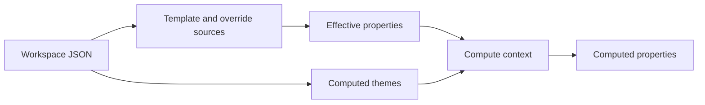

# Workspace Compute

This folder turns raw workspace entries into effective or computed properties for editor and preview code. It does not write computed values back to the workspace.

Workspace compute reads nodes, boards, themes, templates, and overrides. The effective stage merges properties. The computed stage also resolves computed property cells with a theme and parent context.

## Flow

## Major Types And Functions

| Type or Function | File | Purpose and use |
| --- | --- | --- |
| `computeWorkspaceThemes` | `compute-workspace-themes.ts` | Returns stock themes and workspace theme entries as computed themes. Called when workspace code needs every available computed theme. |
| `getComputedTheme` | `compute-workspace-themes.ts` | Resolves a theme id or theme template ref to a computed theme. Called by node compute and theme services. |
| `normalizeThemeId` | `compute-workspace-themes.ts` | Removes the `theme:` prefix from theme refs. Used before matching workspace theme entries. |
| `materializeWorkspaceTheme` | `compute-workspace-themes.ts` | Computes a workspace theme entry from its template and overrides. Used while building the computed theme list. |
| `mergeEffectiveProperties` | `compute-node-properties.ts` | Merges property snapshots in order. Called when callers need effective properties from several sources. |
| `getEffectiveNodeProperties` | `compute-node-properties.ts` | Merges schema defaults, template chains, and overrides. Called when selectors need a node or board property snapshot. |
| `computeNodeProperties` | `compute-node-properties.ts` | Returns effective or computed properties for a node or board. Called by editor and preview code. |
| `getNodes` | `compute-node-properties.ts` | Reads the active workspace node map. Used by compute helpers during property resolution. |
| `getOwnProperties` | `compute-node-properties.ts` | Reads local properties from a node or board. Used before property sources are merged. |
| `getComponentThemeRef` | `compute-node-properties.ts` | Reads the theme ref stored on a board. Used to resolve the theme for a root node. |
| `getNodeComponentId` | `compute-node-properties.ts` | Finds the component id for a node. Used before schema defaults are loaded. |
| `getSchemaProperties` | `compute-node-properties.ts` | Reads default properties from a component schema. Used as the first property source for catalog-backed nodes. |
| `getVariantId` | `compute-node-properties.ts` | Normalizes variant refs into ids. Used while locating a node in a board tree. |
| `findComponentForNode` | `compute-node-properties.ts` | Finds the board that owns a node tree. Used when theme and template context need the containing board. |
| `findParentNode` | `compute-node-properties.ts` | Finds the parent node for a child node. Used to build parent context and inherited theme lookup. |
| `getTemplateNode` | `compute-node-properties.ts` | Resolves a node template ref to the source node. Used when building template property sources. |
| `getRootNode` | `compute-node-properties.ts` | Walks a node up to its root variant. Used before resolving board-level theme context. |
| `normalizeThemeRef` | `compute-node-properties.ts` | Normalizes theme refs and empty theme values. Used before calling theme compute. |
| `getEffectiveThemeId` | `compute-node-properties.ts` | Finds the theme that applies to a node or board. Used to choose the compute theme for property formulas. |
| `mergeLayerArrays` | `compute-node-properties.ts` | Merges layered paint arrays by slot. Used for background, gradient, and shadow stacks. |
| `mergePropertySource` | `compute-node-properties.ts` | Merges one property source into another. Used by effective property merging. |
| `getTemplatePropertySources` | `compute-node-properties.ts` | Walks a template chain and returns its property sources. Used before local overrides are applied. |
| `buildComputeContext` | `compute-node-properties.ts` | Builds parent properties and theme context for property compute. Used when `computeNodeProperties` runs the computed stage. |
| `buildNodeParentIndex` | `../helpers/graph/build-node-parent-index.ts` | Maps child node ids to parent node ids. Re-exported for callers that need parent lookup during compute. |

## Notes

Workspace files store raw state. Selectors call this folder when they need effective or computed values.

Theme compute lives in `packages/core/themes/compute`. Property compute lives in `packages/core/properties/compute`. Resolution lives in `packages/core/helpers/resolution` and turns computed values into strings or numbers for CSS and UI.

Use `@seldon/core/workspace/compute` for workspace theme and node compute. Use `@seldon/core/properties/compute` when calling property compute directly.

`../helpers/properties/properties.ts` uses `getEffectiveNodeProperties` for editor merge behavior.

`@seldon/factory/helpers/compute-workspace` handles legacy export data. It computes a copy for the factory pipeline and stays separate from this selector path.

--- 

## Notice for AI and LLM Training

You may not use this software, or any derivative works of it, in whole or in part, for the purposes of training, fine-tuning, or otherwise improving (directly or indirectly) any machine learning or artificial intelligence system without written permission.