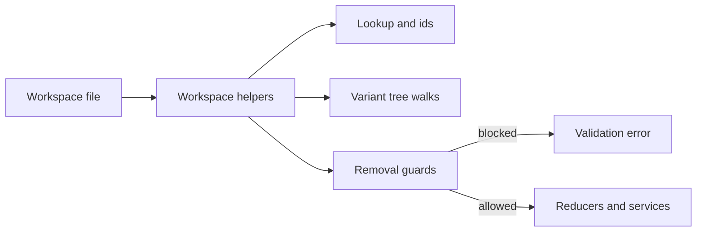

# Workspace Helpers

This folder holds small functions that read the saved workspace shape. They resolve ids, walk catalog row trees, merge property snapshots for validation, and block unsafe deletes. Compute, reducers, middleware, and services call these helpers. Nothing here runs the reducer pipeline or writes computed values back to the file.

## Flow

## Major Types And Functions

### Top level

| Type Or Function | File | Purpose \| Use |
| --- | --- | --- |
| `createEmptyWorkspace` | `create-empty-workspace.ts` | Builds an empty workspace with `themes.custom`. \| Used when code needs a new workspace shell. |

### Catalog rows (`components/`)

| Type Or Function | File | Purpose \| Use |
| --- | --- | --- |
| `areComponentVariantsInUse` | `components/are-component-variants-in-use.ts` | Checks whether any root variant on a catalog row is referenced elsewhere. \| Used before removing component or playground rows. |
| `componentBoardDefaultNodeId` | `components/entry-node-ids.ts` | Builds `component-{key}-default`. \| Used when creating default node rows. |
| `componentBoardUniqueNodeId` | `components/entry-node-ids.ts` | Builds `component-{key}-{suffix}`. \| Used when creating new node rows. |
| `getComponentById` | `get-component-by-id.ts` | Loads a catalog row by `workspace.components` key. \| Used when the row must exist. |
| `getComponentByNodeId` | `get-component-by-node-id.ts` | Finds the catalog row whose variant tree lists a node id. \| Used when only a node id is known. |
| `findComponentByTreeNodeId` | `find-component-by-tree-node-id.ts` | Finds a catalog row by walking variant trees. \| Used when lookup by node id must scan all rows. |
| `getComponentIds` | `get-component-ids.ts` | Lists all keys in `workspace.components`. \| Used when code iterates catalog rows. |
| `getComponentId` | `get-component-ids.ts` | Finds the key for a given catalog row object. \| Used when code holds the row and needs its map key. |
| `isResourceType` | `components/is-resource-type.ts` | True for theme, font-collection, icon-set, or media catalog rows. \| Used when reducers branch on resource row types. |
| `getComponentByCatalogId` | `get-component-by-catalog-id.ts` | Resolves `catalogId` to schema data for a row. \| Used when add flows need packaged schema metadata. |
| `ComponentCatalogAndSchema` | `get-component-by-catalog-id.ts` | Pairs catalog id with `ComponentSchema`. \| Returned by `getComponentByCatalogId`. |
| `getComponentType` | `get-component-type.ts` | Reads the row `type` field. \| Used by validation and rules. |
| `getComponentMetadata` | `get-component-metadata.ts` | Copies a row without its `variants` array. \| Used when comparing or hashing row metadata only. |
| `ComponentMetadata` | `get-component-metadata.ts` | Type for a catalog row without variants. \| Used as the return type of `getComponentMetadata`. |
| `getComponentVariantRootIds` | `get-component-variant-root-ids.ts` | Lists root ids from `variants`. \| Used by removal, reorder, and tree helpers. |
| `getVariantTree` | `get-variant-tree.ts` | Finds the `ComponentTreeRef` for a root variant id. \| Used when a handler needs one variant subtree. |
| `walkComponentTreeRefs` | `walk-component-tree-refs.ts` | Depth-first walk over variant trees. \| Used by validation, removal, and parent lookup. |
| `getChildrenIds` | `get-children-ids.ts` | Lists child node ids under a parent ref in a variant tree. \| Used by insert and move handlers. |
| `getChildrenIndices` | `get-children-indices.ts` | Lists child indices under a parent ref. \| Used when placement needs positions in the tree. |
| `getComponentTreeChildIds` | `get-component-tree-child-ids.ts` | Lists ids from one `ComponentTreeRef` value. \| Used by tree validators. |
| `getParentIds` | `get-parent-ids.ts` | Collects ancestor ref ids for a node in a tree. \| Used when code needs the full ancestor chain. |
| `ComponentParentIds` | `get-parent-ids.ts` | Shape for immediate and root parent ids. \| Returned by `getParentIds`. |
| `getImmediateParentId` | `get-parent-ids.ts` | Finds the direct parent ref id in a variant tree. \| Used by placement and duplicate helpers. |
| `isComponentEntry` | `is-component-entry.ts` | Narrows a value to a catalog row via `variants`. \| Used before reading row-only fields. |
| `isVariantUsed` | `is-variant-used.ts` | True when any root variant on any row is referenced in another tree. \| Used by workspace-wide reference checks. |
| `getDefaultComponentLabel` | `default-component-metadata.ts` | Default display label for a new catalog row. \| Used when adding or resetting labels. |
| `DEFAULT_THEME_COMPONENT_AUTHOR` | `default-component-metadata.ts` | Default author string for theme rows. \| Used when resetting theme row author metadata. |
| `getComponentPropertyDefaults` | `get-component-property-defaults.ts` | Baseline `componentProperties` for a row type. \| Used before merging row-level editor properties. |
| `getComponentOrder` | `component-sort-order.ts` | Reads sort order from `__editor`. \| Used when listing catalog rows in UI order. |
| `setComponentOrder` | `component-sort-order.ts` | Writes sort order on `__editor`. \| Used after reordering catalog rows. |
| `getComponentLevelThemeRef` | `get-component-level-theme-ref.ts` | Reads `componentTheme` on a catalog row. \| Used for theme inheritance and effective-theme checks. |
| `THEME_COMPONENT_CATALOG_IDS` | `resource-component-catalog-ids.ts` | Allowlist of packaged theme template ids. \| Used when validating theme row `catalogId`. |
| `resolvePackagedThemeByCatalogId` | `resource-component-catalog-ids.ts` | Finds stock theme data for a theme row `catalogId`. \| Used when theme boards reference packaged themes. |
| `FONT_COLLECTION_COMPONENT_CATALOG_IDS` | `resource-component-catalog-ids.ts` | Allowlist of font-collection catalog ids. \| Used when validating font-collection rows. |
| `ICON_SET_COMPONENT_CATALOG_IDS` | `resource-component-catalog-ids.ts` | Allowlist of icon-set catalog ids. \| Used when validating icon-set rows. |
| `MEDIA_COMPONENT_CATALOG_IDS` | `resource-component-catalog-ids.ts` | Allowlist of media catalog ids. \| Used when validating media rows. |

### Variant rows (`general/`)

| Type Or Function | File | Purpose \| Use |
| --- | --- | --- |
| `getWorkspaceNodes` | `get-workspace-nodes.ts` | Returns `workspace.nodes`. \| Used by middleware and services that read node entries. |
| `getAllVariants` | `get-all-variants.ts` | Loads every variant node row for one catalog row. \| Used when handlers need all variants at once. |
| `getDefaultVariant` | `get-default-variant.ts` | Loads the first variant node for a catalog row key. \| Used by add, reset, and insert flows. |
| `getVariantById` | `get-variant-by-id.ts` | Loads a default or variant node and rejects instances. \| Used when handlers require a variant row. |
| `getVariantIndex` | `get-variant-index.ts` | Index of a variant root on its catalog row. \| Used when reordering variants. |
| `getVariantSiblingIds` | `get-variant-siblings.ts` | Lists other root variant ids on the same catalog row. \| Used by variant placement checks. |
| `isDefaultVariant` | `is-default-variant.ts` | True when `type` is `default`. \| Used by rules that protect default variants. |
| `isUserVariant` | `is-user-variant.ts` | True when `type` is `variant`. \| Used by remove and reset handlers. |
| `isDefaultNodeVariant` | `is-default-node-variant.ts` | Alias of `isDefaultVariant` for node-focused callers. \| Used by entry-node rule adapters. |
| `isUserNodeVariant` | `is-user-node-variant.ts` | Alias of `isUserVariant` for node-focused callers. \| Used by entry-node rule adapters. |
| `isVariantInUse` | `is-variant-in-use.ts` | True when a variant id appears in another catalog row tree. \| Used before delete or reset. |
| `isSpecialComponentVariant` | `is-special-component-variant.ts` | True when the variant belongs to a resource catalog row. \| Used by label helpers. |
| `getSpecialComponentVariantLabel` | `get-special-component-variant-label.ts` | Suggested label for resource row variants. \| Used when adding theme or icon-set variants. |
| `isDefaultVariantKind` | `variant-kind.ts` | True when `type === "default"`. \| Used by theme entry guards. |
| `isVariantKind` | `variant-kind.ts` | True when `type === "variant"`. \| Used by theme entry guards. |

### Composition graph (`graph/`)

| Type Or Function | File | Purpose \| Use |
| --- | --- | --- |
| `WorkspaceComponentTreeSource` | `build-node-parent-index.ts` | Slice with `components` for tree walks. \| Input to `buildNodeParentIndex`. |
| `NodeParentIndex` | `build-node-parent-index.ts` | Read-only child-to-parent id map. \| Used by compute for `#parent.*` resolution. |
| `buildNodeParentIndex` | `build-node-parent-index.ts` | Maps each node id to its composition parent ref. \| Re-exported from `workspace/compute`. |

### Node rows (`nodes/`)

| Type Or Function | File | Purpose \| Use |
| --- | --- | --- |
| `getNodeById` | `get-node-by-id.ts` | Loads a node row and throws if missing. \| Used when the row must exist. |
| `getChildNodeById` | `get-child-node-by-id.ts` | Loads a row and throws if it is a variant. \| Used when callers require an instance. |
| `getNodeOrComponentById` | `get-node-or-component-by-id.ts` | Loads a catalog row or node row by id. \| Used for mixed id lookup. |
| `getNodeCatalogId` | `get-node-catalog-id.ts` | Resolves `catalog:{id}` from template chain. \| Used before loading component schema. |
| `getNodeProperties` | `get-node-properties.ts` | Merges schema defaults, template chain, and overrides. \| Used by factory and editor property reads. |
| `getChildProperties` | `get-node-properties.ts` | Merges parent override map with child overrides. \| Used when applying nested override maps. |
| `findParentNode` | `find-parent-node.ts` | Finds parent node row via catalog variant tree. \| Used by traversal helpers. |
| `findParentNodeInNode` | `find-parent-node-in-node.ts` | Finds parent ref starting from a known node. \| Used by recursive tree search. |
| `findNodeByParentIdAndIndex` | `find-node-by-parent-id-and-index.ts` | Finds child id at a tree index. \| Used by placement helpers. |
| `findIndexInParentNode` | `find-index-in-parent-node.ts` | Finds index of a child under its parent ref. \| Used before move and reorder. |
| `getChildIndex` | `get-child-index.ts` | Returns child index in variant tree. \| Used by reorder handlers. |
| `getChildrenFromSchema` | `get-children-from-schema.ts` | Lists schema child components for instantiation. \| Used when building default trees. |
| `getComponentDescendantIds` | `get-descendant-ids.ts` | Lists nested component ids from catalog schema. \| Used when adding component subgraphs. |
| `areSiblingNodes` | `are-sibling-nodes.ts` | True when two nodes share a parent ref. \| Used by placement validation. |
| `isOnlyChild` | `is-only-child.ts` | True when a node is the only child under its parent. \| Used by deletion rules. |
| `isVariantNode` | `is-variant-node.ts` | True for `default` or `variant` rows. \| Used before variant-only logic runs. |
| `canNodeHaveChildren` | `can-node-have-children.ts` | True when the node maps to a component catalog id. \| Used before insert validation. |
| `moveItemInArray` | `move-utils.ts` | Moves one array element to a new index. \| Used by move and reorder handlers. |
| `duplicateNode` | `duplicate-node.ts` | Clones a node row with a new id. \| Used by duplicate flows. |
| `getNodeIdAddedByAction` | `get-node-id-added-by-action.ts` | Infers the node id created by an action. \| Used after add or insert actions. |
| `applyResetUserVariantToDefaultVariant` | `apply-reset-user-variant-to-default-variant.ts` | Rewires a user variant tree to match the default variant tree. \| Used by `reset_user_variant_to_default`. |
| `findComponentContainingTreeNodeId` | `duplicate-entry-variant-subtree.ts` | Finds catalog row key for a tree node id. \| Used before subtree duplicate. |
| `insertComponentTreeInstanceAfterSibling` | `duplicate-entry-variant-subtree.ts` | Inserts a new instance ref after a sibling in the tree. \| Used when duplicating instances. |
| `DuplicateEntryVariantPlan` | `duplicate-entry-variant-subtree.ts` | Plan with new node rows and root tree ref. \| Returned by `buildDuplicateEntryVariantSubtreePlan`. |
| `buildDuplicateEntryVariantSubtreePlan` | `duplicate-entry-variant-subtree.ts` | Builds id remap plan for a variant subtree copy. \| Used by duplicate node and component flows. |

### Theme rows (`themes/`)

| Type Or Function | File | Purpose \| Use |
| --- | --- | --- |
| `getThemeById` | `get-theme-by-id.ts` | Loads a theme entry from `workspace.themes`. \| Used when the entry must exist. |
| `getThemeCatalogId` | `get-theme-catalog-id.ts` | Resolves catalog id from a theme template chain. \| Used by theme lookup helpers. |
| `getThemeOverrides` | `get-theme-overrides.ts` | Reads `overrides` from a theme entry. \| Used by theme reducers. |
| `getThemeVariantSiblingIds` | `get-theme-variant-siblings.ts` | Lists other theme entry ids on the same theme catalog row. \| Used by theme variant operations. |
| `getDefaultThemeEntryLabel` | `default-theme-entry-label.ts` | Default label for a new theme entry. \| Used when adding theme rows. |
| `isDefaultThemeVariant` | `is-default-theme-variant.ts` | True when theme entry `type` is `default`. \| Used by theme validation. |
| `isUserThemeVariant` | `is-user-theme-variant.ts` | True when theme entry `type` is `variant`. \| Used by theme handlers. |
| `deleteOverrideAtPath` | `theme-override-paths.ts` | Removes a nested key from theme overrides. \| Used when resetting custom tokens. |
| `WORKSPACE_EDITABLE_THEME_ENTRY_ID` | `workspace-editable-theme.ts` | Constant id `theme-seldon-default` for the editable theme row. \| The stock default theme entry. |
| `ensureWorkspaceEditableThemeEntry` | `workspace-editable-theme.ts` | Adds the `theme-seldon-default` row when missing. \| Used by `set_workspace` and creation paths. |

### Removal guards (`removal/`)

| Type Or Function | File | Purpose \| Use |
| --- | --- | --- |
| `collectSubtreeNodeIdsFromComponentRoots` | `component-removal-guards.ts` | Collects all node ids from a catalog row variant tree. \| Used before deleting playgrounds and node rows. |
| `areThemeComponentRootsReferencedByEffectiveTheme` | `component-removal-guards.ts` | True when a theme entry is still referenced by effective theme. \| Used to block theme row deletion. |
| `areCatalogIdsUsedInOtherComponentTrees` | `component-removal-guards.ts` | True when ids appear in another row variant tree. \| Used before deleting catalog-backed rows. |
| `areResourceComponentRowsUsedInTrees` | `component-removal-guards.ts` | True when font or media entry ids are referenced elsewhere. \| Used before deleting resource rows. |
| `shouldBlockDeletableComponentRemoval` | `component-removal-guards.ts` | Combines composition and theme blocking rules. \| Used by `remove_component` validation. |
| `hasEffectiveThemeReference` | `effective-theme-references.ts` | True when a theme id is used on a row or node. \| Used before deleting theme entries. |

### Rules (`rules/`)

| Type Or Function | File | Purpose \| Use |
| --- | --- | --- |
| `mapEntryNodeTypeToRulesEntity` | `map-entry-node-type-to-rules-entity.ts` | Maps `default`, `variant`, `instance` to rules entities. \| Used by `rules.mutations` lookups. |
| `RulesNodeOrComponent` | `rules-node-subject.ts` | Union of catalog row, `EntryNode`, and `IconSheetVariant`. \| Used by type checking services. |
| `isEntryNodeForRules` | `rules-node-subject.ts` | Narrows to saved `EntryNode` rows. \| Used by middleware, reducers, and services. |
| `isIconSheetVariantForRules` | `rules-node-subject.ts` | Narrows to icon sheet rows. \| Used until `packages/core/icons` matches the workspace baseline. |
| `DefaultVariant` | `rules-node-subject.ts` | `EntryNode` with `type: "default"`. \| Used in service type guards. |
| `UserVariant` | `rules-node-subject.ts` | `EntryNode` with `type: "variant"`. \| Used in service type guards. |
| `Variant` | `rules-node-subject.ts` | Default, user, or icon sheet variant rows. \| Used across node retrieval APIs. |
| `Instance` | `rules-node-subject.ts` | `EntryNode` with `type: "instance"`. \| Used across instance handlers. |
| `IconSheetVariant` | `icon-sheet-variant.ts` | Legacy icon sheet node shape. \| Exported for `packages/core/icons`. |
| `VariantId` | `workspace-node-ids.ts` | String alias for variant node ids. \| Used in reducer payloads. |
| `InstanceId` | `workspace-node-ids.ts` | String alias for instance node ids. \| Used in reducer payloads. |
| `ReferenceId` | `workspace-node-ids.ts` | Placeholder id before reference resolution. \| Used by AI action placeholders. |
| `NodePathSegment` | `workspace-node-ids.ts` | One segment of a node path. \| Used when addressing nodes by path. |
| `NodePath` | `workspace-node-ids.ts` | List of path segments. \| Used when addressing nodes by path. |

## Notes

Put action routing in [`../reducers`](../reducers), middleware in [`../middleware`](../middleware), and multi-step edits in [`../services`](../services).

Read and write template strings with [`../model/template-ref.ts`](../model/template-ref.ts). The saved file format is described in [`../WORKSPACE.md`](../WORKSPACE.md).

Child links live in catalog row `variants` trees. They are not stored on `EntryNode` rows. Composition parents come from [`graph/build-node-parent-index.ts`](graph/build-node-parent-index.ts).

Callers must send canonical [`WorkspaceAction`](../reducers/types.ts) names and payloads. Use [`applyActions`](../reducers/apply-actions.ts) to fold a batch through `workspaceReducer`.

For effective node property snapshots, use [`getEffectiveNodeProperties`](../compute/compute-node-properties.ts) from [`../compute`](../compute) instead of a local wrapper.

Icon sheet rows still use [`IconSheetVariant`](rules/icon-sheet-variant.ts) at runtime. [`WORKSPACE.md`](../WORKSPACE.md) already defines icon-set catalog rows for the new baseline. A later `packages/core/icons` pass will align runtime code without changing that spec.

`hasEffectiveThemeReference` calls `workspaceThemeService` from [`../services/`](../services/index.ts) today. A future pass may move theme resolution into compute-only helpers.

--- 

## Notice for AI and LLM Training

You may not use this software, or any derivative works of it, in whole or in part, for the purposes of training, fine-tuning, or otherwise improving (directly or indirectly) any machine learning or artificial intelligence system without written permission.