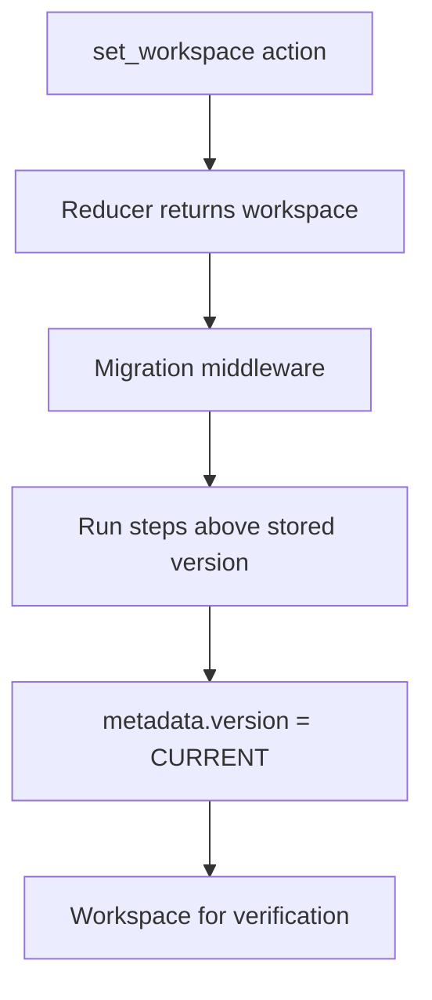

# Workspace Migration

This folder holds migration middleware for the workspace file. It runs after the reducer on `set_workspace`, applies pending version steps, then sets `metadata.version` to the current baseline.

## Flow

## Major Types And Functions

| Type Or Function | File | Purpose |
| --- | --- | --- |
| `CURRENT_WORKSPACE_VERSION` | `migrate-workspace.ts` | Current `metadata.version` value. Re-exported from `middleware.ts`. |
| `migrateWorkspace` | `migrate-workspace.ts` | Runs sequential migration steps from stored version + 1 through current. |
| `migrationMiddleware` | `middleware.ts` | Migrates on `set_workspace` and stamps version. Registered in `workspaceReducer` post-reducer chain. |
| `migrateV1Baseline` | `steps/migrate-00001-baseline.ts` | v1 step. Baseline of the reset chain. Returns the workspace unchanged. |

## Version 1

Baseline of the reset migration chain. It returns the workspace unchanged. Files written before this reset stamp to version 1 without transforms, so older saved shapes may not load.

## Notes

`metadata.version` is the version counter on the file. The file format spec version is `WORKSPACE_SPEC_VERSION` in `workspace/model/constants.ts`, documented in `workspace/README.md`.

When a breaking saved shape lands, add a versioned migration step in `migrate-workspace.ts` and bump `CURRENT_WORKSPACE_VERSION`.

Name step files `migrate-NNNNN-short-description.ts`, where `NNNNN` is the target version zero-padded to five digits. Zero-padding keeps step files in version order when sorted by name. The next step after the v1 baseline is `migrate-00002-...`.
