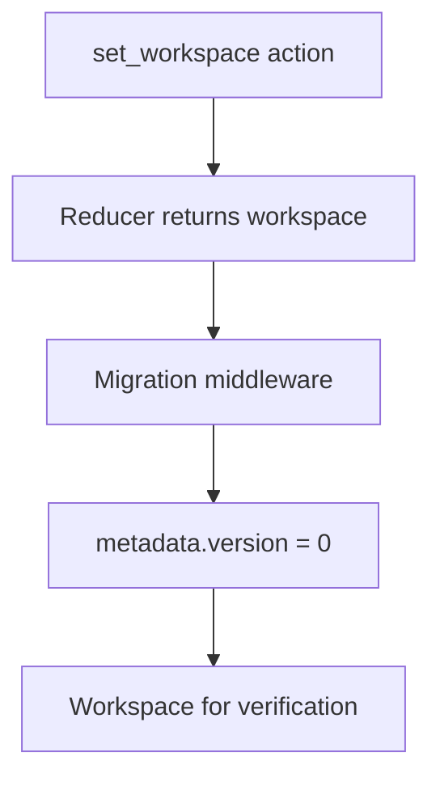

# Workspace Migration

This folder holds migration middleware for the v0 workspace file. It runs after the reducer on `set_workspace` and sets `metadata.version` to the current baseline.

Legacy `boards` files and in-package upgrades from old shapes are out of scope. Add versioned migrations in `migrations/index.ts` when the saved format changes.

## Flow

## Major Types And Functions

| Type Or Function | File | Purpose \| Use |
| --- | --- | --- |
| `CURRENT_WORKSPACE_VERSION` | `middleware.ts` | Current `metadata.version` value for v0 files. \| Used when normalizing loaded workspaces. |
| `migrationMiddleware` | `middleware.ts` | Sets `metadata.version` on `set_workspace`. \| Registered in `workspaceReducer` post-reducer chain. |
| `MigrationFunction` | `migrations/index.ts` | Type for a workspace transform. \| Used when adding a versioned migration. |
| `MigrationRecord` | `migrations/index.ts` | Versioned migration registry entry. \| Listed in `migrations`. |
| `AlwaysRunMigrationRecord` | `migrations/index.ts` | Migration that runs on every load. \| Listed in `alwaysRunMigrations`. |
| `migrations` | `migrations/index.ts` | Versioned migration list. \| Empty at v0 baseline. |
| `alwaysRunMigrations` | `migrations/index.ts` | Always-run migration list. \| Empty at v0 baseline. |

## Notes

`metadata.version` is the migration counter on the file. The file format spec version lives in `WORKSPACE.md` as `WORKSPACE_SPEC_VERSION`.

When a breaking saved shape lands, add a migration, bump `CURRENT_WORKSPACE_VERSION`, and update `WORKSPACE.md`.
