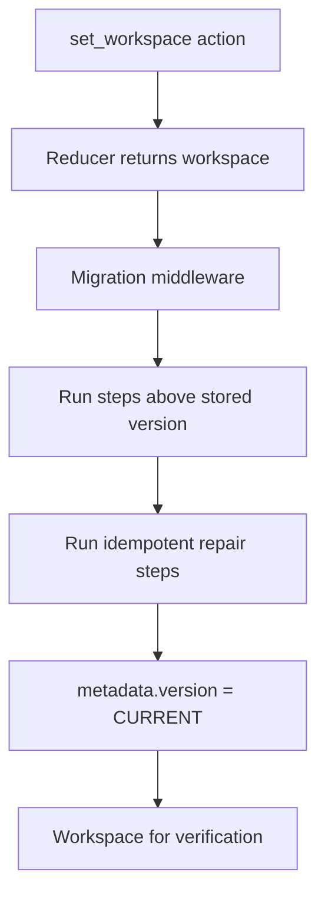

# Workspace Migration

This folder holds migration middleware for the workspace file. It runs after the reducer on `set_workspace`, applies pending version steps, then sets `metadata.version` to the current version.

## Flow

## Major Types And Functions

| Type Or Function | File | Purpose |
| --- | --- | --- |
| `CURRENT_WORKSPACE_VERSION` | `migrate-workspace.ts` | Current `metadata.version` value. Re-exported from `middleware.ts`. |
| `migrateWorkspace` | `migrate-workspace.ts` | Runs sequential migration steps from stored version + 1 through current, then repair steps. |
| `migrationMiddleware` | `middleware.ts` | Migrates on `set_workspace` and stamps version. Registered in `workspaceReducer` post-reducer chain. |

Versioned steps live under `steps/`, one file per target version. Version 1 is the baseline of the reset chain and returns the workspace unchanged. Files written before this reset stamp to version 1 without transforms, so older saved shapes may not load.

## Repair Steps

Repair steps run on every load, regardless of stored version. They cover stock theme and icon set renames that must also reach files already stamped at the current version. Each repair guards itself and only rewrites the references it matches, so it is safe to re-run.

## Version Guards

`migrateWorkspace` throws when a file's stored version is newer than `CURRENT_WORKSPACE_VERSION`. Stamping such a file down would silently discard data this version cannot understand.

The module also asserts at load that a migration step is registered for `CURRENT_WORKSPACE_VERSION`, so a version bump without a matching step fails loudly.

## Notes

`metadata.version` is the migration counter on the file. It is separate from the file format specification version documented in `workspace/README.md`.

When a breaking saved shape lands, add a versioned migration step in `migrate-workspace.ts` and bump `CURRENT_WORKSPACE_VERSION`.

Name step files `migrate-NNNNN-short-description.ts`, where `NNNNN` is the target version zero-padded to five digits. Zero-padding keeps step files in version order when sorted by name.
