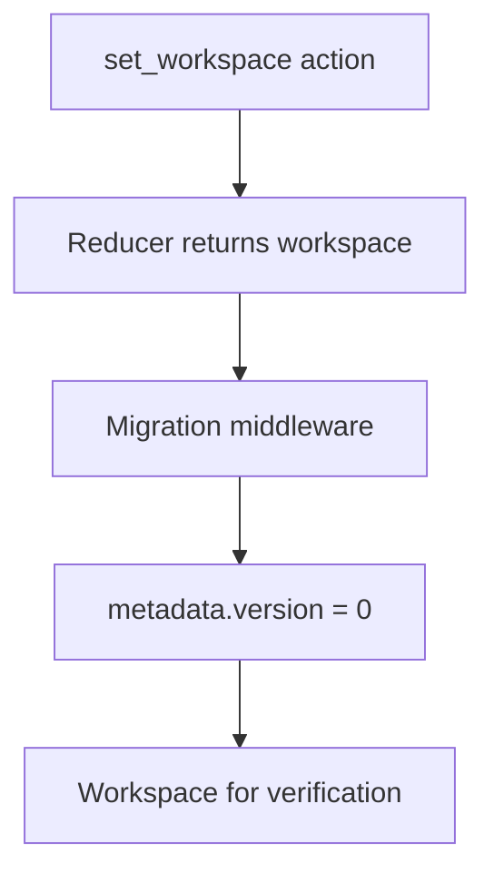

# Workspace Migration

This folder holds migration middleware for the v0 workspace file. It runs after the reducer on `set_workspace` and sets `metadata.version` to the current baseline.

The v0 baseline ships no historical migrations. Files saved before v0 are not guaranteed to load.

## Flow

## Major Types And Functions

| Type Or Function | File | Purpose \| Use |
| --- | --- | --- |
| `CURRENT_WORKSPACE_VERSION` | `middleware.ts` | Current `metadata.version` value for v0 files. \| Used when normalizing loaded workspaces. |
| `migrationMiddleware` | `middleware.ts` | Sets `metadata.version` on `set_workspace`. \| Registered in `workspaceReducer` post-reducer chain. |

## Notes

`metadata.version` is the version counter on the file. The file format spec version is `WORKSPACE_SPEC_VERSION` in `workspace/model/constants.ts`, documented in `workspace/README.md`.

When a breaking saved shape lands, add a versioned migration step here and bump `CURRENT_WORKSPACE_VERSION`.
