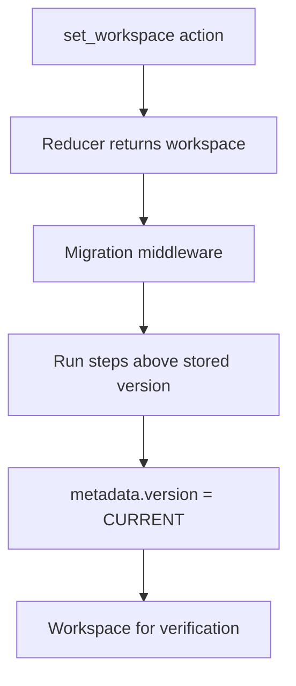

# Workspace Migration

This folder holds migration middleware for the workspace file. It runs after the reducer on `set_workspace`, applies pending version steps, then sets `metadata.version` to the current baseline.

## Flow

## Major Types And Functions

| Type Or Function                 | File                                             | Purpose                                                                                              |
| -------------------------------- | ------------------------------------------------ | ---------------------------------------------------------------------------------------------------- |
| `CURRENT_WORKSPACE_VERSION`      | `migrate-workspace.ts`                           | Current `metadata.version` value. Re-exported from `middleware.ts`.                                  |
| `migrateWorkspace`               | `migrate-workspace.ts`                           | Runs sequential migration steps from stored version + 1 through current.                             |
| `migrationMiddleware`            | `middleware.ts`                                  | Migrates on `set_workspace` and stamps version. Registered in `workspaceReducer` post-reducer chain. |
| `migrateV1BackgroundBlendFilter` | `steps/migrate-00001-background-blend-filter.ts` | v1 step. Normalizes legacy EXACT `blendMode` and `filter` values.                                    |
| `migrateV2SeedPlaygrounds`       | `steps/migrate-00002-seed-playgrounds.ts`        | v2 step. Seeds the playgrounds section.                                                              |
| `migrateV3BackgroundKind`        | `steps/migrate-00003-background-kind.ts`         | v3 step. Rewrites background layers to the kind-typed model.                                         |
| `migrateV4GradientIntoBackground` | `steps/migrate-00004-gradient-into-background.ts` | v4 step. Folds the gradient stack into background as gradient-kind layers.                          |

## Version 1

Normalizes background blend and filter stored shapes:

- `blendMode` EXACT with a known CSS blend keyword becomes OPTION.
- `blendMode` EXACT with an unknown string becomes EMPTY.
- `filter` EXACT that matches a catalog preset becomes OPTION.
- Other `filter` EXACT strings stay unchanged.

The step walks `nodes[*].overrides`, `themes[*].overrides`, and board `componentProperties`.

## Version 3

Rewrites each background layer to the kind-typed model:

- Derives a `kind` of `none`, `color`, or `image` from the layer facets and any legacy `@background.*` preset.
- A layer with a picture, or the `@background.background1` or `@background.background2` preset, becomes `image`. The `@background.background2` preset also sets `repeat` to `repeat`.
- A layer with a color, or another `@background.*` preset, becomes `color`.
- A layer with neither becomes `none`.
- Keeps only the chosen kind's facets, drops the `preset`, and adds the `kind` option.
- Removes the deleted `background` look section from `themes[*].overrides`.

The step walks `nodes[*].overrides` and board `componentProperties`.

## Version 4

Folds the standalone `gradient` paint stack into the `background` stack:

- Each `gradient` layer becomes a `background` layer with `kind` set to `gradient`. Its preset and stop facets carry over unchanged.
- Gradient layers are appended above existing background layers, preserving their prior "on top" paint order.
- The `gradient` key is removed from the property bag.
- Theme `gradient` look tokens are left untouched.

The step walks `nodes[*].overrides` and board `componentProperties`.

## Notes

`metadata.version` is the version counter on the file. The file format spec version is `WORKSPACE_SPEC_VERSION` in `workspace/model/constants.ts`, documented in `workspace/README.md`.

When a breaking saved shape lands, add a versioned migration step in `migrate-workspace.ts` and bump `CURRENT_WORKSPACE_VERSION`.

Name step files `migrate-NNNNN-short-description.ts`, where `NNNNN` is the target version zero-padded to five digits. Zero-padding keeps step files in version order when sorted by name. Version 1 is `migrate-00001-...` and version 2 is `migrate-00002-...`.
