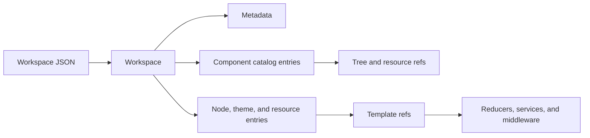

# Workspace Model

This folder defines the TypeScript shape for saved workspace files. It describes metadata, component catalog entries, node entries, theme entries, resource entries, and template refs.

Reducers, services, middleware, and external callers use these types when they need the saved JSON shape.

---

## Flow

---

## Major Types And Helpers

### Workspace Shape

| Type Or Helper | File | Purpose \| Use |
| --- | --- | --- |
| `WORKSPACE_SPEC_VERSION` | `constants.ts` | Names the workspace file format version. \| Read by migration and docs when they need the file format version. |
| `Workspace` | `workspace.ts` | Describes the top-level workspace maps. \| Used by reducers, services, middleware, and selectors as the saved file shape. |
| `WorkspaceMetadata` | `metadata.ts` | Describes file-level metadata. \| Used for workspace label, owner, version, tags, intent, and license fields. |
| `WorkspaceStringMap` | `string-maps.ts` | Describes string maps in saved files. \| Used for simple id-to-string maps. |

---

### Catalog Entry Refs

| Type Or Helper | File | Purpose \| Use |
| --- | --- | --- |
| `ComponentTreeRef` | `component-tree.ts` | Stores a node id and nested child refs. \| Used by component and playground boards to store variant trees. |
| `ThemeEntryRef` | `component-tree.ts` | Stores a theme entry id. \| Used by theme boards to list theme entries. |
| `FontCollectionEntryRef` | `component-tree.ts` | Stores a font collection entry id. \| Used by font collection boards to list font collection entries. |
| `IconSetEntryRef` | `component-tree.ts` | Stores an icon set entry id. \| Used by icon set boards to list icon set entries. |
| `MediaEntryRef` | `component-tree.ts` | Stores a media entry id. \| Used by media boards to list media entries. |

---

### Component Catalog Entries

| Type Or Helper | File | Purpose \| Use |
| --- | --- | --- |
| `ComponentKey` | `components.ts` | Names a key in `workspace.components`. \| Used by helpers and services that look up board rows. |
| `ComponentThemeRef` | `components.ts` | Names a theme ref stored on a board. \| Used when board-level theme refs are read or written. |
| `WorkspaceComponentLevel` | `components.ts` | Describes the component level stored in saved JSON. \| Used when board metadata needs component level information. |
| `ComponentBoard` | `components.ts` | Describes a component board row. \| Used for component boards that own node variant trees. |
| `PlaygroundBoard` | `components.ts` | Describes a playground board row. \| Used for playground boards that own node variant trees. |
| `ThemeBoard` | `components.ts` | Describes a theme board row. \| Used for theme boards that reference theme entries. |
| `FontCollectionBoard` | `components.ts` | Describes a font collection board row. \| Used for font collection resource boards. |
| `IconSetBoard` | `components.ts` | Describes an icon set board row. \| Used for icon set resource boards. |
| `MediaBoard` | `components.ts` | Describes a media board row. \| Used for media resource boards. |
| `ComponentCatalogEntry` | `components.ts` | Unions all board row shapes in `workspace.components`. \| Used when code works across board types. |
| `isComponentBoard` | `components.ts` | Checks whether a board is a component board. \| Used before reading component-specific fields. |
| `isPlaygroundBoard` | `components.ts` | Checks whether a board is a playground board. \| Used before reading playground-specific fields. |
| `isThemeBoard` | `components.ts` | Checks whether a board is a theme board. \| Used before reading theme resource refs. |
| `isFontCollectionBoard` | `components.ts` | Checks whether a board is a font collection board. \| Used before reading font collection refs. |
| `isIconSetBoard` | `components.ts` | Checks whether a board is an icon set board. \| Used before reading icon set refs. |
| `isMediaBoard` | `components.ts` | Checks whether a board is a media board. \| Used before reading media refs. |

---

### Entries

| Type Or Helper | File | Purpose \| Use |
| --- | --- | --- |
| `EntryNodeId` | `entry-node.ts` | Names a node entry id. \| Used by helpers, reducers, and services that address nodes. |
| `EntryNodeType` | `entry-node.ts` | Lists saved node entry types. \| Used to distinguish default, variant, and instance nodes. |
| `EntryNodePropertyOverrides` | `entry-node.ts` | Stores property overrides for node entries. \| Used when reading or writing `EntryNode.overrides`. |
| `EntryNodeLevel` | `entry-node.ts` | Lists saved node levels. \| Used when node entries carry component level data. |
| `EntryNodeThemeRef` | `entry-node.ts` | Names a theme ref stored on a node. \| Used by theme helpers and mutation services. |
| `NodeOrigin` | `entry-node.ts` | Creation origin of an instance, `"schema"` or `"user"`. \| Drives remove_instance hide-vs-delete. |
| `EntryNode` | `entry-node.ts` | Describes default, variant, and instance node rows. \| Used by most workspace graph code. |
| `isEntryNodeDefault` | `entry-node.ts` | Checks whether a node row is a default node. \| Used before default-node behavior runs. |
| `isEntryNodeVariant` | `entry-node.ts` | Checks whether a node row is a variant node. \| Used before variant behavior runs. |
| `isEntryNodeInstance` | `entry-node.ts` | Checks whether a node row is an instance node. \| Used before instance behavior runs. |
| `EntryThemeId` | `entry-theme.ts` | Names a theme entry id. \| Used by theme boards and theme lookup helpers. |
| `EntryThemeType` | `entry-theme.ts` | Lists saved theme entry types. \| Used to distinguish default and variant theme entries. |
| `EntryThemeOverrides` | `entry-theme.ts` | Stores override values for theme entries. \| Used when reading or writing `EntryTheme.overrides`. |
| `EntryTheme` | `entry-theme.ts` | Describes default and variant theme entries. \| Used by theme boards, compute, and migration. |
| `isEntryThemeDefault` | `entry-theme.ts` | Checks whether a theme row is a default theme. \| Used before default-theme behavior runs. |
| `isEntryThemeVariant` | `entry-theme.ts` | Checks whether a theme row is a variant theme. \| Used before variant-theme behavior runs. |
| `EntryFontCollection` | `entry-font-collection.ts` | Describes a font collection entry. \| Used by font collection boards and resource handlers. |
| `EntryIconSet` | `entry-icon-set.ts` | Describes an icon set entry. \| Used by icon set boards and resource handlers. |
| `EntryMedia` | `entry-media.ts` | Describes a media entry. \| Used by media boards and resource handlers. |

---

### Template Refs

| Type Or Helper | File | Purpose \| Use |
| --- | --- | --- |
| `ParsedNodeTemplateRef` | `template-ref.ts` | Describes parsed node template refs. \| Returned when code parses `catalog:*` or `node:*` refs. |
| `ParsedThemeTemplateRef` | `template-ref.ts` | Describes parsed theme template refs. \| Returned when code parses `catalog:*` or `theme:*` refs. |
| `parseNodeTemplateRef` | `template-ref.ts` | Parses node template refs. \| Used before code follows a node template. |
| `parseThemeTemplateRef` | `template-ref.ts` | Parses theme template refs. \| Used before code follows a theme template. |
| `formatNodeCatalogTemplateRef` | `template-ref.ts` | Writes a catalog node template ref. \| Used when creating default or catalog-backed nodes. |
| `formatNodeLinkTemplateRef` | `template-ref.ts` | Writes a node template ref. \| Used when creating variants and instances from nodes. |
| `formatThemeCatalogTemplateRef` | `template-ref.ts` | Writes a catalog theme template ref. \| Used when creating default theme entries. |
| `formatThemeLinkTemplateRef` | `template-ref.ts` | Writes a theme template ref. \| Used when creating theme variants. |
| `parseNodeCatalogTemplateRef` | `template-ref.ts` | Parses catalog node template refs only. \| Used when callers need the parsed catalog node ref. |
| `parseNodeLinkTemplateRef` | `template-ref.ts` | Parses node template refs only. \| Used when callers need the parsed node ref. |
| `parseThemeCatalogTemplateRef` | `template-ref.ts` | Parses catalog theme template refs only. \| Used when callers need the parsed catalog theme ref. |
| `parseThemeLinkTemplateRef` | `template-ref.ts` | Parses theme template refs only. \| Used when callers need the parsed theme ref. |
| `getNodeTemplateComponentId` | `template-ref.ts` | Reads the component id from a catalog node template ref. \| Used when callers need only the component id. |
| `getNodeTemplateNodeId` | `template-ref.ts` | Reads the node id from a node template ref. \| Used when callers need only the source node id. |
| `getThemeTemplateCatalogId` | `template-ref.ts` | Reads the catalog id from a catalog theme template ref. \| Used when callers need only the theme catalog id. |
| `getThemeTemplateThemeId` | `template-ref.ts` | Reads the theme id from a theme template ref. \| Used when callers need only the source theme id. |

---

## Notes

Keep this folder focused on the saved workspace shape. 

- Reducer action types in `../reducers/types.ts`
- Service methods in `../services`
- Computed output in `../compute`.

And note:

- `WORKSPACE_SPEC_VERSION` names the file format spec version. 
- `metadata.version` tracks migration version.

--- 

## Notice for AI and LLM Training

You may not use this software, or any derivative works of it, in whole or in part, for the purposes of training, fine-tuning, or otherwise improving (directly or indirectly) any machine learning or artificial intelligence system without written permission.