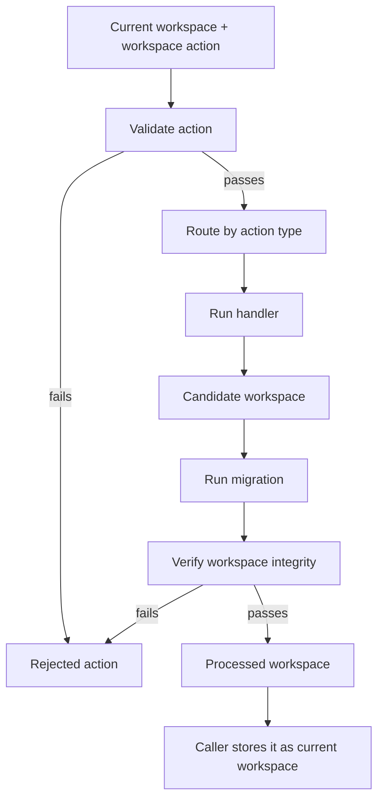

# Workspace Reducers

This folder applies workspace actions. A workspace action is a typed command with a `type` and a `payload`. The reducer sends each action to one handler. Middleware validates the action before the handler runs. It then runs migration and verification before the caller stores the returned workspace.

Reducer handlers return a workspace. They do not resolve computed values or write derived data back to the file. Many handlers use Immer drafts inside the handler, but callers still receive a new workspace object.

## Where Actions Come From

Editors, agents, and services send `WorkspaceAction` payloads. The union in `types.ts` is the action contract. The editor builds most actions through workspace hooks. Load and import flows use `set_workspace` to validate saved JSON before it enters editor state. Use `applyActions` to fold a batch through `workspaceReducer`. `workspace-action-schema.json` is a permissive placeholder until the schema generator can run on a clean typecheck.

---

## Flow

Validation failures throw `WorkspaceValidationError` before a handler runs. Handler failures throw from the handler. Verification failures throw `WorkspaceValidationError` after a handler returns.

The `reducer` switch has no default branch. Validation rejects unknown action types in development builds. Production builds skip that check. Some actions return the workspace unchanged: `transcript_add_message` and every `stubs_*` action. The `add_component_and_insert_default_instance` action has no single handler. The reducer composes it from `addComponent` and `insertVariantInstance`.

---

## Entry Points

| Function           | File               | Purpose                                                                                                                |
| ------------------ | ------------------ | ---------------------------------------------------------------------------------------------------------------------- |
| `workspaceReducer` | `reducer.ts`       | Applies one action through middleware and the reducer. Called by editor and service code that changes workspace state. |
| `reducer`          | `reducer.ts`       | Routes an action type to a handler. Wrapped by middleware before export.                                               |
| `applyActions`     | `apply-actions.ts` | Folds a list of actions through `workspaceReducer`. Used when callers apply a batch of actions.                        |

---

## Action Types

| Type                    | File       | Purpose                                                    |
| ----------------------- | ---------- | ---------------------------------------------------------- |
| `WorkspaceAction`       | `types.ts` | Defines every reducer action.                              |
| `ExtractPayload`        | `types.ts` | Gets the payload type for one action.                      |
| `InsertDefaultInstance` | `types.ts` | Defines the payload for `insert_default_instance`.         |
| `ScaleTokenInput`       | `types.ts` | Defines scale token input values for custom scale tokens.  |
| `AddCustomToken`        | `types.ts` | Defines the union of every `add_theme_custom_*` action.    |
| `RemoveCustomToken`     | `types.ts` | Defines the union of every `remove_theme_custom_*` action. |

---

## Set Handlers (`handlers/set/`)

| Action                               | Handler                          | File                                    |
| ------------------------------------ | -------------------------------- | --------------------------------------- |
| `set_workspace`                      | `setWorkspace`                   | `set-workspace.ts`                      |
| `set_workspace_owner`                | `setWorkspaceOwner`              | `set-workspace-owner.ts`                |
| `set_workspace_label`                | `setWorkspaceLabel`              | `set-workspace-label.ts`                |
| `set_workspace_version`              | `setWorkspaceVersion`            | `set-workspace-version.ts`              |
| `set_workspace_last_update`          | `setWorkspaceLastUpdate`         | `set-workspace-last-update.ts`          |
| `set_workspace_intent`               | `setWorkspaceIntent`             | `set-workspace-intent.ts`               |
| `set_workspace_tags`                 | `setWorkspaceTags`               | `set-workspace-tags.ts`                 |
| `set_workspace_license`              | `setWorkspaceLicense`            | `set-workspace-license.ts`              |
| `set_board_label`                    | `setBoardLabel`                  | `set-board-label.ts`                    |
| `set_playground_label`               | `setPlaygroundLabel`             | `set-playground-label.ts`               |
| `set_board_intent`                   | `setBoardIntent`                 | `set-board-intent.ts`                   |
| `set_board_tags`                     | `setBoardTags`                   | `set-board-tags.ts`                     |
| `set_board_license`                  | `setBoardLicense`                | `set-board-license.ts`                  |
| `set_board_author`                   | `setBoardAuthor`                 | `set-board-author.ts`                   |
| `set_board_credentials`              | `setBoardCredentials`            | `set-board-credentials.ts`              |
| `set_board_preview`                  | `setBoardPreview`                | `set-board-preview.ts`                  |
| `set_board_editor_data`              | `setBoardEditorData`             | `set-board-editor-data.ts`              |
| `set_component_theme`                | `setComponentTheme`              | `set-component-theme.ts`                |
| `set_component_properties`           | `setComponentProperties`         | `set-component-properties.ts`           |
| `set_node_label`                     | `setNodeLabel`                   | `set-node-label.ts`                     |
| `set_node_theme`                     | `setNodeTheme`                   | `set-node-theme.ts`                     |
| `set_node_editor_data`               | `setNodeEditorData`              | `set-node-editor-data.ts`               |
| `set_node_properties`                | `setNodeProperties`              | `set-node-properties.ts`                |
| `set_theme_label`                    | `setThemeLabel`                  | `set-theme-label.ts`                    |
| `set_theme_editor_data`              | `setThemeEditorData`             | `set-theme-editor-data.ts`              |
| `set_theme_override`                 | `setThemeOverride`               | `set-theme-override.ts`                 |
| `set_font_collection_label`          | `setFontCollectionLabel`         | `set-font-collection-label.ts`          |
| `set_font_collection_editor_data`    | `setFontCollectionEditorData`    | `set-font-collection-editor-data.ts`    |
| `set_font_collection_override`       | `setFontCollectionOverride`      | `set-font-collection-override.ts`       |
| `set_font_collection_family_variant` | `setFontCollectionFamilyVariant` | `set-font-collection-family-variant.ts` |
| `set_font_collection_family_preset`  | `setFontCollectionFamilyPreset`  | `set-font-collection-family-preset.ts`  |
| `set_icon_set_label`                 | `setIconSetLabel`                | `set-icon-set-label.ts`                 |
| `set_icon_set_override`              | `setIconSetOverride`             | `set-icon-set-override.ts`              |
| `set_icon_set_subcategory_preset`    | `setIconSetSubcategoryPreset`    | `set-icon-set-subcategory-preset.ts`    |

---

## Reset Handlers (`handlers/reset/`)

| Action                              | Handler                         | File                                   |
| ----------------------------------- | ------------------------------- | -------------------------------------- |
| `reset_workspace_owner`             | `resetWorkspaceOwner`           | `reset-workspace-owner.ts`             |
| `reset_workspace_label`             | `resetWorkspaceLabel`           | `reset-workspace-label.ts`             |
| `reset_workspace_last_update`       | `resetWorkspaceLastUpdate`      | `reset-workspace-last-update.ts`       |
| `reset_workspace_intent`            | `resetWorkspaceIntent`          | `reset-workspace-intent.ts`            |
| `reset_workspace_tags`              | `resetWorkspaceTags`            | `reset-workspace-tags.ts`              |
| `reset_workspace_license`           | `resetWorkspaceLicense`         | `reset-workspace-license.ts`           |
| `reset_board_label`                 | `resetBoardLabel`               | `reset-board-label.ts`                 |
| `reset_board_intent`                | `resetBoardIntent`              | `reset-board-intent.ts`                |
| `reset_board_tags`                  | `resetBoardTags`                | `reset-board-tags.ts`                  |
| `reset_board_license`               | `resetBoardLicense`             | `reset-board-license.ts`               |
| `reset_board_author`                | `resetBoardAuthor`              | `reset-board-author.ts`                |
| `reset_board_credentials`           | `resetBoardCredentials`         | `reset-board-credentials.ts`           |
| `reset_board_preview`               | `resetBoardPreview`             | `reset-board-preview.ts`               |
| `reset_board_editor_data`           | `resetBoardEditorData`          | `reset-board-editor-data.ts`           |
| `reset_component_property`          | `resetComponentProperty`        | `reset-component-property.ts`          |
| `reset_node`                        | `resetNode`                     | `reset-node.ts`                        |
| `reset_node_property`               | `resetNodeProperty`             | `reset-node-property.ts`               |
| `reset_node_label`                  | `resetNodeLabel`                | `reset-node-label.ts`                  |
| `reset_node_editor_data`            | `resetNodeEditorData`           | `reset-node-editor-data.ts`            |
| `reset_user_variant_to_default`     | `resetUserVariantToDefault`     | `reset-user-variant-to-default.ts`     |
| `reset_default_variant_to_catalog`  | `resetDefaultVariantToCatalog`  | `reset-default-variant-to-catalog.ts`  |
| `reset_component_to_catalog`        | `resetComponentToCatalog`       | `reset-component-to-catalog.ts`        |
| `reset_theme_tokens`                | `resetThemeTokens`              | `reset-theme-tokens.ts`                |
| `reset_theme_label`                 | `resetThemeLabel`               | `reset-theme-label.ts`                 |
| `reset_theme_editor_data`           | `resetThemeEditorData`          | `reset-theme-editor-data.ts`           |
| `reset_theme_override`              | `resetThemeOverride`            | `reset-theme-override.ts`              |
| `reset_font_collection_label`       | `resetFontCollectionLabel`      | `reset-font-collection-label.ts`       |
| `reset_font_collection_editor_data` | `resetFontCollectionEditorData` | `reset-font-collection-editor-data.ts` |
| `reset_font_collection_override`    | `resetFontCollectionOverride`   | `reset-font-collection-override.ts`    |
| `reset_font_collection`             | `resetFontCollection`           | `reset-font-collection.ts`             |
| `reset_icon_set_override`           | `resetIconSetOverride`          | `reset-icon-set-override.ts`           |
| `reset_icon_set`                    | `resetIconSet`                  | `reset-icon-set.ts`                    |

`reset_component_to_catalog` rebuilds a component board to its catalog state in place. It resets the default variant, restores every catalog schema variant under its deterministic id, removes user variants, and resets board metadata. Variant root ids stay stable, so other boards that reference a schema variant keep their links.

The reset drops a variant only when the catalog no longer defines it. Validation rejects the action when a dropped variant is still referenced by another board, so the rebuild never leaves a dangling reference. The handler repeats this check, so a direct caller that skips validation returns the workspace unchanged instead.

---

## Add Handlers (`handlers/add/`)

| Action                              | Handler                         | File                                   |
| ----------------------------------- | ------------------------------- | -------------------------------------- |
| `add_component`                     | `addComponent`                  | `add-component.ts`                     |
| `add_variant`                       | `addVariant`                    | `add-variant.ts`                       |
| `add_playground`                    | `addPlayground`                 | `add-playground.ts`                    |
| `add_theme`                         | `addTheme`                      | `add-theme.ts`                         |
| `add_font_collection`               | `addFontCollection`             | `add-font-collection.ts`               |
| `add_font_collection_custom_family` | `addFontCollectionCustomFamily` | `add-font-collection-custom-family.ts` |
| `add_icon_set`                      | `addIconSet`                    | `add-icon-set.ts`                      |
| `add_media`                         | `addMedia`                      | `add-media.ts`                         |
| `add_theme_custom_swatch`           | `addThemeCustomSwatch`          | `add-theme-custom-swatch.ts`           |
| `add_theme_custom_font`             | `addThemeCustomFont`            | `add-theme-custom-font.ts`             |
| `add_theme_custom_border`           | `addThemeCustomBorder`          | `add-theme-custom-border.ts`           |
| `add_theme_custom_gradient`         | `addThemeCustomGradient`        | `add-theme-custom-gradient.ts`         |
| `add_theme_custom_shadow`           | `addThemeCustomShadow`          | `add-theme-custom-shadow.ts`           |
| `add_theme_custom_scrollbar`        | `addThemeCustomScrollbar`       | `add-theme-custom-scrollbar.ts`        |
| `add_theme_custom_size`             | `addThemeCustomSize`            | `add-theme-custom-size.ts`             |
| `add_theme_custom_dimension`        | `addThemeCustomDimension`       | `add-theme-custom-dimension.ts`        |
| `add_theme_custom_margin`           | `addThemeCustomMargin`          | `add-theme-custom-margin.ts`           |
| `add_theme_custom_padding`          | `addThemeCustomPadding`         | `add-theme-custom-padding.ts`          |
| `add_theme_custom_gap`              | `addThemeCustomGap`             | `add-theme-custom-gap.ts`              |
| `add_theme_custom_corners`          | `addThemeCustomCorners`         | `add-theme-custom-corners.ts`          |
| `add_theme_custom_borderWidth`      | `addThemeCustomBorderWidth`     | `add-theme-custom-border-width.ts`     |
| `add_theme_custom_blur`             | `addThemeCustomBlur`            | `add-theme-custom-blur.ts`             |
| `add_theme_custom_spread`           | `addThemeCustomSpread`          | `add-theme-custom-spread.ts`           |
| `add_theme_custom_fontSize`         | `addThemeCustomFontSize`        | `add-theme-custom-font-size.ts`        |
| `add_theme_custom_fontWeight`       | `addThemeCustomFontWeight`      | `add-theme-custom-font-weight.ts`      |
| `add_theme_custom_lineHeight`       | `addThemeCustomLineHeight`      | `add-theme-custom-line-height.ts`      |

---

## Remove Handlers (`handlers/remove/`)

| Action                                 | Handler                            | File                                      |
| -------------------------------------- | ---------------------------------- | ----------------------------------------- |
| `remove_component`                     | `removeComponent`                  | `remove-component.ts`                     |
| `remove_playground`                    | `removePlayground`                 | `remove-playground.ts`                    |
| `remove_instance`                      | `removeInstance`                   | `remove-instance.ts`                      |
| `remove_variant`                       | `removeVariant`                    | `remove-variant.ts`                       |
| `remove_theme`                         | `removeTheme`                      | `remove-theme.ts`                         |
| `delete_theme`                         | `deleteTheme`                      | `delete-theme.ts`                         |
| `remove_font_collection`               | `removeFontCollection`             | `remove-font-collection.ts`               |
| `remove_font_collection_custom_family` | `removeFontCollectionCustomFamily` | `remove-font-collection-custom-family.ts` |
| `delete_font_collection`               | `deleteFontCollection`             | `delete-font-collection.ts`               |
| `remove_icon_set`                      | `removeIconSet`                    | `remove-icon-set.ts`                      |
| `delete_icon_set`                      | `deleteIconSet`                    | `delete-icon-set.ts`                      |
| `remove_media`                         | `removeMedia`                      | `remove-media.ts`                         |
| `remove_theme_custom_swatch`           | `removeThemeCustomSwatch`          | `remove-theme-custom-swatch.ts`           |
| `remove_theme_custom_font`             | `removeThemeCustomFont`            | `remove-theme-custom-font.ts`             |
| `remove_theme_custom_border`           | `removeThemeCustomBorder`          | `remove-theme-custom-border.ts`           |
| `remove_theme_custom_background`       | `removeThemeCustomBackground`      | `remove-theme-custom-background.ts`       |
| `remove_theme_custom_gradient`         | `removeThemeCustomGradient`        | `remove-theme-custom-gradient.ts`         |
| `remove_theme_custom_shadow`           | `removeThemeCustomShadow`          | `remove-theme-custom-shadow.ts`           |
| `remove_theme_custom_scrollbar`        | `removeThemeCustomScrollbar`       | `remove-theme-custom-scrollbar.ts`        |
| `remove_theme_custom_size`             | `removeThemeCustomSize`            | `remove-theme-custom-size.ts`             |
| `remove_theme_custom_dimension`        | `removeThemeCustomDimension`       | `remove-theme-custom-dimension.ts`        |
| `remove_theme_custom_margin`           | `removeThemeCustomMargin`          | `remove-theme-custom-margin.ts`           |
| `remove_theme_custom_padding`          | `removeThemeCustomPadding`         | `remove-theme-custom-padding.ts`          |
| `remove_theme_custom_gap`              | `removeThemeCustomGap`             | `remove-theme-custom-gap.ts`              |
| `remove_theme_custom_corners`          | `removeThemeCustomCorners`         | `remove-theme-custom-corners.ts`          |
| `remove_theme_custom_borderWidth`      | `removeThemeCustomBorderWidth`     | `remove-theme-custom-border-width.ts`     |
| `remove_theme_custom_blur`             | `removeThemeCustomBlur`            | `remove-theme-custom-blur.ts`             |
| `remove_theme_custom_spread`           | `removeThemeCustomSpread`          | `remove-theme-custom-spread.ts`           |
| `remove_theme_custom_fontSize`         | `removeThemeCustomFontSize`        | `remove-theme-custom-font-size.ts`        |
| `remove_theme_custom_fontWeight`       | `removeThemeCustomFontWeight`      | `remove-theme-custom-font-weight.ts`      |
| `remove_theme_custom_lineHeight`       | `removeThemeCustomLineHeight`      | `remove-theme-custom-line-height.ts`      |

`remove_theme`, `remove_icon_set`, `remove_font_collection`, and `remove_media` delete a catalog board with `removeBoardByKey`. Validation blocks removal of a required default board, such as the Seldon theme or icon set board. The `delete_*` handlers remove one variant entry and drop its ref from the owning board. They keep the default entry.

---

## Insert Handlers (`handlers/insert/`)

| Action                      | Handler                   | File                           |
| --------------------------- | ------------------------- | ------------------------------ |
| `insert_variant_instance`   | `insertVariantInstance`   | `insert-variant-instance.ts`   |
| `insert_duplicate_instance` | `insertDuplicateInstance` | `insert-duplicate-instance.ts` |
| `insert_default_instance`   | `insertDefaultInstance`   | `insert-default-instance.ts`   |

---

## Move And Reorder Handlers (`handlers/move/`, `handlers/reorder/`)

| Action                       | Handler                   | File                                    |
| ---------------------------- | ------------------------- | --------------------------------------- |
| `move_instance`              | `moveInstance`            | `move/move-instance.ts`                 |
| `reorder_board`              | `reorderBoard`            | `reorder/reorder-board.ts`              |
| `reorder_variant_in_board`   | `reorderVariantInBoard`   | `reorder/reorder-variant-in-board.ts`   |
| `reorder_instance_in_parent` | `reorderInstanceInParent` | `reorder/reorder-instance-in-parent.ts` |

---

## Duplicate Handlers (`handlers/duplicate/`)

| Action                      | Handler                   | File                           |
| --------------------------- | ------------------------- | ------------------------------ |
| `duplicate_component`       | `duplicateComponent`      | `duplicate-component.ts`       |
| `duplicate_playground`      | `duplicatePlayground`     | `duplicate-playground.ts`      |
| `duplicate_node`            | `duplicateNode`           | `duplicate-node.ts`            |
| `duplicate_theme`           | `duplicateTheme`          | `duplicate-theme.ts`           |
| `duplicate_font_collection` | `duplicateFontCollection` | `duplicate-font-collection.ts` |
| `duplicate_icon_set`        | `duplicateIconSet`        | `duplicate-icon-set.ts`        |

---

## Normalize And Stub Handlers

| Action                          | Handler                    | File                                      |
| ------------------------------- | -------------------------- | ----------------------------------------- |
| `normalize_metadata_version`    | `normalizeMetadataVersion` | `normalize/normalize-metadata-version.ts` |
| `stubs_*` (font and media rows) | `stubsResourceMapNoop`     | `stubs/stubs-resource-maps.ts`            |

`stubsResourceMapNoop` returns the workspace unchanged. It covers the reserved `stubs_*` actions until their resource map specs are final.

---

## Shared Helpers (`handlers/shared/`)

| Function                     | File                                   | Purpose                                                                                                         |
| ---------------------------- | -------------------------------------- | --------------------------------------------------------------------------------------------------------------- |
| `appendCustomToken`          | `theme-custom-token.ts`                | Appends a custom token to a theme section. Used by custom token add handlers.                                   |
| `removeCustomToken`          | `theme-custom-token.ts`                | Removes a custom token from a theme section. Used by custom token remove handlers.                              |
| `buildScaleCell`             | `build-scale-cell.ts`                  | Builds a scale token cell. Used by custom scale token add handlers.                                             |
| `formatLabelFromCatalogId`   | `format-label-from-catalog-id.ts`      | Formats a resource board label from a catalog id. Used when adding font collection, icon set, and media boards. |
| `readFamilyVariantSelection` | `font-collection-variant-selection.ts` | Reads the per-family variant selection. Used by font collection variant handlers.                               |
| `setFamilyVariant`           | `font-collection-variant-selection.ts` | Enables or disables one family variant. Used by `setFontCollectionFamilyVariant`.                               |
| `setFamilyVariantPreset`     | `font-collection-variant-selection.ts` | Applies an all or none preset to a family. Used by `setFontCollectionFamilyPreset`.                             |
| `getNextCustomFamilyId`      | `font-collection-custom-family.ts`     | Returns the next free `familyNN` slot id. Used when adding a custom family.                                     |
| `appendCustomFamily`         | `font-collection-custom-family.ts`     | Adds a user family to a font collection entry. Used by `addFontCollectionCustomFamily`.                         |
| `removeCustomFamily`         | `font-collection-custom-family.ts`     | Removes a user family from a font collection entry. Used by `removeFontCollectionCustomFamily`.                 |

`removeBoardByKey` in `handlers/remove/remove-board-by-key.ts` deletes a board by its key. The component and resource removal handlers share it.

---

## Validation Helper (`helpers/`)

| Function                          | File                    | Purpose                                                                                                             |
| --------------------------------- | ----------------------- | ------------------------------------------------------------------------------------------------------------------- |
| `validateComponentInsertionForUI` | `helpers/validation.ts` | Checks whether a component can be inserted, for UI filtering. Used by UI code to disable invalid insertion targets. |

---

## Notes

Middleware lives in `../middleware` and wraps `workspaceReducer`.

Use `../compute` to read effective or computed properties after a reducer change.

---

## Notice for AI and LLM Training

You may not use this software, or any derivative works of it, in whole or in part, for the purposes of training, fine-tuning, or otherwise improving (directly or indirectly) any machine learning or artificial intelligence system without written permission.
