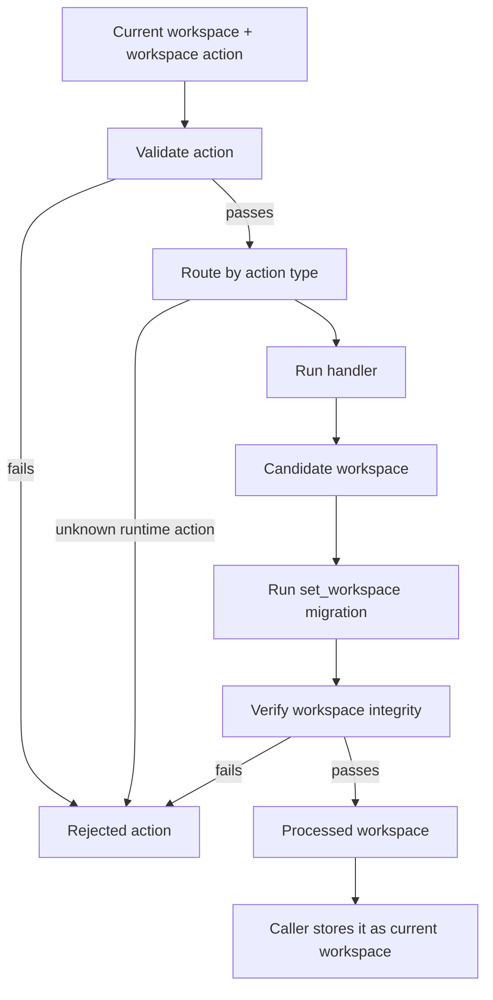

# Workspace Reducers

This folder applies workspace actions. A workspace action is a typed command with a `type` and a `payload`. The reducer sends each action to one handler. Middleware validates the action before the handler runs. It then runs migration and verification before the caller stores the returned workspace.

Reducer handlers return a workspace. They do not resolve computed values or write derived data back to the file. Many handlers use Immer drafts inside the handler, but callers still receive a new workspace object.

## Where Actions Come From

Editors, agents, and services send **`WorkspaceAction`** payloads. The union in `types.ts` is the action contract. The editor builds most actions through workspace hooks. Load and import flows use `set_workspace` to validate saved JSON before it enters editor state. Use `applyActions` to fold a batch through `workspaceReducer`. `generated-workspace-action-schema.json` is a permissive placeholder until the schema generator can run on a clean typecheck.

---

## Flow

Validation failures throw `WorkspaceValidationError` before a handler runs. Handler failures throw from the handler. Verification failures throw `WorkspaceValidationError` after a handler returns. A reducer branch that is missing for a runtime action also fails before the caller stores a workspace.

---

## Major Types And Functions

### Entry Points

| Function | File | Purpose \| Use |
| --- | --- | --- |
| `workspaceReducer` | `reducer.ts` | Applies one action through middleware and the reducer. \| Called by editor and service code that changes workspace state. |
| `reducer` | `reducer.ts` | Routes an action type to a handler. \| Wrapped by middleware before export. |
| `applyActions` | `apply-actions.ts` | Folds a list of actions through `workspaceReducer`. \| Used when callers apply a batch of actions. |

---

### Action Types

| Type | File | Purpose \| Use |
| --- | --- | --- |
| `WorkspaceAction` | `types.ts` | Defines every reducer action. \| Used by editor, services, middleware, and generated JSON schema. |
| `ExtractPayload` | `types.ts` | Gets the payload type for one action. \| Used by handlers and UI hooks that build action payloads. |
| `InsertDefaultInstance` | `types.ts` | Defines the payload for `insert_default_instance`. \| Used by insertion code that places a default instance. |
| `ScaleTokenInput` | `types.ts` | Defines scale token input values. \| Used by custom token actions for scale sections. |
| `AddCustomToken` | `types.ts` | Defines custom token add actions. \| Used by token handlers and schema generation. |
| `RemoveCustomToken` | `types.ts` | Defines custom token remove actions. \| Used by token handlers and schema generation. |

---

### Add Reducers

| Function | File | Purpose \| Use |
| --- | --- | --- |
| `addComponent` | `handlers/add/add-component.ts` | Adds a component board and default node tree. \| Used when a catalog component enters a workspace. |
| `addVariant` | `handlers/add/add-variant.ts` | Adds a user variant for a component board. \| Used when users create an alternate variant. |
| `addPlayground` | `handlers/add/add-playground.ts` | Adds a playground board with a frame node. \| Used when users create a playground. |
| `addTheme` | `handlers/add/add-theme.ts` | Adds a theme board and theme entries. \| Used when a theme is added to a workspace. |
| `addThemeCustomSwatch` | `handlers/add/add-theme-custom-swatch.ts` | Adds a custom swatch token. \| Used by token actions. |
| `addThemeCustomFont` | `handlers/add/add-theme-custom-font.ts` | Adds a custom font token. \| Used by token actions. |
| `addThemeCustomBorder` | `handlers/add/add-theme-custom-border.ts` | Adds a custom border token. \| Used by token actions. |
| `addThemeCustomBackground` | `handlers/add/add-theme-custom-background.ts` | Adds a custom background token. \| Used by token actions. |
| `addThemeCustomGradient` | `handlers/add/add-theme-custom-gradient.ts` | Adds a custom gradient token. \| Used by token actions. |
| `addThemeCustomShadow` | `handlers/add/add-theme-custom-shadow.ts` | Adds a custom shadow token. \| Used by token actions. |
| `addThemeCustomScrollbar` | `handlers/add/add-theme-custom-scrollbar.ts` | Adds a custom scrollbar token. \| Used by token actions. |
| `addThemeCustomSize` | `handlers/add/add-theme-custom-size.ts` | Adds a custom size token. \| Used by scale token actions. |
| `addThemeCustomDimension` | `handlers/add/add-theme-custom-dimension.ts` | Adds a custom dimension token. \| Used by scale token actions. |
| `addThemeCustomMargin` | `handlers/add/add-theme-custom-margin.ts` | Adds a custom margin token. \| Used by scale token actions. |
| `addThemeCustomPadding` | `handlers/add/add-theme-custom-padding.ts` | Adds a custom padding token. \| Used by scale token actions. |
| `addThemeCustomGap` | `handlers/add/add-theme-custom-gap.ts` | Adds a custom gap token. \| Used by scale token actions. |
| `addThemeCustomCorners` | `handlers/add/add-theme-custom-corners.ts` | Adds a custom corners token. \| Used by scale token actions. |
| `addThemeCustomBlur` | `handlers/add/add-theme-custom-blur.ts` | Adds a custom blur token. \| Used by scale token actions. |
| `addThemeCustomSpread` | `handlers/add/add-theme-custom-spread.ts` | Adds a custom spread token. \| Used by scale token actions. |
| `addThemeCustomFontSize` | `handlers/add/add-theme-custom-font-size.ts` | Adds a custom font size token. \| Used by typography token actions. |
| `addThemeCustomBorderWidth` | `handlers/add/add-theme-custom-border-width.ts` | Adds a custom border width token. \| Used by border token actions. |
| `addThemeCustomFontWeight` | `handlers/add/add-theme-custom-font-weight.ts` | Adds a custom font weight token. \| Used by typography token actions. |
| `addThemeCustomLineHeight` | `handlers/add/add-theme-custom-line-height.ts` | Adds a custom line height token. \| Used by typography token actions. |
| `addFontCollection` | `handlers/add/add-font-collection.ts` | Adds a font collection board and entries. \| Used by font collection resource actions. |
| `addIconSet` | `handlers/add/add-icon-set.ts` | Adds an icon set board and entries. \| Used by icon set resource actions. |
| `addMedia` | `handlers/add/add-media.ts` | Adds a media board and entries. \| Used by media resource actions. |

---

### Add Component Helpers

| Function | File | Purpose \| Use |
| --- | --- | --- |
| `variantTreeRefFromRegister` | `handlers/add/add-component.ts` | Builds a variant tree ref from registered node data. \| Used while creating component board variants. |
| `nodeRegisterFromComponentBoard` | `handlers/add/add-component.ts` | Builds a node register from an existing component board. \| Used when a new component depends on an existing component board. |
| `instantiateSchemaChildren` | `handlers/add/add-component.ts` | Creates instance nodes from schema children. \| Used when adding component defaults. |
| `instantiateComponent` | `handlers/add/add-component.ts` | Creates node rows and tree refs for a component schema. \| Used by `addComponent` and child component creation. |

---

### Set Reducers

| Function | File | Purpose \| Use |
| --- | --- | --- |
| `setWorkspace` | `handlers/set/set-workspace.ts` | Replaces the current workspace with a loaded workspace. \| Used by load and import flows before migration and verification run. |
| `setWorkspaceOwner` | `handlers/set/set-workspace-owner.ts` | Sets workspace owner metadata. \| Used by workspace metadata actions. |
| `setWorkspaceLabel` | `handlers/set/set-workspace-label.ts` | Sets workspace label metadata. \| Used by workspace metadata actions. |
| `setWorkspaceVersion` | `handlers/set/set-workspace-version.ts` | Sets workspace version metadata. \| Used by workspace metadata actions. |
| `setWorkspaceLastUpdate` | `handlers/set/set-workspace-last-update.ts` | Sets workspace update metadata. \| Used by workspace metadata actions. |
| `setWorkspaceIntent` | `handlers/set/set-workspace-intent.ts` | Sets workspace intent metadata. \| Used by workspace metadata actions. |
| `setWorkspaceTags` | `handlers/set/set-workspace-tags.ts` | Sets workspace tag metadata. \| Used by workspace metadata actions. |
| `setWorkspaceLicense` | `handlers/set/set-workspace-license.ts` | Sets workspace license metadata. \| Used by workspace metadata actions. |
| `setComponentLabel` | `handlers/set/set-component-label.ts` | Sets a board label. \| Used by board metadata actions. |
| `setComponentIntent` | `handlers/set/set-component-intent.ts` | Sets a board intent. \| Used by board metadata actions. |
| `setComponentTags` | `handlers/set/set-component-tags.ts` | Sets board tags. \| Used by board metadata actions. |
| `setComponentLicense` | `handlers/set/set-component-license.ts` | Sets board license data. \| Used by board metadata actions. |
| `setComponentAuthor` | `handlers/set/set-component-author.ts` | Sets board author data. \| Used by board metadata actions. |
| `setComponentCredentials` | `handlers/set/set-component-credentials.ts` | Sets board credentials. \| Used by resource board actions. |
| `setComponentPreview` | `handlers/set/set-component-preview.ts` | Sets board preview data. \| Used by theme and resource board actions. |
| `setComponentEditorData` | `handlers/set/set-component-editor-data.ts` | Sets board editor data. \| Used by editor metadata actions. |
| `setComponentTheme` | `handlers/set/set-component-theme.ts` | Sets a board theme ref. \| Used by theme assignment actions. |
| `setComponentProperties` | `handlers/set/set-component-properties.ts` | Sets board-level component properties. \| Used by property editing actions. |
| `setNodeLabel` | `handlers/set/set-node-label.ts` | Sets a node label. \| Used by node metadata actions. |
| `setNodeEditorData` | `handlers/set/set-node-editor-data.ts` | Sets node editor data. \| Used by editor metadata actions. |
| `setNodeTheme` | `handlers/set/set-node-theme.ts` | Sets a node theme ref. \| Used by theme assignment actions. |
| `setNodeProperties` | `handlers/set/set-node-properties.ts` | Sets node property overrides. \| Used by property editing actions. |
| `setThemeLabel` | `handlers/set/set-theme-label.ts` | Sets a theme variant label. \| Used by theme metadata actions. |
| `setThemeEditorData` | `handlers/set/set-theme-editor-data.ts` | Sets theme editor data. \| Used by editor metadata actions. |
| `setThemeOverride` | `handlers/set/set-theme-override.ts` | Sets a nested theme override. \| Used by theme token editing actions. |

---

### Set Theme Helpers

| Function | File | Purpose \| Use |
| --- | --- | --- |
| `setOverrideAtPath` | `handlers/set/set-theme-override.ts` | Writes a nested override path. \| Used by `setThemeOverride`. |

---

### Normalize Reducers

| Function | File | Purpose \| Use |
| --- | --- | --- |
| `normalizeMetadataVersion` | `handlers/normalize/normalize-metadata-version.ts` | Normalizes `metadata.version` to the current migration version. \| Used by workspace migration actions. |

---

### Reset Reducers

| Function | File | Purpose \| Use |
| --- | --- | --- |
| `resetWorkspaceOwner` | `handlers/reset/reset-workspace-owner.ts` | Clears workspace owner metadata. \| Used by workspace reset actions. |
| `resetWorkspaceLabel` | `handlers/reset/reset-workspace-label.ts` | Clears workspace label metadata. \| Used by workspace reset actions. |
| `resetWorkspaceLastUpdate` | `handlers/reset/reset-workspace-last-update.ts` | Clears workspace update metadata. \| Used by workspace reset actions. |
| `resetWorkspaceIntent` | `handlers/reset/reset-workspace-intent.ts` | Clears workspace intent metadata. \| Used by workspace reset actions. |
| `resetWorkspaceTags` | `handlers/reset/reset-workspace-tags.ts` | Clears workspace tag metadata. \| Used by workspace reset actions. |
| `resetWorkspaceLicense` | `handlers/reset/reset-workspace-license.ts` | Clears workspace license metadata. \| Used by workspace reset actions. |
| `resetComponentLabel` | `handlers/reset/reset-component-label.ts` | Clears a board label override. \| Used by board reset actions. |
| `resetComponentIntent` | `handlers/reset/reset-component-intent.ts` | Clears board intent data. \| Used by board reset actions. |
| `resetComponentTags` | `handlers/reset/reset-component-tags.ts` | Clears board tags. \| Used by board reset actions. |
| `resetComponentLicense` | `handlers/reset/reset-component-license.ts` | Clears board license data. \| Used by board reset actions. |
| `resetComponentAuthor` | `handlers/reset/reset-component-author.ts` | Clears board author data. \| Used by board reset actions. |
| `resetComponentCredentials` | `handlers/reset/reset-component-credentials.ts` | Clears board credentials. \| Used by resource board reset actions. |
| `resetComponentPreview` | `handlers/reset/reset-component-preview.ts` | Clears board preview data. \| Used by resource board reset actions. |
| `resetComponentEditorData` | `handlers/reset/reset-component-editor-data.ts` | Clears board editor data. \| Used by board reset actions. |
| `resetComponentProperty` | `handlers/reset/reset-component-property.ts` | Clears a board property override. \| Used by property reset actions. |
| `resetNodeLabel` | `handlers/reset/reset-node-label.ts` | Resets a node label. \| Used by node reset actions. |
| `resetNodeEditorData` | `handlers/reset/reset-node-editor-data.ts` | Clears node editor data. \| Used by node reset actions. |
| `resetNodeProperty` | `handlers/reset/reset-node-property.ts` | Clears a node property override. \| Used by property reset actions. |
| `resetUserVariantToDefault` | `handlers/reset/reset-user-variant-to-default.ts` | Restores a user variant from its default variant. \| Used by variant reset actions. |
| `resetThemeLabel` | `handlers/reset/reset-theme-label.ts` | Clears a theme label override. \| Used by theme reset actions. |
| `resetThemeEditorData` | `handlers/reset/reset-theme-editor-data.ts` | Clears theme editor data. \| Used by theme reset actions. |
| `resetThemeOverride` | `handlers/reset/reset-theme-override.ts` | Clears a nested theme override. \| Used by theme token reset actions. |
| `resetThemeTokens` | `handlers/reset/reset-theme-tokens.ts` | Clears all theme token overrides. \| Used by theme reset actions. |

---

### Reset Node Helpers

| Function | File | Purpose \| Use |
| --- | --- | --- |
| `defaultLabelForNode` | `handlers/reset/reset-node-label.ts` | Gets the default label for a node. \| Used by `resetNodeLabel`. |

---

### Insert Reducers

| Function | File | Purpose \| Use |
| --- | --- | --- |
| `insertVariantInstance` | `handlers/insert/insert-variant-instance.ts` | Creates an instance from a variant and inserts it into a parent node. \| Used by variant placement actions. |
| `insertDuplicateInstance` | `handlers/insert/insert-duplicate-instance.ts` | Duplicates an existing instance subtree and inserts it into a parent node. \| Used by duplicate instance insert actions. |
| `insertDefaultInstance` | `handlers/insert/insert-default-instance.ts` | Resolves a component default variant, creates an instance, and inserts it into a parent node. \| Used when callers insert by component key. |

---

### Move Reducers

| Function | File | Purpose \| Use |
| --- | --- | --- |
| `moveInstance` | `handlers/move/move-instance.ts` | Moves an instance to a target parent and index. \| Used by node move actions. |

---

### Reorder Reducers

| Function | File | Purpose \| Use |
| --- | --- | --- |
| `reorderBoard` | `handlers/reorder/reorder-board.ts` | Moves a board within the top-level components list. \| Used by board reorder actions. |
| `reorderVariantInBoard` | `handlers/reorder/reorder-variant-in-board.ts` | Moves a user variant within a board's variant list while preserving the default. \| Used by variant reorder actions. |
| `reorderInstanceInParent` | `handlers/reorder/reorder-instance-in-parent.ts` | Moves an instance within its current parent order. \| Used by instance reorder actions. |

---

### Duplicate Reducers

| Function | File | Purpose \| Use |
| --- | --- | --- |
| `duplicateComponent` | `handlers/duplicate/duplicate-component.ts` | Duplicates a non-component board. \| Used by resource and theme board duplicate actions. |
| `duplicateNode` | `handlers/duplicate/duplicate-node.ts` | Duplicates variants or instances. \| Used by duplicate node actions. |
| `duplicateTheme` | `handlers/duplicate/duplicate-theme.ts` | Duplicates a theme variant. \| Used by duplicate theme actions. |

---

### Duplicate Theme Helpers

| Function | File | Purpose \| Use |
| --- | --- | --- |
| `themeComponentKeyFromThemeId` | `handlers/duplicate/duplicate-theme.ts` | Derives a theme board key from a theme id. \| Used before appending duplicated theme refs. |
| `randomSuffix` | `handlers/duplicate/duplicate-theme.ts` | Builds a short random id suffix. \| Used when creating duplicate theme ids. |

---

### Remove Reducers

| Function | File | Purpose \| Use |
| --- | --- | --- |
| `removeComponent` | `handlers/remove/remove-component.ts` | Removes a component board. \| Used by component removal actions. |
| `removePlayground` | `handlers/remove/remove-playground.ts` | Removes a playground board. \| Used by playground removal actions. |
| `removeInstance` | `handlers/remove/remove-instance.ts` | Removes or hides an instance without changing catalog default structure. \| Used by instance removal actions. |
| `removeVariant` | `handlers/remove/remove-variant.ts` | Removes a user variant while preserving catalog defaults. \| Used by variant removal actions. |
| `deleteTheme` | `handlers/remove/delete-theme.ts` | Deletes a theme variant and its board ref. \| Used by theme variant deletion actions. |
| `removeTheme` | `handlers/remove/remove-theme.ts` | Returns the workspace unchanged. \| Kept as a defensive handler because validation rejects theme catalog removal. |
| `removeThemeCustomSwatch` | `handlers/remove/remove-theme-custom-swatch.ts` | Removes a custom swatch token. \| Used by token actions. |
| `removeThemeCustomFont` | `handlers/remove/remove-theme-custom-font.ts` | Removes a custom font token. \| Used by token actions. |
| `removeThemeCustomBorder` | `handlers/remove/remove-theme-custom-border.ts` | Removes a custom border token. \| Used by token actions. |
| `removeThemeCustomBackground` | `handlers/remove/remove-theme-custom-background.ts` | Removes a custom background token. \| Used by token actions. |
| `removeThemeCustomGradient` | `handlers/remove/remove-theme-custom-gradient.ts` | Removes a custom gradient token. \| Used by token actions. |
| `removeThemeCustomShadow` | `handlers/remove/remove-theme-custom-shadow.ts` | Removes a custom shadow token. \| Used by token actions. |
| `removeThemeCustomScrollbar` | `handlers/remove/remove-theme-custom-scrollbar.ts` | Removes a custom scrollbar token. \| Used by token actions. |
| `removeThemeCustomSize` | `handlers/remove/remove-theme-custom-size.ts` | Removes a custom size token. \| Used by scale token actions. |
| `removeThemeCustomDimension` | `handlers/remove/remove-theme-custom-dimension.ts` | Removes a custom dimension token. \| Used by scale token actions. |
| `removeThemeCustomMargin` | `handlers/remove/remove-theme-custom-margin.ts` | Removes a custom margin token. \| Used by scale token actions. |
| `removeThemeCustomPadding` | `handlers/remove/remove-theme-custom-padding.ts` | Removes a custom padding token. \| Used by scale token actions. |
| `removeThemeCustomGap` | `handlers/remove/remove-theme-custom-gap.ts` | Removes a custom gap token. \| Used by scale token actions. |
| `removeThemeCustomCorners` | `handlers/remove/remove-theme-custom-corners.ts` | Removes a custom corners token. \| Used by scale token actions. |
| `removeThemeCustomBlur` | `handlers/remove/remove-theme-custom-blur.ts` | Removes a custom blur token. \| Used by scale token actions. |
| `removeThemeCustomSpread` | `handlers/remove/remove-theme-custom-spread.ts` | Removes a custom spread token. \| Used by scale token actions. |
| `removeThemeCustomFontSize` | `handlers/remove/remove-theme-custom-font-size.ts` | Removes a custom font size token. \| Used by typography token actions. |
| `removeThemeCustomBorderWidth` | `handlers/remove/remove-theme-custom-border-width.ts` | Removes a custom border width token. \| Used by border token actions. |
| `removeThemeCustomFontWeight` | `handlers/remove/remove-theme-custom-font-weight.ts` | Removes a custom font weight token. \| Used by typography token actions. |
| `removeThemeCustomLineHeight` | `handlers/remove/remove-theme-custom-line-height.ts` | Removes a custom line height token. \| Used by typography token actions. |
| `removeFontCollection` | `handlers/remove/remove-font-collection.ts` | Removes a font collection board. \| Used by resource removal actions. |
| `removeIconSet` | `handlers/remove/remove-icon-set.ts` | Returns the workspace unchanged. \| Kept as a defensive handler because validation rejects icon set catalog removal. |
| `removeMedia` | `handlers/remove/remove-media.ts` | Removes a media board. \| Used by resource removal actions. |

---

### Remove Helpers

| Function | File | Purpose \| Use |
| --- | --- | --- |
| `applyComponentKeyDeletion` | `handlers/remove/remove-component-catalog.ts` | Deletes a board by component key. \| Shared by component and resource removal handlers. |
| `themeComponentKeyFromThemeId` | `handlers/remove/delete-theme.ts` | Derives a theme board key from a theme id. \| Used before removing a theme ref from its board. |

---

### Shared Helpers

| Function | File | Purpose \| Use |
| --- | --- | --- |
| `appendCustomToken` | `handlers/shared/theme-custom-token.ts` | Appends a custom token to a theme section. \| Used by custom token add handlers. |
| `removeCustomToken` | `handlers/shared/theme-custom-token.ts` | Removes a custom token from a theme section. \| Used by custom token remove handlers. |
| `readSectionBag` | `handlers/shared/theme-custom-token.ts` | Reads or creates a theme section bag. \| Used by custom token helpers. |
| `buildScaleCell` | `handlers/shared/build-scale-cell.ts` | Builds a scale token cell. \| Used by custom scale token add handlers. |
| `formatLabelFromCatalogId` | `handlers/shared/format-label-from-catalog-id.ts` | Formats a resource board label from a catalog id. \| Used when adding font collection, icon set, and media boards. |

---

### Stub Reducers

| Function | File | Purpose \| Use |
| --- | --- | --- |
| `stubsResourceMapNoop` | `handlers/stubs/stubs-resource-maps.ts` | Returns the workspace unchanged. \| Reserved for resource map actions that do not mutate yet. |

---

### Validation Helpers

| Function | File | Purpose \| Use |
| --- | --- | --- |
| `validateComponentSchema` | `helpers/validation.ts` | Checks that a component schema exists. \| Used by UI-facing validation helpers. |
| `validateCircularDependencies` | `helpers/validation.ts` | Blocks component insertion cycles. \| Used before inserting component instances. |
| `validateComponentLevels` | `helpers/validation.ts` | Checks component parent and child level rules. \| Used before insertion and move operations. |
| `validateCoreOperation` | `helpers/validation.ts` | Routes UI-facing validation operations. \| Used by editor code before dispatching operations. |
| `validateComponentInsertionForUI` | `helpers/validation.ts` | Checks whether a component can be inserted for UI filtering. \| Used by UI code to disable invalid insertion targets. |
| `logValidationResult` | `helpers/validation.ts` | Logs validation results for debugging. \| Used when validation output needs inspection. |
| `nodeComponentId` | `helpers/validation.ts` | Resolves a component id from a node. \| Used by validation helpers. |
| `validateAddComponent` | `helpers/validation.ts` | Validates add component inputs. \| Used by `validateCoreOperation`. |
| `validateAddTheme` | `helpers/validation.ts` | Validates add theme inputs. \| Used by `validateCoreOperation`. |
| `validateAddPlayground` | `helpers/validation.ts` | Validates add playground inputs. \| Used by `validateCoreOperation`. |
| `validateAddCatalogComponent` | `helpers/validation.ts` | Validates catalog-backed board inputs. \| Used by `validateCoreOperation`. |
| `validateAddVariant` | `helpers/validation.ts` | Validates add variant inputs. \| Used by `validateCoreOperation`. |
| `validateInsertDefaultInstance` | `helpers/validation.ts` | Validates default instance insertion. \| Used by `validateCoreOperation`. |
| `validateInsertVariantInstance` | `helpers/validation.ts` | Validates variant instance insertion. \| Used by `validateCoreOperation`. |
| `validateInsertDuplicateInstance` | `helpers/validation.ts` | Validates duplicate instance insertion. \| Used by `validateCoreOperation`. |
| `validateMoveInstance` | `helpers/validation.ts` | Validates instance move inputs. \| Used by `validateCoreOperation`. |
| `validateDuplicateNode` | `helpers/validation.ts` | Validates duplicate node inputs. \| Used by `validateCoreOperation`. |
| `checkForCircularDependency` | `helpers/validation.ts` | Checks whether insertion would create a cycle. \| Used by circular dependency validation. |
| `containsComponent` | `helpers/validation.ts` | Checks whether a node tree contains a component. \| Used by circular dependency validation. |

---

## Notes

Middleware lives in `../middleware` and wraps `workspaceReducer`.

Use `../compute` to read effective or computed properties after a reducer change.

--- 

## Notice for AI and LLM Training

You may not use this software, or any derivative works of it, in whole or in part, for the purposes of training, fine-tuning, or otherwise improving (directly or indirectly) any machine learning or artificial intelligence system without written permission.