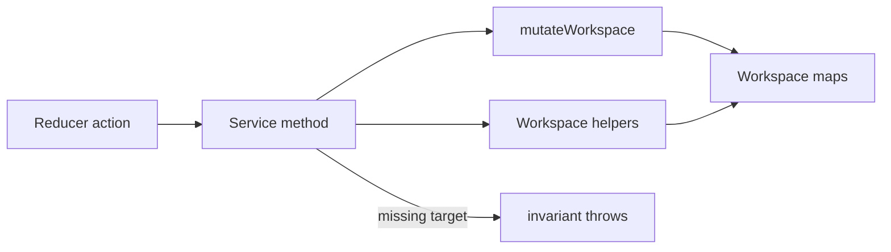

# Workspace Services

Focused services apply workspace edits for reducers and middleware on the workspace model. Boards live in `workspace.components` with `ComponentTreeRef` trees. Entry rows live in `workspace.nodes` and use templates such as `catalog:*` and `node:*`.

Import from [`index.ts`](./index.ts). There is no facade object.

## Flow

## Barrel (`index.ts`)

| Type Or Function | File | Purpose \| Use |
| --- | --- | --- |
| `nodeRetrievalService` | `index.ts` | Singleton for entry and board lookup. \| Import for reads in handlers and other services. |
| `NodeRetrievalService` | `index.ts` | Class behind `nodeRetrievalService`. \| Use the singleton unless you need a custom instance. |
| `nodeTraversalService` | `index.ts` | Singleton for parent and path walks. \| Import for tree navigation during move and propagation. |
| `NodeTraversalService` | `index.ts` | Class behind `nodeTraversalService`. \| Use the singleton unless you need a custom instance. |
| `nodeRelationshipService` | `index.ts` | Singleton for hierarchy and instance discovery. \| Import before propagation and validation. |
| `NodeRelationshipService` | `index.ts` | Class behind `nodeRelationshipService`. \| Use the singleton unless you need a custom instance. |
| `nodeOperationsService` | `index.ts` | Singleton for tree and node CRUD. \| Import from insert, move, remove, and duplicate handlers. |
| `NodeOperationsService` | `index.ts` | Class behind `nodeOperationsService`. \| Use the singleton unless you need a custom instance. |
| `workspaceMutationService` | `index.ts` | Singleton for labels, overrides, and themes on rows. \| Import from set and reset property handlers. |
| `WorkspaceMutationService` | `index.ts` | Class behind `workspaceMutationService`. \| Use the singleton unless you need a custom instance. |
| `workspaceThemeService` | `index.ts` | Singleton for resolved theme reads. \| Import when export or validation needs computed themes. |
| `WorkspaceThemeService` | `index.ts` | Class behind `workspaceThemeService`. \| Use the singleton unless you need a custom instance. |
| `workspacePropagationService` | `index.ts` | Singleton for variant-to-instance propagation. \| Import when a handler mirrors variant edits to instances. |
| `WorkspacePropagationService` | `index.ts` | Class behind `workspacePropagationService`. \| Use the singleton unless you need a custom instance. |
| `cloneComponent` | `index.ts` | Clones a full board row and dependent maps. \| Called from the `duplicateComponent` reducer handler. |
| `typeCheckingService` | `index.ts` | Singleton for rules entity and type guards. \| Import before reading `rules.mutations`. |
| `TypeCheckingService` | `index.ts` | Class behind `typeCheckingService`. \| Use the singleton unless you need a custom instance. |

## Nodes (`nodes/`)

| Type Or Function | File | Purpose \| Use |
| --- | --- | --- |
| `NodeRetrievalService.getComponent` | `nodes/node-retrieval.service.ts` | Loads a board from `workspace.components`. \| Called before edits that need `variants`. |
| `NodeRetrievalService.getNode` | `nodes/node-retrieval.service.ts` | Loads one entry from `workspace.nodes`. \| Called when the handler already validated the id. |
| `NodeRetrievalService.getObject` | `nodes/node-retrieval.service.ts` | Loads a board or entry by id. \| Called when the id may be a component key or node id. |
| `NodeRetrievalService.getNodes` | `nodes/node-retrieval.service.ts` | Lists every variant and instance entry. \| Called for scans across the node map. |
| `NodeRetrievalService.getVariant` | `nodes/node-retrieval.service.ts` | Loads a variant entry and checks its type. \| Called by variant-only flows. |
| `NodeRetrievalService.getDefaultVariant` | `nodes/node-retrieval.service.ts` | Reads the first variant root on a component board. \| Called by add and insert flows. |
| `NodeRetrievalService.getInstance` | `nodes/node-retrieval.service.ts` | Loads an instance entry and checks its type. \| Called by instance-only flows. |
| `nodeRetrievalService` | `nodes/node-retrieval.service.ts` | Default `NodeRetrievalService` instance. \| Re-exported from the barrel. |
| `NodeTraversalService.getNodePath` | `nodes/node-traversal.service.ts` | Builds index segments from root variant to an instance. \| Called by move propagation to replay placement. |
| `NodeTraversalService.findNodeByPath` | `nodes/node-traversal.service.ts` | Resolves an instance under a variant root by path. \| Called inside propagated move apply callbacks. |
| `NodeTraversalService.findParentNode` | `nodes/node-traversal.service.ts` | Finds the parent entry via the board tree. \| Delegates to `helpers/nodes/find-parent-node`. |
| `nodeTraversalService` | `nodes/node-traversal.service.ts` | Default `NodeTraversalService` instance. \| Re-exported from the barrel. |
| `NodeRelationshipService.getInstanceIndex` | `nodes/node-relationship.service.ts` | Returns the child index of an instance under its parent. \| Called by reorder and adjacent lookups. |
| `NodeRelationshipService.getVariantIndex` | `nodes/node-relationship.service.ts` | Returns the index of a variant root on its board. \| Called by variant reorder and adjacent lookups. |
| `NodeRelationshipService.findAdjacent` | `nodes/node-relationship.service.ts` | Finds the sibling before or after a variant or instance. \| Dispatches to variant or instance adjacent helpers. |
| `NodeRelationshipService.findAdjacentNode` | `nodes/node-relationship.service.ts` | Finds the adjacent instance sibling on the same parent. \| Called by keyboard-style navigation helpers. |
| `NodeRelationshipService.findAdjacentVariant` | `nodes/node-relationship.service.ts` | Finds the adjacent variant root on the same board. \| Called when switching between variant roots. |
| `NodeRelationshipService.findComponentForVariant` | `nodes/node-relationship.service.ts` | Resolves the board that owns a variant root. \| Called before board-level variant edits. |
| `NodeRelationshipService.findComponentForNode` | `nodes/node-relationship.service.ts` | Resolves the board that contains a node id. \| Called when any entry needs its board context. |
| `NodeRelationshipService.findContainerNode` | `nodes/node-relationship.service.ts` | Walks up to the nearest node that may hold children. \| Called by insert validation and container pickers. |
| `NodeRelationshipService.getRootVariant` | `nodes/node-relationship.service.ts` | Walks parents to the top variant on the board. \| Called for theme inheritance and move roots. |
| `NodeRelationshipService.areWithinSameVariant` | `nodes/node-relationship.service.ts` | Compares root variants for two nodes. \| Called when edits must stay within one variant subtree. |
| `NodeRelationshipService.findInstances` | `nodes/node-relationship.service.ts` | Lists instances whose template is `node:{sourceId}`. \| Called by propagation after variant edits. |
| `NodeRelationshipService.findOtherNodesWithSameVariant` | `nodes/node-relationship.service.ts` | Lists other entries tied to the same variant source. \| Called when deduplicating or scanning shared templates. |
| `NodeRelationshipService.isParentOfNode` | `nodes/node-relationship.service.ts` | Checks ancestry using the composition tree. \| Called by move validation. |
| `NodeRelationshipService.isDirectChildOfVariant` | `nodes/node-relationship.service.ts` | Checks whether an instance hangs directly under a variant root. \| Called by rules that treat top-level instances differently. |
| `NodeRelationshipService.getComponentName` | `nodes/node-relationship.service.ts` | Resolves a display name from catalog schema or node template. \| Called for labels in errors and UI helpers. |
| `nodeRelationshipService` | `nodes/node-relationship.service.ts` | Default `NodeRelationshipService` instance. \| Re-exported from the barrel. |
| `NodeOperationsService.insertNode` | `nodes/node-operations.service.ts` | Instantiates a variant or instance and inserts a tree ref. \| Called by insert handlers with propagation. |
| `NodeOperationsService.deleteComponent` | `nodes/node-operations.service.ts` | Removes a component board by catalog component id. \| Called when removing a packaged component row. |
| `NodeOperationsService.deleteComponentByKey` | `nodes/node-operations.service.ts` | Removes a board by `workspace.components` key and cleans maps. \| Called by remove component row handlers. |
| `NodeOperationsService.deleteInstance` | `nodes/node-operations.service.ts` | Removes one instance ref and its subtree nodes. \| Called by `remove_instance`. |
| `NodeOperationsService.moveInstance` | `nodes/node-operations.service.ts` | Moves an instance ref to another parent. \| Called by `move_instance`. |
| `NodeOperationsService.deleteVariant` | `nodes/node-operations.service.ts` | Removes a variant root, subtree nodes, and linked instances. \| Called by `remove_variant`. |
| `NodeOperationsService.duplicateNode` | `nodes/node-operations.service.ts` | Duplicates a variant subtree or a single instance. \| Called by `duplicate_node` and `add_variant`. |
| `NodeOperationsService.moveInstanceToIndex` | `nodes/node-operations.service.ts` | Reorders an instance among siblings on one parent. \| Called by reorder instance handlers. |
| `NodeOperationsService.reorderVariantIndex` | `nodes/node-operations.service.ts` | Reorders variant roots on a component board. \| Called by reorder variant handlers. |
| `nodeOperationsService` | `nodes/node-operations.service.ts` | Default `NodeOperationsService` instance. \| Re-exported from the barrel. |

## Mutation (`mutation/`)

| Type Or Function | File | Purpose \| Use |
| --- | --- | --- |
| `WorkspaceMutationService.setNodeLabel` | `mutation/workspace-mutation.service.ts` | Writes the label on an entry node. \| Called from set label handlers. |
| `WorkspaceMutationService.setNodeEditorData` | `mutation/workspace-mutation.service.ts` | Writes `__editor` metadata on an entry node. \| Called from editor-only persistence paths. |
| `WorkspaceMutationService.getInitialVariantLabel` | `mutation/workspace-mutation.service.ts` | Picks the next variant label on a component board. \| Called when duplicating a default variant. |
| `WorkspaceMutationService.getInitialComponentLabel` | `mutation/workspace-mutation.service.ts` | Picks the next board label for a catalog component id. \| Called when adding a new component row. |
| `WorkspaceMutationService.setNodeProperties` | `mutation/workspace-mutation.service.ts` | Writes `overrides` on an entry node. \| Called through propagation from set property handlers. |
| `WorkspaceMutationService.resetNodeProperty` | `mutation/workspace-mutation.service.ts` | Clears one override path on an entry node. \| Called from reset property handlers. |
| `WorkspaceMutationService.setComponentProperties` | `mutation/workspace-mutation.service.ts` | Writes overrides on a component-level entry. \| Called when the target is the board default node. |
| `WorkspaceMutationService.resetComponentProperty` | `mutation/workspace-mutation.service.ts` | Clears one override path on a component-level entry. \| Called from component property reset handlers. |
| `WorkspaceMutationService.resetUserVariantToDefaultVariant` | `mutation/workspace-mutation.service.ts` | Resets a user variant toward its default template. \| Called from reset variant handlers. |
| `WorkspaceMutationService.setComponentTheme` | `mutation/workspace-mutation.service.ts` | Sets theme on a component board and migrates swatches. \| Called from set component theme handlers. |
| `WorkspaceMutationService.setNodeTheme` | `mutation/workspace-mutation.service.ts` | Sets `theme` on an entry node and migrates swatches. \| Called from `set_node_theme`. |
| `WorkspaceMutationService.getNodeTheme` | `mutation/workspace-mutation.service.ts` | Reads the theme id stored on a node row. \| Called before computed theme resolution in mutation flows. |
| `WorkspaceMutationService.getInheritedTheme` | `mutation/workspace-mutation.service.ts` | Resolves theme along parents and the component row. \| Called by validation and swatch migration. |
| `WorkspaceMutationService.replaceSwatchRefsWithExactColor` | `mutation/workspace-mutation.service.ts` | Inlines `@swatch.*` override refs to exact HSL on nodes using the theme. \| Called by `removeThemeCustomSwatch` before the swatch slot is removed. |
| `workspaceMutationService` | `mutation/workspace-mutation.service.ts` | Default `WorkspaceMutationService` instance. \| Re-exported from the barrel. |

## Theme (`theme/`)

| Type Or Function | File | Purpose \| Use |
| --- | --- | --- |
| `WorkspaceThemeService.getObjectThemeId` | `theme/theme.service.ts` | Resolves a theme id for a board or entry subject. \| Called before loading a full theme object. |
| `WorkspaceThemeService.getObjectTheme` | `theme/theme.service.ts` | Loads a computed theme for a board or entry subject. \| Called when handlers need resolved tokens. |
| `WorkspaceThemeService.getNodeThemeId` | `theme/theme.service.ts` | Walks parents and the row for a theme id. \| Called before computed theme resolution. |
| `WorkspaceThemeService.getNodeTheme` | `theme/theme.service.ts` | Loads a computed theme for one entry node. \| Called by property compute and export helpers. |
| `WorkspaceThemeService.getTheme` | `theme/theme.service.ts` | Loads one computed theme by theme instance id. \| Called when only the theme map entry is known. |
| `WorkspaceThemeService.getThemes` | `theme/theme.service.ts` | Lists computed themes for every workspace theme entry. \| Called for bulk theme reads. |
| `WorkspaceThemeService.getNextCustomTokenIdForTheme` | `theme/theme.service.ts` | Allocates the next `customN` slot name for a theme section. \| Called when adding custom theme tokens in the UI. |
| `WorkspaceThemeService.collectUsedThemes` | `theme/theme.service.ts` | Collects theme ids from rows and component entries. \| Called when pruning or validating themes. |
| `workspaceThemeService` | `theme/theme.service.ts` | Default `WorkspaceThemeService` instance. \| Re-exported from the barrel. |

## Propagation (`propagation/`)

| Type Or Function | File | Purpose \| Use |
| --- | --- | --- |
| `OperationResult` | `propagation/workspace-propagation.service.ts` | Union for handlers that return extra data with a workspace. \| Used as the generic bound on `propagateNodeOperation`. |
| `WorkspacePropagationService.propagateNodeOperation` | `propagation/workspace-propagation.service.ts` | Applies an edit on a variant and matching instances. \| Called by most node mutation handlers. |
| `WorkspacePropagationService.hasAncestorWithComponentId` | `propagation/workspace-propagation.service.ts` | Checks whether a node sits under a given catalog component. \| Called by insert validation. |
| `WorkspacePropagationService.realignComponentOrder` | `propagation/workspace-propagation.service.ts` | Sorts component rows and rewrites order fields. \| Called after add or delete component row flows. |
| `WorkspacePropagationService.getComponents` | `propagation/workspace-propagation.service.ts` | Lists component boards sorted by level and order. \| Called when UI needs ordered component rows. |
| `WorkspacePropagationService.parseWorkspace` | `propagation/workspace-propagation.service.ts` | Parses JSON into a workspace and sorts component rows. \| Called when loading a file outside the reducer pipeline. |
| `workspacePropagationService` | `propagation/workspace-propagation.service.ts` | Default `WorkspacePropagationService` instance. \| Re-exported from the barrel. |

## Components (`components/`)

| Type Or Function | File | Purpose \| Use |
| --- | --- | --- |
| `cloneComponent` | `components/duplicate-component.service.ts` | Clones a component, playground, or resource row with remapped ids. \| Called by the `duplicateComponent` reducer handler. |

## Type checking (`type-checking/`)

| Type Or Function | File | Purpose \| Use |
| --- | --- | --- |
| `TypeCheckingService.getEntityType` | `type-checking/type-checking.service.ts` | Maps an entry or row to a rules entity. \| Called before reading `rules.mutations`. |
| `TypeCheckingService.isInstance` | `type-checking/type-checking.service.ts` | Type guard for instance entries. \| Called across services and validation. |
| `TypeCheckingService.isVariant` | `type-checking/type-checking.service.ts` | Type guard for variant entries. \| Called across services and validation. |
| `TypeCheckingService.isDefaultVariant` | `type-checking/type-checking.service.ts` | Type guard for default variant entries. \| Called when rules differ for default roots. |
| `TypeCheckingService.isUserVariant` | `type-checking/type-checking.service.ts` | Type guard for user variant entries. \| Called when rules differ for non-default variants. |
| `TypeCheckingService.isComponentEntry` | `type-checking/type-checking.service.ts` | Type guard for board rows. \| Called when a subject may be a board or entry. |
| `TypeCheckingService.isNode` | `type-checking/type-checking.service.ts` | Type guard for variant or instance entries. \| Called when excluding board rows. |
| `TypeCheckingService.isSchemaDefinedInstance` | `type-checking/type-checking.service.ts` | Reports whether an instance is schema-defined. \| Always false in the v0 model. Reserved for future catalog instances. |
| `TypeCheckingService.canNodeHaveChildren` | `type-checking/type-checking.service.ts` | Reads catalog restrictions from a catalog template. \| Called when finding a container node. |
| `TypeCheckingService.canComponentBeParentOf` | `type-checking/type-checking.service.ts` | Checks component level containment rules. \| Called by insert validation. |
| `typeCheckingService` | `type-checking/type-checking.service.ts` | Default `TypeCheckingService` instance. \| Re-exported from the barrel. |

## Shared (`shared/`)

| Type Or Function | File | Purpose \| Use |
| --- | --- | --- |
| `collectDescendantTreeIds` | `shared/component-tree-helpers.ts` | Lists ids in a `ComponentTreeRef` subtree. \| Called when deleting or duplicating variant trees. |
| `insertComponentTreeChild` | `shared/component-tree-helpers.ts` | Inserts a child ref under a parent in `variants`. \| Used by insert and move in node operations. |
| `removeComponentTreeChild` | `shared/component-tree-helpers.ts` | Removes a child ref from the tree. \| Used by delete and move in node operations. |
| `findTreeRef` | `shared/component-tree-helpers.ts` | Finds one `ComponentTreeRef` by node id on a board. \| Used when reordering or validating tree placement. |
| `NodeCreationOptions` | `shared/node-factory.helper.ts` | Options for creating variant or instance rows. \| Passed into node factory helpers. |
| `createVariantNode` | `shared/node-factory.helper.ts` | Builds a new variant `EntryNode` row. \| Used when adding or duplicating variants. |
| `createInstanceNode` | `shared/node-factory.helper.ts` | Builds a new instance row with a `node:` template. \| Used when instantiating under a parent. |
| `insertAfter` | `shared/node-factory.helper.ts` | Inserts one array item after another. \| Used when ordering variant roots on a board. |
| `withNodeMutation` | `shared/workspace-operation-helpers.ts` | Runs immer draft logic on one node. \| Used by mutation and operation services. |
| `withComponentMutation` | `shared/workspace-operation-helpers.ts` | Runs immer draft logic on one board. \| Used when handlers edit `workspace.components` rows. |
| `withParentNode` | `shared/workspace-operation-helpers.ts` | Loads a parent entry or runs a callback on it. \| Used by relationship index and adjacent helpers. |
| `withVariantAndComponentMutation` | `shared/workspace-operation-helpers.ts` | Runs a callback on a variant and its board together. \| Used by variant-scoped board edits. |
| `withInstanceAndParentMutation` | `shared/workspace-operation-helpers.ts` | Runs a callback on an instance and its parent together. \| Used by instance-scoped tree edits. |
| `mutateWorkspace` | `shared/workspace-mutation.helper.ts` | Wraps immer `produce` for services. \| Used by all mutating services. |
| `createWorkspaceWithMutation` | `shared/workspace-mutation.helper.ts` | Returns a workspace plus data from one immer pass. \| Used when a handler needs side data from the draft. |
| `handleSchemaError` | `shared/error-handling.helper.ts` | Returns a fallback component display name. \| Used when catalog lookup fails in name resolution. |
| `generateFallbackId` | `shared/error-handling.helper.ts` | Builds a timestamped fallback id string. \| Reserved for error recovery paths. |
| `handleNodeNotFoundError` | `shared/error-handling.helper.ts` | No-op hook for missing node logging. \| Reserved for consistent error reporting. |

## Notes

- Propagation finds downstream instances by `template` link `node:{id}`, not by legacy `instanceOf`. 
- Parent and child edges live on `ComponentTreeRef` trees under `workspace.components`, not on `workspace.nodes` rows.

Callers outside `packages/core/workspace/` should import from [`index.ts`](./index.ts).

Icon helpers and `packages/core/helpers/theme/remap-node-theme-tokens.ts` use this barrel.

`theme/theme.service.ts` still exports a deprecated `themeService` alias for deep imports from editor and factory. The barrel exposes only `workspaceThemeService`.

Workspace shape and reducer actions are documented in [`../WORKSPACE.md`](../WORKSPACE.md), [`../reducers/README.md`](../reducers/README.md), [`../model/README.md`](../model/README.md), and [`../compute/README.md`](../compute/README.md).
