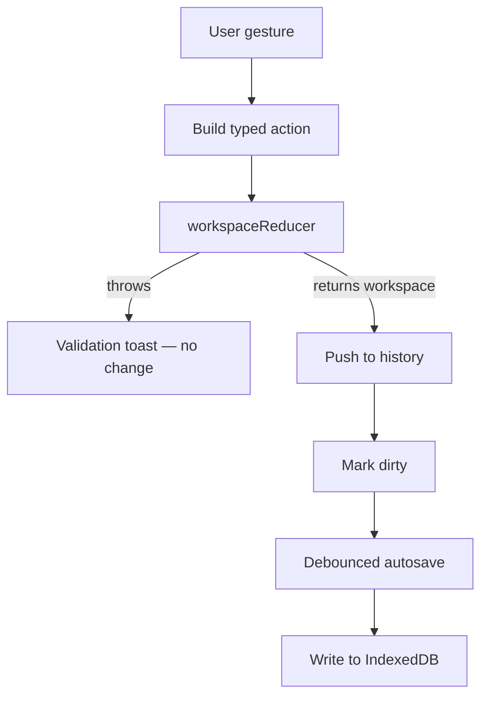

# Seldon · Editor

Seldon Editor is the browser-only design client for Seldon workspaces. It runs on one machine, stores workspaces in **IndexedDB**, and needs no API, database, auth, or cloud service. A designer opens a workspace, edits components, and the editor turns each action into a typed **action** that flows through the same Core reducer that an AI agent would use.

Core owns design state and rules. The editor owns gestures, undo history, selection, and local storage. When the design is ready, the workspace passes to **Factory** for React, CSS, and asset generation.

---

## What The Editor Contains

The editor groups two layers that work together:

| Area | Role | Deep reference |
| --- | --- | --- |
| **App** | Next.js App Router routes and all UI: canvas, sidebars, panels, menu | [app/](./app) |
| **Workspace state** | In-memory workspace, history, selection, preview | [lib/workspace/](./lib/workspace) |
| **Storage** | IndexedDB read and write for stored workspaces | [lib/storage/workspace-store.ts](./lib/storage/workspace-store.ts) |
| **Local workspace** | Record loading and debounced autosave | [lib/local-workspace/](./lib/local-workspace) |

The editor imports and exports code directly from `@seldon/core` and `@seldon/factory`. It does not fork their logic. See the existing [README.md](./README.md) for run steps and the package name `@seldon/editor-local`.

### Stack

- **Next.js 16** App Router with **React 19**. The editor view is client-only and loads with `ssr: false`.
- **Zustand** holds runtime state. There is no Redux or React context store.
- **IndexedDB** through `idb-keyval` persists workspaces. The database is `seldon-editor-local` and the object store is `workspaces`.

---

## How The Editor Uses Core

The editor and an autonomous agent follow the same contract. Both hold a **workspace** object in memory, send **actions** to change it, and persist the result as JSON. Neither patches workspace maps by hand outside the reducer. The editor adds history, selection, and autosave on top of that contract.

### Load

1. The route `app/[id]/page.tsx` reads the workspace id and loads the stored record through `useWorkspaceRecord`.
2. [ProjectInitialize.tsx](./app/_components/ProjectInitialize.tsx) re-runs the record through the reducer with a `set_workspace` action so **migration** can upgrade `metadata.version` and normalize the file.
3. The verified workspace becomes the first snapshot in history.

### Edit

Each user gesture becomes one **workspace action**: a `type` plus a `payload`. The central dispatch lives in [lib/workspace/use-workspace.ts](./lib/workspace/use-workspace.ts). It calls `workspaceReducer(current, action)`, pushes the result onto history, and marks the workspace dirty. A `WorkspaceValidationError` surfaces as a toast and the snapshot does not change.

```typescript
// Illustrative shape — higher-level hooks build these payloads
{
  type: "set_node_properties",
  payload: {
    nodeId: "component-button-7f3a9c12",
    properties: {
      color: { type: "theme.categorical", value: "@swatch.primary" },
    },
  },
}
```

Property hooks such as `use-object-properties` dispatch `set_node_properties`, `set_component_properties`, and `reset_node_property`. Theme hooks dispatch `set_theme_override` and related actions. Every path goes through the one reducer.

---

**Edit loop**



- **History** keeps an array of snapshots with undo and redo. It bounds revisions so memory stays stable.
- **Selection** tracks the active board, node, and theme so panels know their target.
- **Preview** holds a transient workspace for changes the designer has not committed.

---

### Display values

The workspace stores overrides and templates only. The canvas needs **computed** values to render. The editor computes per node rather than recomputing the whole workspace.

Each node builds its context with `buildContext` from `@seldon/factory`, then turns computed properties into CSS with `getCssFromProperties`. Themes resolve through Core's `getComputedTheme`. The editor does not merge properties or resolve tokens on its own.

### Save

A debounced autosave in [lib/local-workspace/use-workspace-autosave.ts](./lib/local-workspace/use-workspace-autosave.ts) writes the live workspace back to IndexedDB when it is dirty, with a final flush before the page unloads. The File menu also downloads the current workspace as JSON. That JSON file is the handoff artifact for version control and Factory.

---

## The Editor At A Glance

### Canvas

The canvas is the design surface. `Canvas` handles zoom and pan, `Workspace` renders the active board, and `Node` renders the node tree. `ComponentRenderer` injects per-node CSS through a style portal.

### Objects sidebar

The left sidebar shows the tree of boards, nodes, and themes. Selecting an entry sets the active target for the rest of the editor.

### Properties sidebar

The right sidebar edits the selected node or theme. Its controls call property and theme hooks, which dispatch the typed actions described above.

---

## Workflows

- **New workspace** — create an empty workspace and open it.
- **Open workspace.json** — import a file from disk into a new stored workspace.
- **Export workspace JSON** — download the current workspace from the File menu.
- **Debug mode** — use Help to enable local logging while developing.

Folder and code export is not wired into the editor yet. [lib/export/run-local-export.ts](./lib/export/run-local-export.ts) throws, so the working export today is the JSON download. Code generation runs through Factory on a saved workspace.

---

## From Editor To Factory

The editor produces a valid workspace. Factory consumes that workspace and produces exportable files. The usual path:

1. Finish editing in the editor and export the workspace JSON.
2. Feed that workspace into Factory.
3. Call `exportWorkspace` with target options, for example React plus CSS.

Pipeline detail lives in [../factory/FACTORY.md](../factory/FACTORY.md).

---

## Further Reading

| Topic | Document |
| --- | --- |
| Core kernel | [../core/CORE.md](../core/CORE.md) |
| Factory export | [../factory/FACTORY.md](../factory/FACTORY.md) |
| Run steps | [README.md](./README.md) |
| Vocabulary | [../core/GLOSSARY.md](../core/GLOSSARY.md) |
| Workspace file spec | [../core/workspace/WORKSPACE.md](../core/workspace/WORKSPACE.md) |
| Reducer actions | [../core/workspace/reducers/README.md](../core/workspace/reducers/README.md) |

---

## Licensing

Seldon is offered under a **layered model**: repository access, then software use licenses.

### 1. Repository access

You must pay the agreed flat fee to access the private GitHub repository (view, clone, fork on GitHub).

- See [REPOSITORY-ACCESS.md](../../license/access/REPOSITORY-ACCESS.md) for fees, forks, termination, and contributor access (TBD).
- The access fee does **not** include commercial-use rights.

### 2. Noncommercial license

The default software license is the **PolyForm Noncommercial License 1.0.0**.

- You may use, copy, and modify this software for **noncommercial purposes** (e.g. research, education, personal projects).
- Commercial use is **not permitted** under this license.
- See [license/noncommercial/LICENSE.md](../../license/noncommercial/LICENSE.md) for the summary and link to the full PolyForm text.

This license applies to your use of the code **after** you lawfully obtain the source through paid repository access.

### 3. Commercial license

For commercial use (including proprietary software, SaaS platforms, internal business tools, or use as training data for AI or LLMs), you need a **commercial license** separate from the repository access fee.

The commercial license may grant:

- Use in commercial or for-profit contexts.
- Ability to create proprietary derivative works (as stated in your agreement).
- Long-term support, security updates, and priority bug fixes if offered by the licensor.
- Optional custom terms negotiated with the licensor.

See [COMMERCIAL-LICENSE.md](../../license/commercial/COMMERCIAL-LICENSE.md).

### 4. Obtaining a commercial license

Contact:

- **Licensor:** Seldon Digital, B.V.
- **Email:** info@seldon.digital

### 5. Summary

| Role | Requirement |
|------|-------------|
| Anyone obtaining source | Paid repository access |
| Noncommercial use | PolyForm Noncommercial License 1.0.0 (after access) |
| Commercial use | Paid commercial license (separate from access fee) |

Note: Noncommercial use does not require a commercial license, but it still requires paid repository access to obtain the source from the official private repository.

---

## Links

- [Core kernel](../core/CORE.md)
- [Factory export](../factory/FACTORY.md)
- [Editor run steps](./README.md)
- [Official Website](https://seldon.digital)
- [Documentation](https://docs.seldon.digital)
- [Issues & Discussions](https://github.com/seldon/issues)
