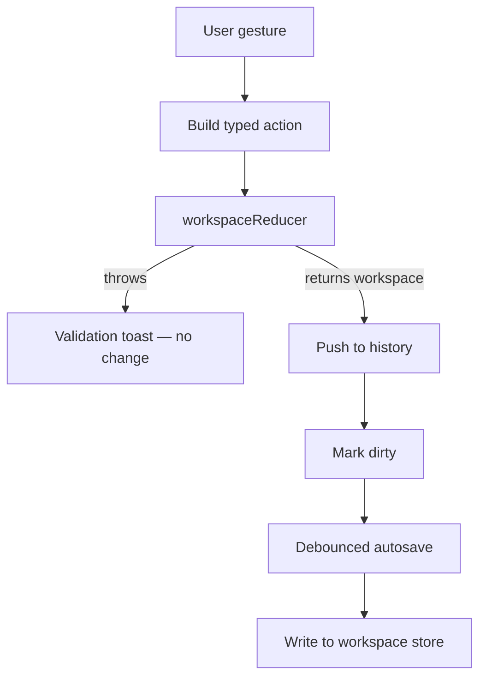

# Seldon · Editor

This package is not a runnable app. `@seldon/editor` is the framework-neutral code shared by the other Seldon editors. The React app lives in `@seldon/editor-react` and the Vue app lives in `@seldon/editor-vue`.

The shared package holds three things: domain logic in `lib/`, dev-server plugins in `vite/`, and static assets in `public/`. Both editors run against the same Core reducer, the same dev-server endpoints, and the same on-disk workspace store. An edit in one editor produces a workspace the other editor can open.

Core owns design state and rules. The shared lib owns the platform-neutral editor logic: property and theme derivation, menu and anchor math, selection and tree helpers, export and import calls, the AI chat client, and the workspace store. 

Each app owns its own gestures, generated components, and runtime state on top.

---

## Packages

| Package | Role | README |
| --- | --- | --- |
| `@seldon/editor` | Shared framework-neutral lib, dev-server plugins, assets | This file |
| `@seldon/editor-react` | React 19 editor app | [../editor-react/README.md](../editor-react/README.md) |
| `@seldon/editor-vue` | Vue 3 editor app | [../editor-vue/README.md](../editor-vue/README.md) |

The two apps share the same structure and behavior. When you change behavior in one app, mirror it in the other. When the logic is platform-neutral, put it in this package so both apps use one definition.

---

## What The Shared Package Contains

### `lib/` — platform-neutral logic

`lib/` holds pure TypeScript. It does not import React or Vue. Both apps call the same functions so their behavior does not drift.

| Area | Role | Path |
| --- | --- | --- |
| **AI** | Chat client that streams the local agent, turn integrity, change summaries | [lib/ai/](./lib/ai) |
| **Canvas** | Tag resolution and property to HTML attribute mapping for node render | [lib/canvas/](./lib/canvas) |
| **Chrome** | Editor chrome theme list | [lib/chrome/](./lib/chrome) |
| **Commands** | Move decision helpers for drag and reorder | [lib/commands/](./lib/commands) |
| **Devices** | Device preset constants and types | [lib/devices/](./lib/devices) |
| **Dialogs** | Dialog helpers, including the image upload target mapping | [lib/dialogs/](./lib/dialogs) |
| **Export** | Local export call and folder writer | [lib/export/](./lib/export) |
| **Font collections** | Font collection helpers | [lib/font-collections/](./lib/font-collections) |
| **Helpers** | Shared utilities: window size, blob to base64, file select, download | [lib/helpers/](./lib/helpers) |
| **Icon sets** | Icon sheet preview, availability, active set resolution | [lib/icon-sets/](./lib/icon-sets) |
| **Icons** | Icon registry and property option icons | [lib/icons/](./lib/icons) |
| **Import** | Web import call | [lib/import/](./lib/import) |
| **Menus** | Anchor placement, combobox selection and submit, menu types | [lib/menus/](./lib/menus) |
| **Properties** | Inspector rows, compute helpers, serialization, property paths | [lib/properties/](./lib/properties) |
| **Resources** | Resource rows and resource edit actions | [lib/resources/](./lib/resources) |
| **Schema** | Schema TypeScript serializer | [lib/schema/](./lib/schema) |
| **Sidebars** | Board section grouping | [lib/sidebars/](./lib/sidebars) |
| **Storage** | Shared workspace store client | [lib/storage/workspace-store.ts](./lib/storage/workspace-store.ts) |
| **Themes** | Theme token rows, values, and previews | [lib/themes/](./lib/themes) |
| **Workspace** | Workspace accessors, selection, target, component tree | [lib/workspace/](./lib/workspace) |

### `vite/` — dev-server plugins

The plugins serve local API routes during `dev` and `preview`. Both editors register the same plugins in their `vite.config.ts`.

| Route | Plugin | Role |
| --- | --- | --- |
| `/api/workspaces` | [workspace-api-plugin.ts](./vite/workspace-api-plugin.ts) | Filesystem workspace store shared across editors |
| `/api/export` | [export-api-plugin.ts](./vite/export-api-plugin.ts) | Runs the Factory export handler and returns files |
| `/api/import` | [import-web-api-plugin.ts](./vite/import-web-api-plugin.ts) | Imports a workspace from the web |
| `/api/agent` | [agent-api-plugin.ts](./vite/agent-api-plugin.ts) | Runs the local AI agent and streams its events |

### `public/` — shared assets

Both editors serve their static assets from this folder. The two `vite.config.ts` files set `publicDir` to `../editor/public`, so logos, fonts, avatars, and background images stay in one place.

---

## How An Editor Consumes This Package

Each app resolves the shared code with path aliases in its `vite.config.ts`:

- `@seldon/editor` points at this package for `lib/` logic and `vite/` plugins.
- `@app` points at the app's own `app/` folder.
- `@seldon/components` points at the app's own generated `seldon/` folder.
- `@seldon/core`, `@seldon/factory`, and `@seldon/ai` point at their sibling packages.

An app imports shared logic as `@seldon/editor/lib/...`. For example, both apps route an image upload row through `@seldon/editor/lib/dialogs/image-upload-target`.

The React editor runs on port 5173 and the Vue editor runs on port 5174, so both can run at once.

---

## The Shared Contract With Core

The editor and an autonomous agent follow the same contract. Both hold a **workspace** object in memory, send **actions** to change it, and persist the result as JSON. Neither patches workspace maps by hand outside the reducer. Each app adds history, selection, and autosave on top of that contract.

### Load

1. The app reads a workspace id from the route and loads the stored record from the workspace store.
2. The app re-runs the record through the reducer with a `set_workspace` action so **migration** can upgrade `metadata.version` and normalize the file.
3. The verified workspace becomes the first snapshot in history.

### Edit

Each user gesture becomes one **workspace action**: a `type` plus a `payload`. The app calls `workspaceReducer(current, action)`, pushes the result onto history, and marks the workspace dirty. A `WorkspaceValidationError` surfaces as a toast and the snapshot does not change.

```typescript
{
  type: "set_node_properties",
  payload: {
    nodeId: "component-button-7f3a9c12",
    properties: {
      color: { type: "theme.categorical", value: "@swatch.primary" },
    },
  },
}
```

Property edits dispatch `set_node_properties`, `set_component_properties`, and `reset_node_property`. Theme edits dispatch `set_theme_override` and related actions. Every path goes through the one reducer.

**Edit loop**



- **History** keeps an array of snapshots with undo and redo. It bounds revisions so memory stays stable.
- **Selection** tracks the active board, node, and theme so panels know their target.
- **Preview** holds a transient workspace for changes the designer has not committed.

### Display values

The workspace stores overrides and templates only. The canvas needs **computed** values to render. Each app computes per node rather than recomputing the whole workspace. A node builds its context with `buildContext` from `@seldon/factory`, then turns computed properties into CSS with `getCssFromProperties`. Themes resolve through Core's `getComputedTheme`. The apps do not merge properties or resolve tokens on their own.

### Save

A debounced autosave writes the live workspace back to the workspace store when it is dirty, with a final flush before the page unloads. The File menu also downloads the current workspace as JSON. That JSON file is the handoff artifact for version control and Factory.

### The workspace store

The workspace store is filesystem-backed, not browser IndexedDB. Browser IndexedDB is per-origin, so two editors on different ports cannot share it. The `workspace-api-plugin` serves `/api/workspaces` over a shared folder at `<repoRoot>/.seldon/workspaces/`, one JSON file per workspace. Both editors read and write the same files, so a workspace saved in the React editor opens in the Vue editor. Each app calls `configureWorkspaceStore` at startup to stamp `lastEditor` with `"react"` or `"vue"` for drift debugging.

This is a dev-server capability. A static production build has no Node backend. That is acceptable because these editors are local-only.

### Hari, an AI Assistant

Each editor ships a local AI assistant that edits the workspace through the same action contract. The chat surface posts the message and current workspace to the local `/api/agent` route through the shared [lib/ai/run-agent-chat.ts](./lib/ai/run-agent-chat.ts).

The route is served by [vite/agent-api-plugin.ts](./vite/agent-api-plugin.ts), which bundles the handler in [vite/agent-handler.ts](./vite/agent-handler.ts). The handler runs the agent from `@seldon/ai` in Node against a local Ollama model and streams its events back as newline-delimited JSON for live rendering.

The agent grounds on the workspace but does not mutate it. The turn returns typed **workspace actions**, and the app applies them through the one reducer as a single undo step, exactly like a manual edit. Extra endpoints cover session config and model warm-up.

---

## Editor MVVM

Both editor apps use MVVM to keep the interface separate from the logic. MVVM splits the app into three layers:

- **Model**: the app's data and domain logic. It does not know about the UI.
- **View**: the interface. It binds to a ViewModel and renders. It holds no logic.
- **ViewModel**: the layer between them. It owns UI state, derives display values, exposes commands, and is the only layer that talks to the Model.

This shared package is the platform-neutral part of the **Model**. It backs the Model with `@seldon/core` services and its own `lib/` logic. It runs without React or Vue. Each app builds its **View** and **ViewModel** in its own framework:

- The React app uses `use-*.ts` hooks as ViewModels and generated `.tsx` components as Views. See [../editor-react/README.md](../editor-react/README.md).
- The Vue app uses composables and Pinia stores as ViewModels and generated `.vue` components as Views. See [../editor-vue/README.md](../editor-vue/README.md).

Each app enforces its View and ViewModel boundaries with lint rules. The framework-specific View authoring rules live in each app's README and in `.cursor/rules/editor-jsx.mdc`.

### Why MVVM

1. **The interface changes often and late.** MVVM lets us redesign a panel or swap a control without touching the ViewModel or Model, because the View only binds names.
2. **Logic stays testable.** Derivation and commands live in framework-neutral `lib/` functions and in per-app view-models, so the hard parts test without the interface.
3. **One place for each concern.** State goes in a view-model. Markup goes in a View. Domain logic goes in the Model. A new feature has an obvious home.
4. **Reuse across surfaces and frameworks.** Shared logic feeds both apps. A change in `lib/` reaches React and Vue at once.
5. **The boundary holds.** Lint enforces the layers, so the separation does not decay as the apps grow.

---

## The Editor At A Glance

Both apps implement the same surfaces.

### Canvas

The canvas is the design surface. It handles zoom and pan, renders the active board, and renders the node tree. Per-node CSS injects through a style portal. Each board has an interaction-state switcher. Selecting a non-Normal state routes node edits to that state's overrides, and instances cannot author states.

### Objects sidebar

The left sidebar shows the tree of boards and nodes, along with themes, font collections, icon sets, and media. Selecting an entry sets the active target for the rest of the editor.

### Properties sidebar

The right sidebar edits the selected node or theme. Its controls call property and theme view-models, which dispatch the typed actions described above.

### Topbar, dialogs, and tracking

The topbar holds the menus and tools. Dialogs cover catalog inserts, component create and export, and image upload. The tracking layer draws hover and selection indicators. The focus and toaster layers render the focus ring and toasts.

---

## Workflows

- **New workspace**: create an empty workspace and open it.
- **Open workspace JSON**: import a file from disk into a new stored workspace.
- **Export workspace JSON**: download the current workspace from the File menu.
- **Export code to a folder**: generate framework and CSS files into a chosen directory.
- **Ask the AI assistant**: open the chat, describe a change, and let the agent apply workspace actions as one undo step.

Folder export runs through the local export route. [lib/export/run-local-export.ts](./lib/export/run-local-export.ts) posts the workspace to `/api/export`, which [vite/export-api-plugin.ts](./vite/export-api-plugin.ts) serves by bundling the Factory export handler. The app then writes the returned files to the folder the browser picks. The JSON download stays available as the version-control handoff artifact.

---

## From Editor To Factory

The editor produces a valid workspace. Factory consumes that workspace and produces exportable files. The usual path:

1. Finish editing and export the workspace JSON.
2. Feed that workspace into Factory.
3. Call `exportWorkspace` with target options, for example React plus CSS.

Pipeline detail lives in [../factory/README.md](../factory/README.md).

---

## Further Reading

| Topic | Document |
| --- | --- |
| React editor app | [../editor-react/README.md](../editor-react/README.md) |
| Vue editor app | [../editor-vue/README.md](../editor-vue/README.md) |
| Core | [../core/README.md](../core/README.md) |
| Factory | [../factory/README.md](../factory/README.md) |
| Vocabulary | [GLOSSARY.md](../../GLOSSARY.md) |
| Workspace file spec | [../core/workspace/WORKSPACE.md](../core/workspace/WORKSPACE.md) |
| Reducer actions | [../core/workspace/reducers/README.md](../core/workspace/reducers/README.md) |

---

## Licensing

Seldon is offered under the **PolyForm Noncommercial License 1.0.0** by default, with a separate commercial license for commercial use.

### 1. Noncommercial license

The default software license is the **PolyForm Noncommercial License 1.0.0**.

- You may use, copy, and modify this software for **noncommercial purposes** such as research, education, and personal projects.
- Commercial use is **not permitted** under this license.
- See [license/noncommercial/LICENSE.md](../../license/noncommercial/LICENSE.md) for the summary and link to the full PolyForm text.

### 2. Commercial license

Commercial use covers proprietary software, SaaS platforms, internal business tools, and use as training data for AI or LLMs. You need a **commercial license** for these.

The commercial license may grant:

- Use in commercial or for-profit contexts.
- Ability to create proprietary derivative works as stated in your agreement.
- Long-term support, security updates, and priority bug fixes if offered by the licensor.
- Optional custom terms negotiated with the licensor.

See [COMMERCIAL-LICENSE.md](../../license/commercial/COMMERCIAL-LICENSE.md).

### 3. Obtaining a commercial license

Contact:

- **Licensor:** Seldon Digital, B.V.
- **Email:** info@seldon.digital

### 4. Summary

| Use | Requirement |
| --- | --- |
| Noncommercial use | PolyForm Noncommercial License 1.0.0 |
| Commercial use | Paid commercial license |

---

## Links

- [Core](../core/README.md)
- [Factory](../factory/README.md)
- [React editor](../editor-react/README.md)
- [Vue editor](../editor-vue/README.md)
- [Official Website](https://seldon.digital)
- [Issues & Discussions](https://github.com/seldon/issues)

---

## Notice for AI and LLM Training

You may not use this software, or any derivative works of it, in whole or in part, for the purposes of training, fine-tuning, or otherwise improving (directly or indirectly) any machine learning or artificial intelligence system without written permission.
