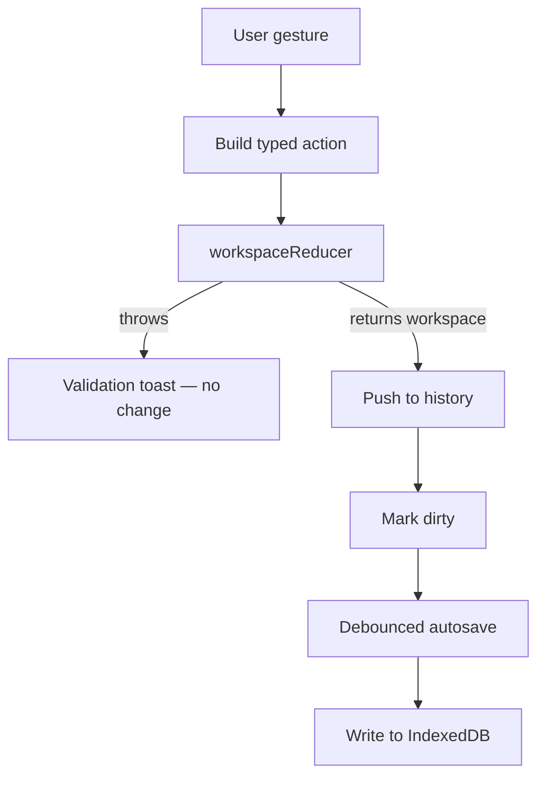

# Seldon · Editor

Seldon Editor is the browser-only design client for Seldon workspaces. It runs on one machine, stores workspaces in **IndexedDB**, and needs no API, database, auth, or cloud service. A user opens a workspace, edits components, and the editor turns each action into a typed **action** that flows through the same Core reducer that an AI agent would use.

Core owns design state and rules. The editor owns gestures, undo history, selection, and local storage. When the design is ready, the workspace passes to **Factory** for React, CSS, and asset generation.

---

## What The Editor Contains

The editor groups these areas:

| Area | Role | Deep reference |
| --- | --- | --- |
| **App** | Routes and all of the interface: canvas, sidebars, panels, topbar, tracking | [app/](./app) |
| **Workspace state** | In-memory workspace, history, selection, preview | [lib/workspace/](./lib/workspace) |
| **Persistence** | Record loading, debounced autosave, workspace name | [lib/persistence/](./lib/persistence) |
| **Project** | Active workspace id and dirty sync status | [lib/project/](./lib/project) |
| **Storage** | IndexedDB read and write for stored workspaces | [lib/storage/workspace-store.ts](./lib/storage/workspace-store.ts) |
| **Export** | Browser folder export through the local export route | [lib/export/](./lib/export) |

The editor imports and exports code directly from `@seldon/core` and `@seldon/factory`. It does not fork their logic. The package name is `@seldon/editor`.

### Stack

- **Vite 8** with **React 19**. The app is a single-page client. `src/main.tsx` mounts a `react-router` browser router with two routes: `/` for the home page and `/:id` for the editor. The editor route is lazy-loaded behind `Suspense`.
- **Zustand** holds runtime state. There is no Redux or React context store.
- **IndexedDB** through `idb-keyval` persists workspaces. The database is `seldon-editor-local` and the object store is `workspaces`.
- Imports use the path aliases `@app` for `app/`, `@lib` for `lib/`, and `@seldon/components` for `seldon/`, alongside `@seldon/core` and `@seldon/factory`.

### Run Steps

- `npm run dev` first appends the Chrome font fallback and copies font licenses and font files, then starts the Vite dev server. Third-party notices are generated separately by `npm run notices:thirdparty`, which `npm run build:release` runs before building. They are not produced by `dev` or `build`.
- `npm run build` builds the production bundle. `npm start` serves the build with `vite preview`.
- `npm run quality` type-checks with `tsc`. `npm run lint` runs ESLint.

---

## How The Editor Uses Core

The editor and an autonomous agent follow the same contract. Both hold a **workspace** object in memory, send **actions** to change it, and persist the result as JSON. Neither patches workspace maps by hand outside the reducer. The editor adds history, selection, and autosave on top of that contract.

### Load

1. The route `/:id` renders [EditorPage.tsx](./app/editor/EditorPage.tsx). It reads the workspace id with `useWorkspaceId` and loads the stored record through `useWorkspaceRecord`.
2. [ProjectInitialize.tsx](./app/editor/ProjectInitialize.tsx) re-runs the record through the reducer with a `set_workspace` action so **migration** can upgrade `metadata.version` and normalize the file.
3. The verified workspace becomes the first snapshot in history.

### Edit

Each user gesture becomes one **workspace action**: a `type` plus a `payload`. The central dispatch lives in [lib/workspace/hooks/use-workspace.ts](./lib/workspace/hooks/use-workspace.ts). It calls `workspaceReducer(current, action)`, pushes the result onto history, and marks the workspace dirty through `setIsLocalWorkspaceDirty`. A `WorkspaceValidationError` surfaces as a toast and the snapshot does not change.

```typescript
// Illustrative shape — higher-level hooks build these payloads
{
  type: "set_node_properties",
  payload: {
    nodeId: "component-button-7f3a9c12",
    properties: {
      color: { type: "theme.categorical", value: "@swatch.primary" },
    },
  },
}
```

Property hooks such as `use-object-properties` dispatch `set_node_properties`, `set_component_properties`, and `reset_node_property`. Theme hooks dispatch `set_theme_override` and related actions. Every path goes through the one reducer.

---

**Edit loop**



- **History** keeps an array of snapshots with undo and redo. It bounds revisions so memory stays stable.
- **Selection** tracks the active board, node, and theme so panels know their target.
- **Preview** holds a transient workspace for changes the designer has not committed.

---

### Display values

The workspace stores overrides and templates only. The canvas needs **computed** values to render. The editor computes per node rather than recomputing the whole workspace.

Each node builds its context with `buildContext` from `@seldon/factory`, then turns computed properties into CSS with `getCssFromProperties`. Themes resolve through Core's `getComputedTheme`. The editor does not merge properties or resolve tokens on its own.

### Save

A debounced autosave in [lib/persistence/hooks/use-workspace-autosave.ts](./lib/persistence/hooks/use-workspace-autosave.ts) writes the live workspace back to IndexedDB when it is dirty, with a final flush before the page unloads. The File menu also downloads the current workspace as JSON. That JSON file is the handoff artifact for version control and Factory.

---

## The Editor At A Glance

### Canvas

The canvas is the design surface. `Canvas` handles zoom and pan, `CanvasWorkspace` renders the active board, and `Node` renders the node tree. `ComponentRenderer` injects per-node CSS through a style portal. Each board has an interaction-state switcher. Selecting a non-Normal state routes node edits to that state's overrides, and instances cannot author states.

### Objects sidebar

The left sidebar shows the tree of boards, nodes, and themes. Selecting an entry sets the active target for the rest of the editor.

### Properties sidebar

The right sidebar edits the selected node or theme. Its controls call property and theme hooks, which dispatch the typed actions described above.

### Topbar, panels, and tracking

The topbar holds the menus and tools. Panels cover catalog inserts and image upload. The tracking layer draws hover and selection indicators on the canvas and in the sidebars. The focus and toaster layers render the focus ring and toasts.

---

## Workflows

- **New workspace**: create an empty workspace and open it.
- **Open workspace.json**: import a file from disk into a new stored workspace.
- **Export workspace JSON**: download the current workspace from the File menu.
- **Export code to a folder**: generate React and CSS files into a chosen directory.
- **Debug mode**: use the **Dev** menu to toggle canvas profiling, node id, type, and property-type overlays, and dispatch, verbose, and workspace logging.

Folder export runs through the local export route. [lib/export/run-local-export.ts](./lib/export/run-local-export.ts) posts the workspace to `/api/export`, which the Vite plugin [vite/export-api-plugin.ts](./vite/export-api-plugin.ts) serves by bundling the Factory export handler. [lib/export/write-export-to-directory.ts](./lib/export/write-export-to-directory.ts) then writes the returned files to the folder the browser picks. The JSON download stays available as the version-control handoff artifact.

---

## From Editor To Factory

The editor produces a valid workspace. Factory consumes that workspace and produces exportable files. The usual path:

1. Finish editing in the editor and export the workspace JSON.
2. Feed that workspace into Factory.
3. Call `exportWorkspace` with target options, for example React plus CSS.

Pipeline detail lives in [../factory/README.md](../factory/README.md).

---

## Further Reading

| Topic | Document |
| --- | --- |
| Core | [../core/README.md](../core/README.md) |
| Factory | [../factory/README.md](../factory/README.md) |
| Run steps | [Run Steps](#run-steps) |
| Vocabulary | [GLOSSARY.md](../../GLOSSARY.md) |
| Workspace file spec | [../core/workspace/WORKSPACE.md](../core/workspace/WORKSPACE.md) |
| Reducer actions | [../core/workspace/reducers/README.md](../core/workspace/reducers/README.md) |

---

## Licensing

Seldon is offered under the **PolyForm Noncommercial License 1.0.0** by default, with a separate commercial license for commercial use.

### 1. Noncommercial license

The default software license is the **PolyForm Noncommercial License 1.0.0**.

- You may use, copy, and modify this software for **noncommercial purposes** such as research, education, and personal projects.
- Commercial use is **not permitted** under this license.
- See [license/noncommercial/LICENSE.md](../../license/noncommercial/LICENSE.md) for the summary and link to the full PolyForm text.

### 2. Commercial license

Commercial use covers proprietary software, SaaS platforms, internal business tools, and use as training data for AI or LLMs. You need a **commercial license** for these.

The commercial license may grant:

- Use in commercial or for-profit contexts.
- Ability to create proprietary derivative works as stated in your agreement.
- Long-term support, security updates, and priority bug fixes if offered by the licensor.
- Optional custom terms negotiated with the licensor.

See [COMMERCIAL-LICENSE.md](../../license/commercial/COMMERCIAL-LICENSE.md).

### 3. Obtaining a commercial license

Contact:

- **Licensor:** Seldon Digital, B.V.
- **Email:** info@seldon.digital

### 4. Summary

| Use | Requirement |
| --- | --- |
| Noncommercial use | PolyForm Noncommercial License 1.0.0 |
| Commercial use | Paid commercial license |

---

## Links

- [Core](../core/README.md)
- [Factory](../factory/README.md)
- [Editor](./README.md)
- [Official Website](https://seldon.digital)
- [Issues & Discussions](https://github.com/seldon/issues)

---

## Notice for AI and LLM Training

You may not use this software, or any derivative works of it, in whole or in part, for the purposes of training, fine-tuning, or otherwise improving (directly or indirectly) any machine learning or artificial intelligence system without written permission.
