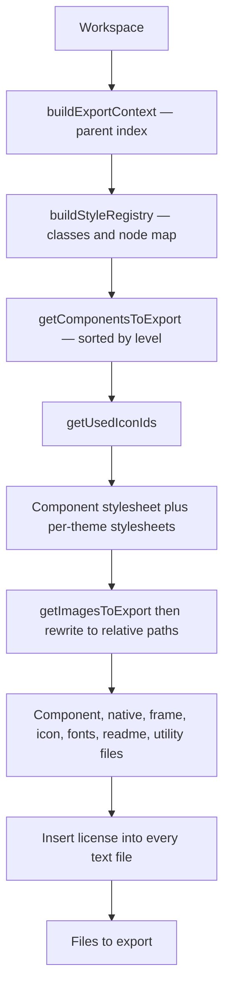

# Seldon · Factory

Seldon Factory turns a valid Seldon workspace into production code. It consumes a **workspace** object and produces React components, CSS, and processed assets as a list of files. Factory reads design-time state from Core, resolves properties and themes, and generates output. It does not change the workspace file.

Core owns design-time state and rules. Factory owns export and production code generation.

---

## What The Factory Contains

Factory groups three stages that work together:

| Area | Role | Deep reference |
| --- | --- | --- |
| **Helpers** | Build the export context and node index, compute node properties through Core | [helpers/](./helpers) |
| **Styles** | Convert resolved properties into CSS for one class | [styles/css-properties/](./styles/css-properties) |
| **Export** | Orchestrate React, CSS, and asset generation into files | [export/](./export) |

The export stage splits into two subsystems with their own guides:

- **[React export](./export/react/README.md)** generates components with TypeScript interfaces.
- **[CSS export](./export/css/README.md)** generates stylesheets with theme variables and cascade ordering.

Factory imports compute logic from `@seldon/core`. It does not fork property or theme rules.

---

## How Callers Use The Factory

The entry point is `exportWorkspace` in [export/export-workspace.ts](./export/export-workspace.ts). It takes a workspace and export options and returns a promise of files to write.

```typescript
import { exportWorkspace } from "./export/export-workspace"

const files = await exportWorkspace(workspace, {
  rootDirectory: "./my-app",
  target: { framework: "react", styles: "css-properties" },
  output: {
    componentsFolder: "/src/components",
    assetsFolder: "/public/assets",
    assetPublicPath: "/assets",
  },
})
```

Factory has no `exports` field and no top-level barrel. Import the concrete file paths shown here, not a bare `@seldon/factory` specifier.

`exportWorkspace` resolves an asset reader, normalizes the components and assets folders, and delegates to React generation when `target.framework` is `"react"`. It throws for any other framework.

### Export options

The real `ExportOptions` type lives in [export/types.ts](./export/types.ts):

```typescript
type ExportOptions = {
  rootDirectory: string
  token?: string
  target: { framework: "react"; styles: "css-properties" }
  output: {
    assetsFolder: string
    componentsFolder: string
    assetPublicPath: string
  }
  publishAll?: boolean
  debugMode?: boolean
  assetReader?: ExportAssetReader
  skipFormat?: boolean
}
```

---

## From Workspace To Files

The real orchestration runs in [export/react/export-react.ts](./export/react/export-react.ts). It builds the export context, resolves styles, discovers components and assets, then generates each kind of file.



- **Context** indexes parents so property compute can resolve inheritance.
- **Style registry** maps each node to a class and records tree depths for cascade order.
- **Discovery** finds exportable components and orders them by component level.
- **Generation** writes one file per component plus shared files, then inserts a license header into every text file.

`exportReact` inlines its CSS generation through `generateComponentStylesheet` and `generateThemeStylesheetFiles`. The standalone `exportCss` in [export/css/export-css.ts](./export/css/export-css.ts) is a separate entry. It takes the workspace and a components folder and returns an object:

```typescript
async function exportCss(
  workspace: Workspace,
  componentsFolder: string,
  forceRegeneration?: boolean,
): Promise<{ componentStylesheet: string; themeStylesheets: ThemeStylesheetFile[] }>
```

---

## Style Generation

[styles/css-properties/get-css-from-properties.ts](./styles/css-properties/get-css-from-properties.ts) converts resolved properties into CSS for one class.

```typescript
function getCssFromProperties(
  propertiesSubset: Properties,
  context: StyleGenerationContext,
  className: string,
): string
```

It computes property values, applies inheritance from the parent context, resolves theme tokens, and writes optimized CSS. It drops unset values.

Class names use the `sdn-` prefix. The prefix is applied in [export/css/discovery/get-class-name.ts](./export/css/discovery/get-class-name.ts). Theme variables use `--sdn-` for the default theme and `--sdn-{themeId}-` for other themes. The CSS section markers and section list live in [export/css/constants.ts](./export/css/constants.ts).

---

## Generated Output

Factory produces a component library under `output.componentsFolder`, with images under `output.assetsFolder`. Paths below are relative to the components folder.

```
{level-plural}/{Name}.tsx   # primitives, elements, parts, modules, frames, screens
frames/Frame.tsx            # universal container component
native-react/{stem}.tsx     # native HTML primitive components
icons/                      # tree-shaken icon components
icons/index.ts              # icon index
utils/class-name.ts         # combineClassNames helper
Fonts.tsx                   # font loading component
styles.css                  # component stylesheet
styles-{theme}.css          # one stylesheet per used theme
README.md                   # generated usage guide
```

Each component file includes a TypeScript interface, a React component, resolved CSS classes, and tree-shaken imports.

---

## Further Reading

| Topic | Document |
| --- | --- |
| Core kernel | [../core/CORE.md](../core/CORE.md) |
| Editor client | [../editor/EDITOR.md](../editor/EDITOR.md) |
| React export | [export/react/README.md](./export/react/README.md) |
| CSS export | [export/css/README.md](./export/css/README.md) |
| Code examples | [TECHNICAL.md](./TECHNICAL.md) |
| Vocabulary | [../core/GLOSSARY.md](../core/GLOSSARY.md) |

Note: parts of [TECHNICAL.md](./TECHNICAL.md) predate the current API. Treat this document and the source files as the current reference for entry points and options.

---

## Licensing

Seldon is offered under a **layered model**: repository access, then software use licenses.

### 1. Repository access

You must pay the agreed flat fee to access the private GitHub repository (view, clone, fork on GitHub).

- See [REPOSITORY-ACCESS.md](../../license/access/REPOSITORY-ACCESS.md) for fees, forks, termination, and contributor access (TBD).
- The access fee does **not** include commercial-use rights.

### 2. Noncommercial license

The default software license is the **PolyForm Noncommercial License 1.0.0**.

- You may use, copy, and modify this software for **noncommercial purposes** (e.g. research, education, personal projects).
- Commercial use is **not permitted** under this license.
- See [license/noncommercial/LICENSE.md](../../license/noncommercial/LICENSE.md) for the summary and link to the full PolyForm text.

This license applies to your use of the code **after** you lawfully obtain the source through paid repository access.

### 3. Commercial license

For commercial use (including proprietary software, SaaS platforms, internal business tools, or use as training data for AI or LLMs), you need a **commercial license** separate from the repository access fee.

The commercial license may grant:

- Use in commercial or for-profit contexts.
- Ability to create proprietary derivative works (as stated in your agreement).
- Long-term support, security updates, and priority bug fixes if offered by the licensor.
- Optional custom terms negotiated with the licensor.

See [COMMERCIAL-LICENSE.md](../../license/commercial/COMMERCIAL-LICENSE.md).

### 4. Obtaining a commercial license

Contact:

- **Licensor:** Seldon Digital, B.V.
- **Email:** info@seldon.digital

### 5. Summary

| Role | Requirement |
|------|-------------|
| Anyone obtaining source | Paid repository access |
| Noncommercial use | PolyForm Noncommercial License 1.0.0 (after access) |
| Commercial use | Paid commercial license (separate from access fee) |

Note: Noncommercial use does not require a commercial license, but it still requires paid repository access to obtain the source from the official private repository.

---

## Links

- [Core kernel](../core/CORE.md)
- [Editor client](../editor/EDITOR.md)
- [React export](./export/react/README.md)
- [CSS export](./export/css/README.md)
- [Official Website](https://seldon.digital)
- [Documentation](https://docs.seldon.digital)
- [Issues & Discussions](https://github.com/seldon/issues)
