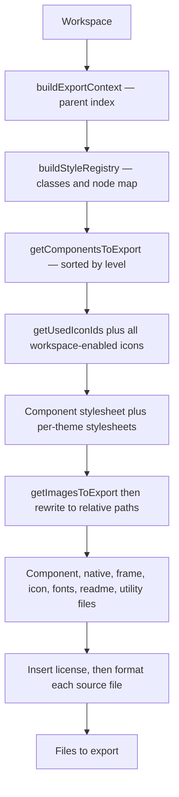

# Seldon · Factory

Seldon Factory turns a valid Seldon workspace into production code. It consumes a **workspace** object and produces a list of files. React is the current output target. It produces React components, CSS, and processed assets. Other targets such as Swift and Java are planned. Factory reads design-time state from Core, resolves properties and themes, and generates output. It does not change the workspace file.

Core owns design-time state and rules. Factory owns export and production code generation.

---

## What The Factory Contains

Factory groups three stages that work together:

| Area | Role | Deep reference |
| --- | --- | --- |
| **Helpers** | Build the export context and node index, compute node properties through Core | [helpers/](./helpers) |
| **Styles** | Convert resolved properties into CSS for one class | [styles/css-properties/](./styles/css-properties) |
| **Export** | Orchestrate React, CSS, and asset generation into files | [export/](./export) |

The export stage splits into two subsystems with their own guides:

- **[React export](./export/react/README.md)** generates components with TypeScript interfaces.
- **[CSS export](./export/css/README.md)** generates stylesheets with theme variables and cascade ordering.

Factory imports compute logic from `@seldon/core`. It does not fork property or theme rules.

---

## How Callers Use The Factory

The entry point is `exportWorkspace` in [export/export-workspace.ts](./export/export-workspace.ts). It takes a workspace and export options and returns a promise of files to write.

```typescript
import { exportWorkspace } from "./export/export-workspace"

const files = await exportWorkspace(workspace, {
  rootDirectory: "./my-app",
  target: { framework: "react", styles: "css-properties" },
  output: {
    componentsFolder: "/src/components",
    assetsFolder: "/public/assets",
    assetPublicPath: "/assets",
  },
})
```

Factory has no `exports` field and no top-level barrel. Import the concrete file paths shown here, not a bare `@seldon/factory` specifier.

`exportWorkspace` resolves an asset reader, normalizes the components and assets folders, and dispatches by `target.framework`. React is the only implemented target today, so it delegates to React generation when `target.framework` is `"react"` and throws for any other framework. Future targets such as Swift and Java add their own generation branches here.

### Export options

The real `ExportOptions` type lives in [export/types.ts](./export/types.ts):

```typescript
type ExportOptions = {
  rootDirectory: string
  token?: string
  target: { framework: "react"; styles: "css-properties" }
  output: {
    assetsFolder: string
    componentsFolder: string
    assetPublicPath: string
  }
  publishAll?: boolean
  debugMode?: boolean
  assetReader?: ExportAssetReader
  skipFormat?: boolean
  enableRemoteFonts?: boolean
}
```

`enableRemoteFonts` is off by default. The default keeps exports request-free. Set it to `true` to emit remote font host links in the generated `Fonts.tsx`.

---

## From Workspace To Files

The real orchestration runs in [export/react/export-react.ts](./export/react/export-react.ts). It builds the export context, resolves styles, discovers components and assets, then generates each kind of file.



- **Context** indexes parents so property compute can resolve inheritance.
- **Style registry** maps each node to a class and records tree depths for cascade order.
- **Discovery** finds exportable components and orders them by component level. Icon discovery collects icons referenced by components, then adds every icon turned on in the workspace's icon sets, so exports ship complete icon sets.
- **Generation** writes one file per component plus shared files, then inserts a license header into every text file and formats each source file. Native wrappers come from the `exportConfig.react.returns` of every exported component, plus `HTML.Div` for Frame.

`exportReact` inlines its CSS generation through `buildStyleRegistry`, `generateComponentStylesheet`, and `generateThemeStylesheetFiles`. It produces one component stylesheet and one stylesheet file per theme.

---

## Style Generation

[styles/css-properties/get-css-from-properties.ts](./styles/css-properties/get-css-from-properties.ts) converts resolved properties into CSS for one class.

```typescript
function getCssFromProperties(
  propertiesSubset: Properties,
  context: StyleGenerationContext,
  className: string,
): string
```

It computes property values, applies inheritance from the parent context, resolves theme tokens, and writes optimized CSS. It drops unset values.

Class names use the `sdn-` prefix. The prefix is applied in [export/css/discovery/get-class-name.ts](./export/css/discovery/get-class-name.ts). Theme variables use a per-theme prefix: bare `--sdn-` for the default `seldon` theme and `--sdn-{slug}-` for every other theme. The slug is a stable, human-readable name built in [export/css/generation/get-theme-slug.ts](./export/css/generation/get-theme-slug.ts). A default-type theme slugs from its stock theme catalog id, such as `high-contrast` from `catalog:highContrast`, and falls back to its label or id when the template is missing. A variant theme prepends its root slug and appends its own label, such as `seldon-red`.

---

## Formatting

Factory formats its output with Prettier. The options live in one file: [export/export-prettier-config.ts](./export/export-prettier-config.ts). Both the React and CSS formatters read it, so every exported file formats the same way. To change how exports are formatted, edit that file.

The defaults match the Seldon repository, so generated files land already formatted and do not churn on the next format pass. The filename is not a name Prettier auto-discovers, so a consumer's own Prettier never applies it to their source. A consumer exporting into a differently formatted codebase edits this file to match their style.

The `skipFormat` export option turns formatting off for a run.

---

## Generated Output

Factory produces a component library under `output.componentsFolder`, with images under `output.assetsFolder`. Paths below are relative to the components folder.

```
{level-plural}/{Name}.tsx              # primitives, elements, parts, modules, frames, screens
frames/Frame.tsx                       # generated universal container, wraps HTML.Div
frames/Container.tsx                   # frame-level component, an instance of {level-plural}/{Name}.tsx
native-react/HTML.{Tag}.tsx            # native HTML primitive components, such as HTML.Div
icons/{set}/{category}/Icon{Name}.tsx  # tree-shaken icon components, nested by catalog path
icons/IconDefault.tsx                  # fallback icon for ids that do not resolve
icons/index.ts                         # icon index, re-exports the emitted icons
refs/index.ts                          # ref registry, emitted only when nodes carry refs
utils/class-name.ts                    # combineClassNames helper
Fonts.tsx                              # font loading component
styles.css                             # component stylesheet
styles/{slug}.css                      # one stylesheet per workspace theme
README.md                              # generated usage guide
```

The `frames/` folder holds both the generated `Frame.tsx` wrapper and any frame-level components, such as `Container.tsx`. Icon files keep their catalog subfolder path, such as `icons/material/user-interface/navigation/IconMaterialChevronUp.tsx`. The `refs/index.ts` file is emitted only when at least one node carries a ref. It exports a `SeldonRef` union and a `SELDON_REFS` map, and each referenced node renders a `data-seldon-ref` attribute so app code can target it by a type-safe ref name.

Factory writes one theme stylesheet for every entry in `workspace.themes`, both default themes and their variants. Each file goes in the `styles/` folder and is named by its slug, such as `styles/seldon.css` and `styles/seldon-red.css`, with no hash. `generateThemeStylesheetFiles` in [export/css/generation/insert-theme-variables.ts](./export/css/generation/insert-theme-variables.ts) produces them.

Each component file includes a TypeScript interface, a React component, resolved CSS classes, and tree-shaken imports.

### Child Prop Contract

Every child of a generated component is an optional, nullable prop. The render behavior depends on whether the child is part of the component's schema. The generated interface and function signature show the difference. Schema children carry a default. Inline extras do not.

```tsx
export interface ItemNodeRowProps extends HTMLAttributes<HTMLDivElement> {
  className?: string
  buttonIconic?: ButtonIconicProps | null // schema child
  textTitle?: TextProps | null            // schema child
  textLabel?: TextProps | null            // inline extra
}

export function ItemNodeRow({
  className = "",
  buttonIconic = sdn.buttonIconic, // schema child: default applied
  textTitle = sdn.textTitle,       // schema child: default applied
  textLabel,                       // inline extra: no default
  ...props
}: ItemNodeRowProps) {
  /* ... */
}
```

- **Schema children** have a default sourced from `sdn`, such as `buttonIconic = sdn.buttonIconic`. Omit the prop and the child renders with its defaults. Pass `null` and the child does not render.
- **Inline extras** are children that the workspace adds outside the schema. They have no default and render only when the caller passes the prop. The render guard is a truthy check, so an empty object still renders the extra with its defaults.

Usage follows directly from the signature:

```tsx
// Defaults: every schema child renders, no inline extras
<ItemNodeRow />

// Override one schema child; the rest keep their defaults
<ItemNodeRow textTitle={{ children: "Renamed node" }} />

// Remove a schema child by passing null
<ItemNodeRow buttonIconic={null} />

// Add an inline extra by passing its prop
<ItemNodeRow textLabel={{ children: "Label" }} />

// null flows into nested children: suppress the icon inside the button
<ItemNodeRow buttonIconic={{ icon: null }} />

// Gotcha: {} is truthy, so an inline extra still renders with defaults.
// Omit the prop to skip it instead.
<ItemNodeRow textLabel={{}} />
```

### Icon Output

The generated `IconProps["icon"]` union covers every icon turned on in the workspace's icon sets. Icon component files emit only for icons that resolve to a catalog source file, found by [export/react/utils/find-icon-path.ts](./export/react/utils/find-icon-path.ts). `icons/index.ts` lists only emitted files. Icons that do not resolve render through `IconDefault`.

---

## Further Reading

| Topic | Document |
| --- | --- |
| Core | [../core/README.md](../core/README.md) |
| Editor | [../editor/README.md](../editor/README.md) |
| React export | [export/react/README.md](./export/react/README.md) |
| CSS export | [export/css/README.md](./export/css/README.md) |
| Code examples | [TECHNICAL.md](./TECHNICAL.md) |
| Vocabulary | [GLOSSARY.md](../../GLOSSARY.md) |

Note: parts of [TECHNICAL.md](./TECHNICAL.md) predate the current API. Treat this document and the source files as the current reference for entry points and options.

---

## Licensing

Seldon is offered under the **PolyForm Noncommercial License 1.0.0** by default, with a separate commercial license for commercial use.

### 1. Noncommercial license

The default software license is the **PolyForm Noncommercial License 1.0.0**.

- You may use, copy, and modify this software for **noncommercial purposes** such as research, education, and personal projects.
- Commercial use is **not permitted** under this license.
- See [license/noncommercial/LICENSE.md](../../license/noncommercial/LICENSE.md) for the summary and link to the full PolyForm text.

### 2. Commercial license

Commercial use covers proprietary software, SaaS platforms, internal business tools, and use as training data for AI or LLMs. You need a **commercial license** for these.

The commercial license may grant:

- Use in commercial or for-profit contexts.
- Ability to create proprietary derivative works as stated in your agreement.
- Long-term support, security updates, and priority bug fixes if offered by the licensor.
- Optional custom terms negotiated with the licensor.

See [COMMERCIAL-LICENSE.md](../../license/commercial/COMMERCIAL-LICENSE.md).

### 3. Obtaining a commercial license

Contact:

- **Licensor:** Seldon Digital, B.V.
- **Email:** info@seldon.digital

### 4. Summary

| Use | Requirement |
| --- | --- |
| Noncommercial use | PolyForm Noncommercial License 1.0.0 |
| Commercial use | Paid commercial license |

---

## Links

- [Core](../core/README.md)
- [Factory](./README.md)
- [Editor](../editor/README.md)
- [Official Website](https://seldon.digital)
- [Issues & Discussions](https://github.com/seldon/issues)

---

## Notice for AI and LLM Training

You may not use this software, or any derivative works of it, in whole or in part, for the purposes of training, fine-tuning, or otherwise improving (directly or indirectly) any machine learning or artificial intelligence system without written permission.
